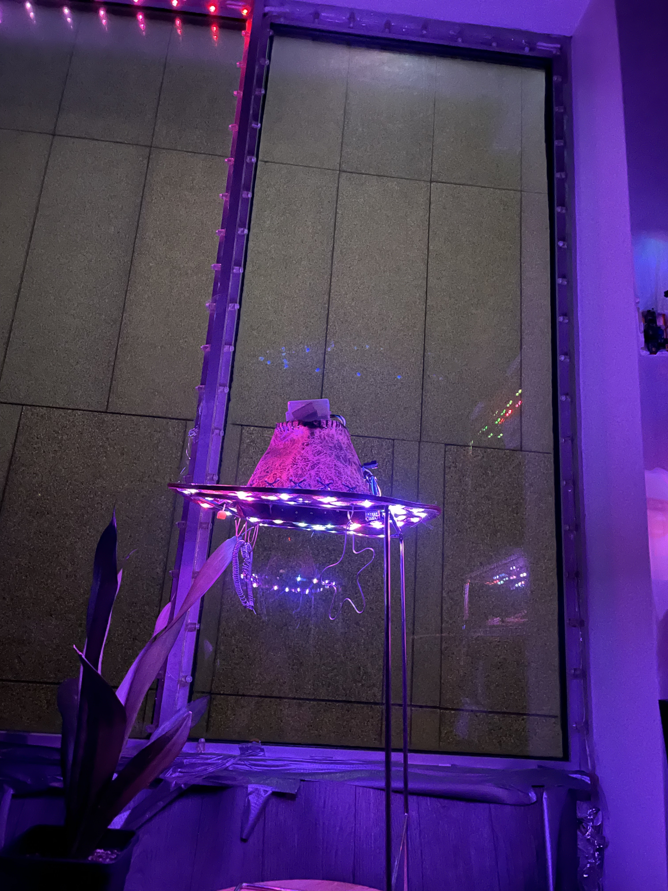
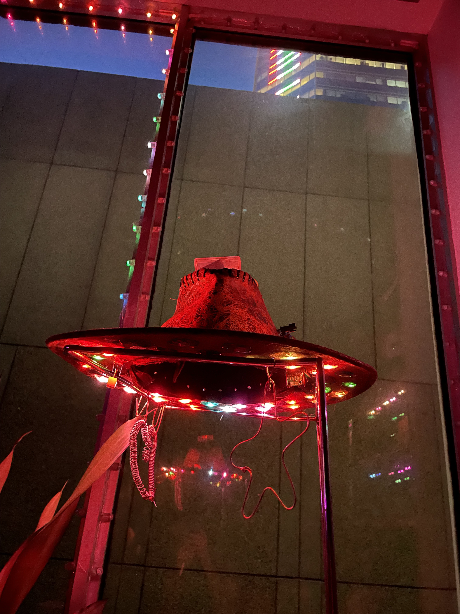
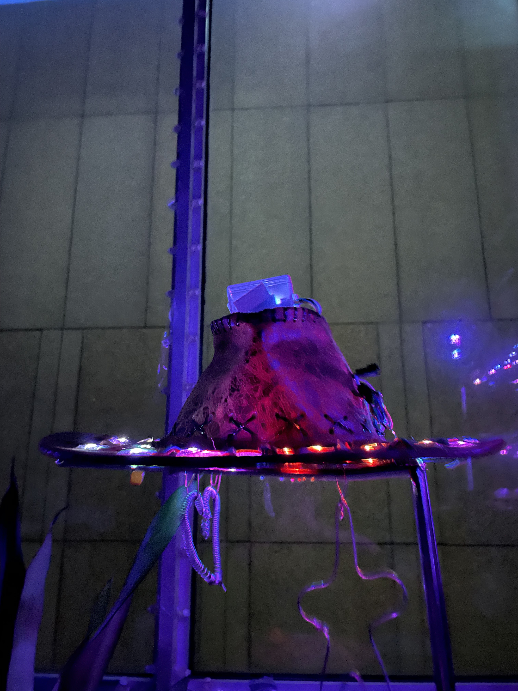
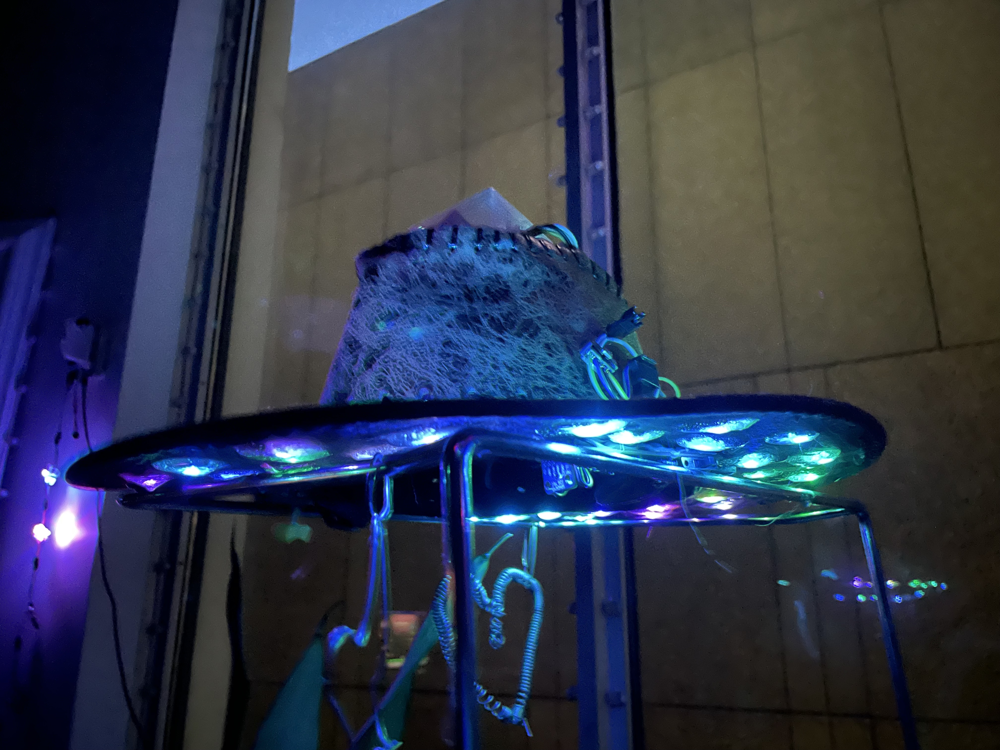
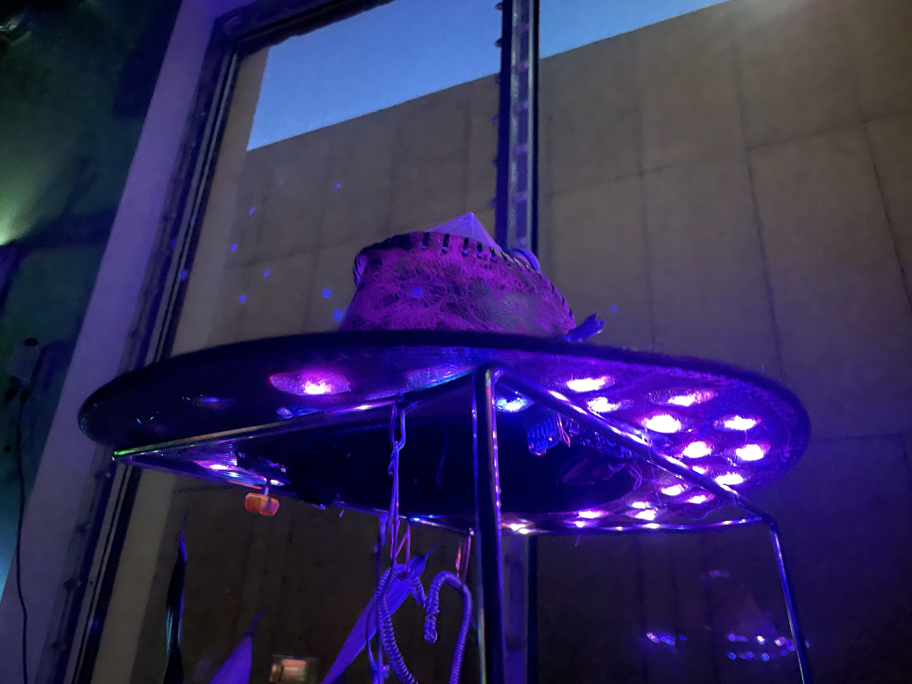
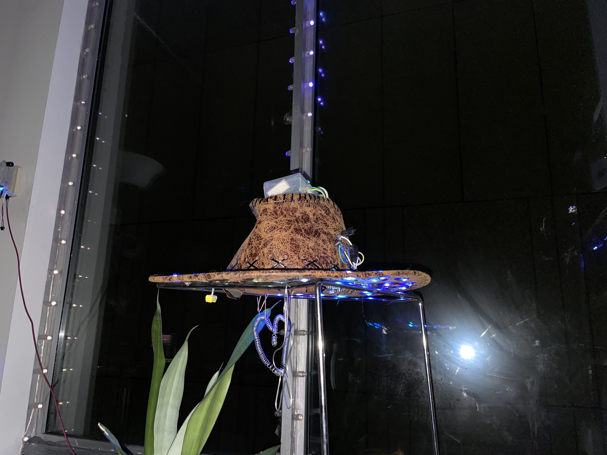
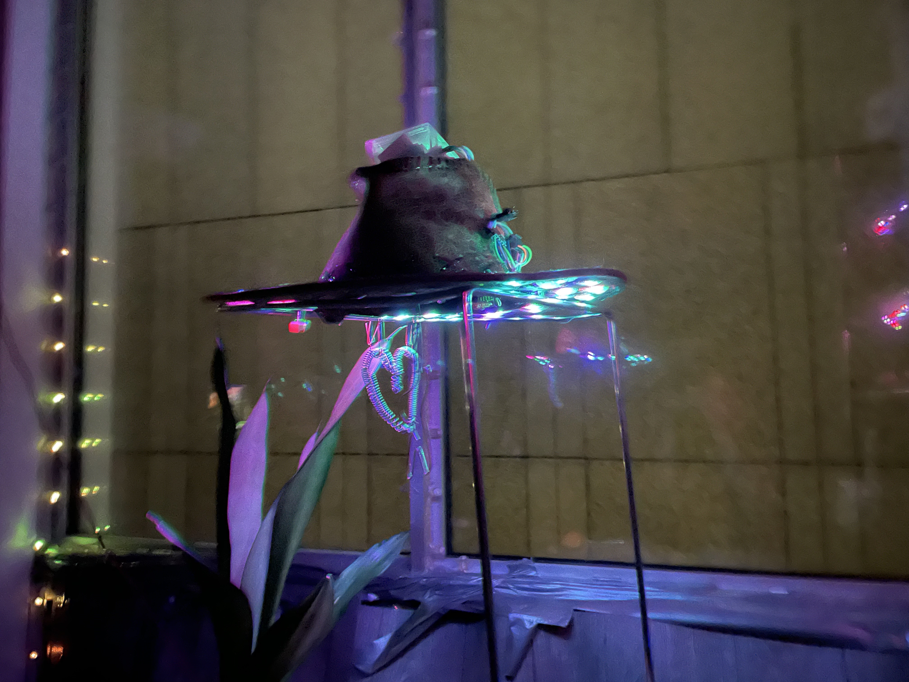
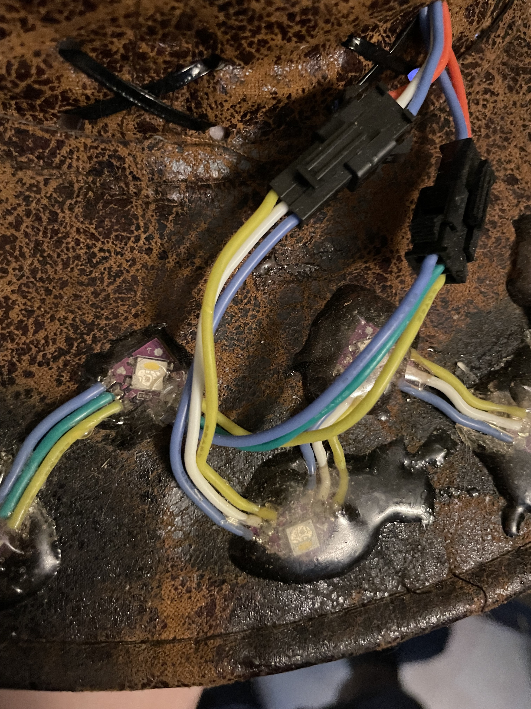
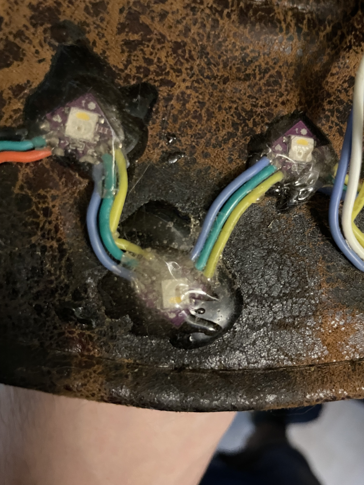
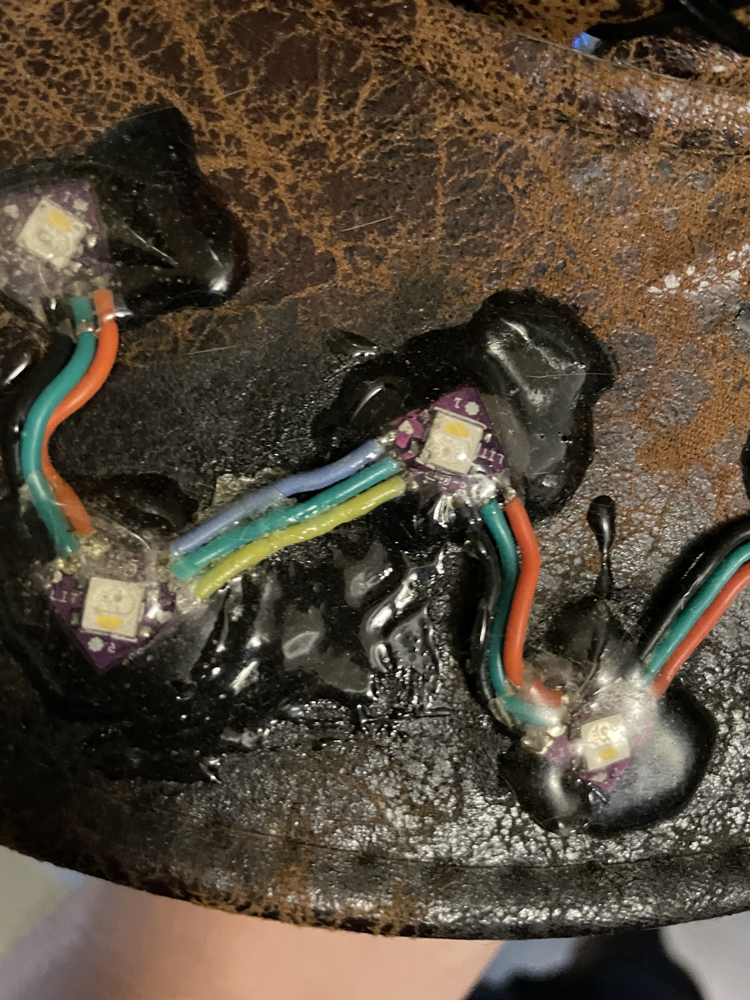

## Pictures





## Videos

### Alpha Sound Reactivity Test


### Tesselate


### Alpha Sound Reactivity Test 2


### Alpha Diffusion Cloud Test


### Alpha Tinfoil Hat Test


### Alpha Sound Reactivity Test 3


### Alpha Sound Reactivity Test 4


### Alpha Field Test
This is obviously the best video, and the one that should be included on the page!



## Schematics







## Updated Power Supply




## Construction




## Live Demo




