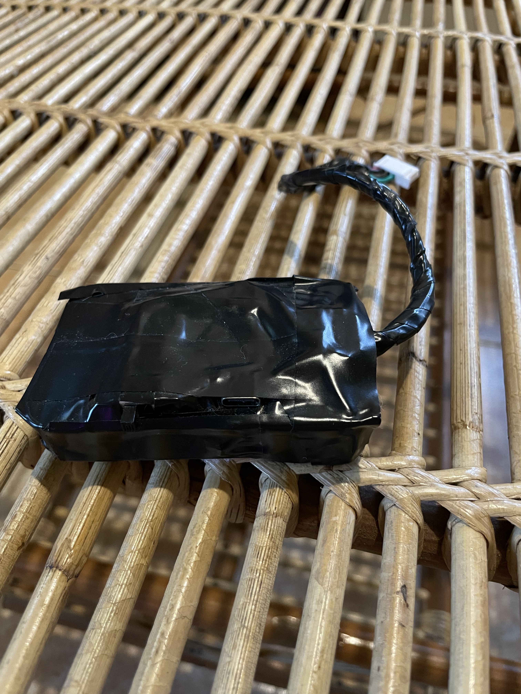

## Hat
I made this hat in the couple of weeks leading up to Shambhala this year. I worked on it for a couple of hours 
every day after work (and I was working 10 hour days while I did this). I set a reasonable scope, kept to my 
timeline, set work-life boundaries, and made it happen. I got it done just in time, just before I was to leave, 
and do you want to know what happened?

It didn't work. Hardware is fun like that. And it's funny, because it didn't actually successfully turn on until 
I was going through airport security in Japan, and they turned it on, and it just MAGICALLY DECIDED TO WORK.

Because all of my connections were solid. All of my work was good. What wasn't good was the fact that I built this 
with the BETA version of WLED, and, it could be argued, this was a foolish choice. Beta means buggy, and in theory, 
I could just switch to stable, right?

Wrong! See, I made another oopsy, and this was from the outset of the project. Instead of choosing a platform 
that was supported (the ESP32), I chose one that was not (the ESP32-S3). I've spent days trying to port my build 
settings back over to a stable version, and I have consistently failed. What continues to build reliably? The 
MoonModules beta firmware.

Highly Annoying.





## Case
At some point, I'm going to need to learn to do 3D printing. This case was not 3D printed. It was painstakingly 
hollowed-out of another (inferior) light controller that I purchased. I drilled out holes, and ground it down, 
and trimmed the protoboard so that it would fit within the alotted space.





I'm going to be honest - this was absolutely brutal. It took me an absurd amount of time. It likely would have 
been faster to sit down, design the case specifications, and have it 3d printed. In fact, I'm sure that it would be.

So. Why didn't I?

As I did this, I had a 3D Printer. It was on the floor behind me. I didn't set it up, because I didn't actually 
have space for it. I was living in a 500 sq ft loft, a place that I worked my full time job, and also worked on 
my various (time-intensive) projects, and it was absolutely C O N S U M I N G my life... I think of what a home 
is, what it had ought to be, and it's a place you go to eat, sleep, fuck, and have fun. I had the first two 
of those down, but the rest of what I did there was work, and I do so to such excess that I was no longer able 
to open up additional avenues of work - I simply didn't have the space MENTALLY to do so.

In an ideal world, I'd have an entire room full of this shit, and it would be wonderful.

## Electronics
Electronics were entirely wired by hand, which is insane, and took me a lot of hours. On the upside, I'm getting 
kinda good at this through-hole soldering thing, which is silly, because it's incredibly strenuous on my body. 
The next version is clearly going to need to be made with actual PCB's -- I slapped this together with what I had, 
and that just happened to be a bunch of through-hole parts.





I'm not kidding about it being strenuous on my body. My eyes stung from the flux in the air. My cat just wanted 
to play, and I had to tell her N O Seven, I'm working. And she's such a good kitty, and here I am a total fucking 
asshole, through-hole soldering instead of showing love to my cat. Absolutely fucking dispicable.

My cat much prefers when I'm working on my laptop. She's got lots of chill for that. Any future work that I'm to 
present had ought to be fabricated in China, to maintain a harmonious relationship with my cat.

## Power Supply

The entire system is powered by a 3000mAh Li-Po battery, augmented with the addition of a USB Pass-Through circuit 
alongside the TP4056 charger. This was necessary to avoid the deleterious effects on battery capacity when constantly 
draining/charging the battery when plugged in.





There is no boost circuit, and that's turned out to be a problem. The reason there's no boost is because, in theory, 
the SK6812 LED's are capable of running on as little as 3.3V, and I've confirmed this repeatedly through testing 
(and also witnessing the voltage drop over long strings). That's good. The part that's not good is the LDO regulator 
on the S3 Mini. And it's not that it's not good - it's just the fact that it's an LDO, instead of a switched mode converter.

So that was the outcome of this design choice? Data Corruption. It's not in the firmware itself, but rather within 
the configuration that gets saved. When the battery runs down too far, I basically lose all of the really fun bits. 
Specifically, the OLED display stops functioning, which is the sole mechanism I've included for controlling this 
thing without wireless. It's a major problem.

In the next iteration, I'm going to need to include a switching regulator to provide a dedicated 5V rail. That raises 
eyebrows w/r/t things like noise, which are things I've been trying to avoid... however I can no longer see any alternative.

