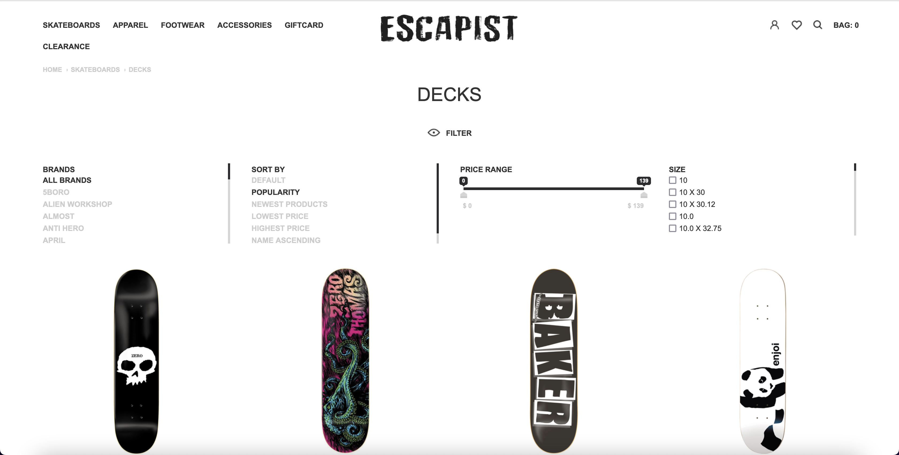
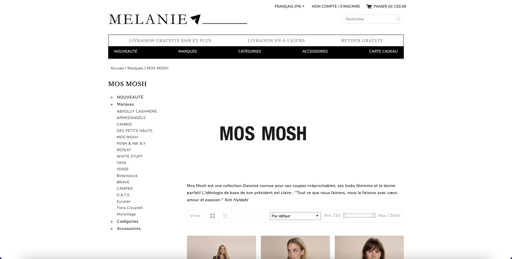

**Client:** Advision E-Commerce
**Role:** Freelance Front-End Developer

## Overview
As a Freelance Front-End Developer at Advision E-Commerce, I specialized in developing and customizing 
e-commerce interfaces integrated with the Lightspeed POS system. My responsibilities included translating 
Photoshop designs into responsive web pages using HTML, CSS, and JavaScript, ensuring cross-browser 
compatibility, and customizing receipt layouts within the Lightspeed POS framework.

## Challenges and Objectives
- **Design Translation:** Accurately converting Photoshop designs into responsive and functional web pages.
- **Cross-Browser Compatibility:** Ensuring consistent styling and functionality across various browsers, particularly for complex UI elements like forms and scrollbars.
- **Lightspeed POS Customization:** Tailoring receipt layouts and other interface elements within the Lightspeed POS system to meet specific client requirements.

## My Contributions

### 1. Responsive Design Implementation
- Converted detailed Photoshop designs into responsive web pages using **HTML**, **CSS**, and **JavaScript**, ensuring design fidelity across devices.

### 2. Advanced UI Customization and Cross-Browser Compatibility
- Styled complex UI components, including forms and scrollbars, to achieve a consistent look and feel across multiple browsers.
- Overcame browser-specific challenges by researching and applying best practices for cross-browser compatibility.

### 3. Lightspeed POS Integration and Customization
- Customized receipt layouts within the Lightspeed POS system to align with client branding and operational needs.
- Ensured seamless integration of front-end customizations with the Lightspeed POS platform, enhancing overall user experience.

## Outcomes and Results
- **Enhanced User Experience:** Delivered responsive and visually consistent e-commerce interfaces that improved user engagement.
- **Cross-Browser Consistency:** Achieved uniform functionality and appearance across major browsers, reducing user issues and support requests.
- **Customized POS Solutions:** Provided tailored receipt layouts and interface elements within the Lightspeed POS system, meeting specific client requirements and enhancing operational efficiency.

## Reflection
This role enhanced my expertise in front-end development, particularly in creating responsive designs and 
ensuring cross-browser compatibility for complex UI elements. Working extensively with the Lightspeed POS 
system deepened my understanding of integrating and customizing POS platforms to meet unique client needs.

## Technical Summary
- **Skills:** Front-End Development, Responsive Design, Cross-Browser Compatibility, POS System Integration
- **Tools:** HTML, CSS, JavaScript, Photoshop, Lightspeed POS
- **Specialized Tasks:** Design Translation, UI Customization, POS Receipt Layout Customization

## Gallery




