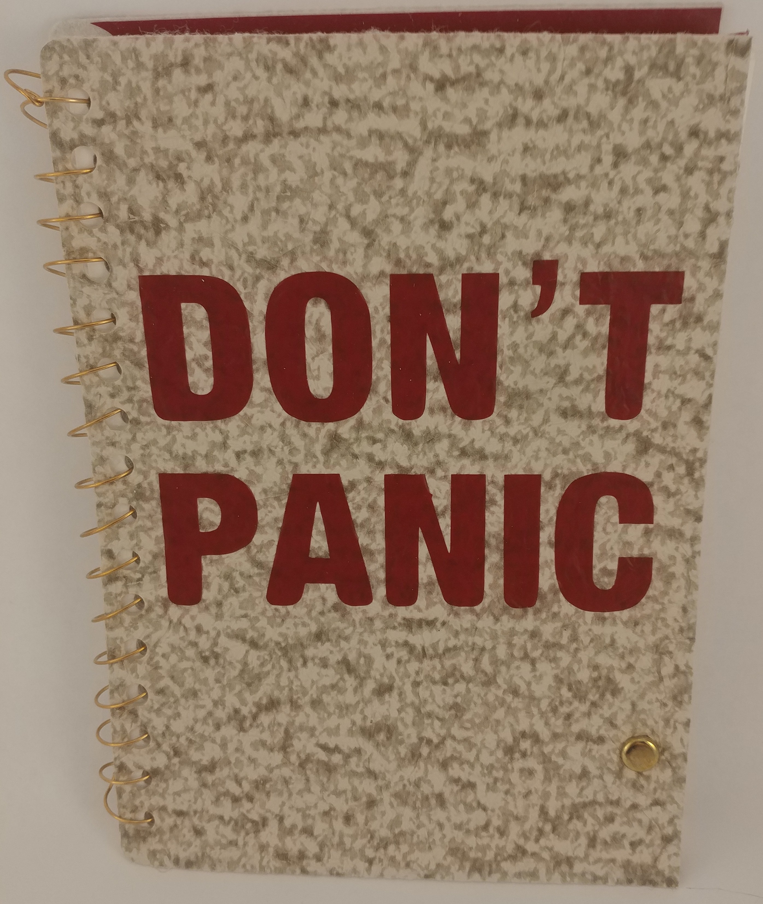
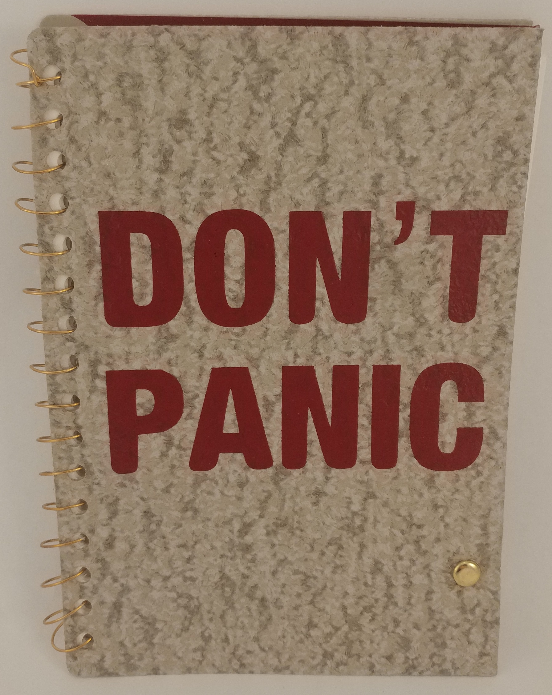
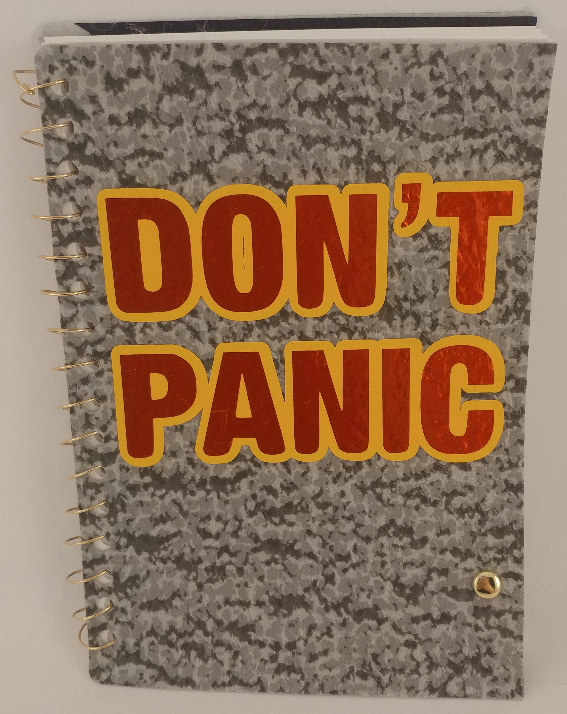
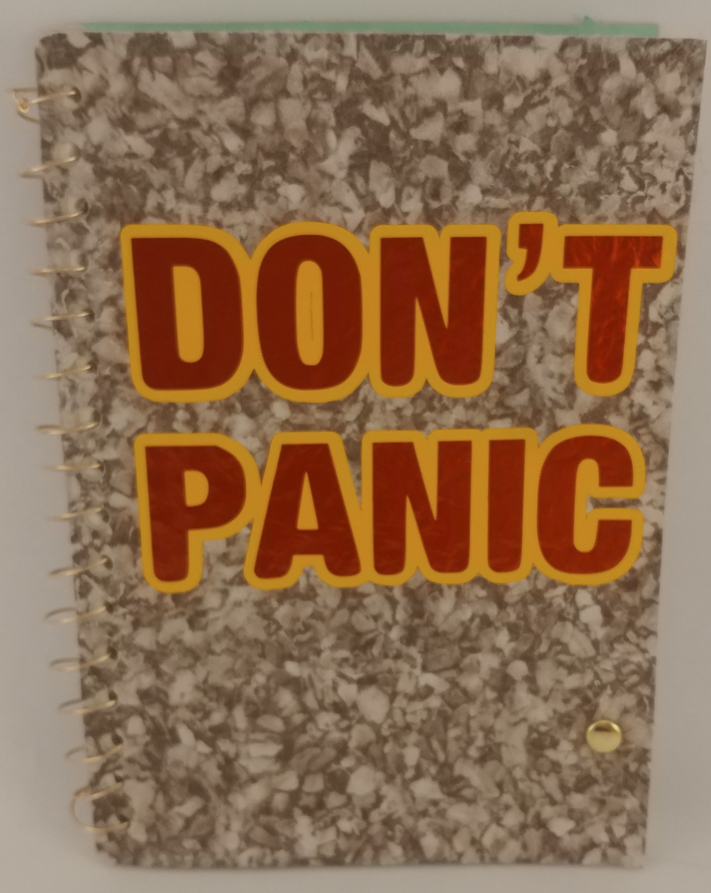
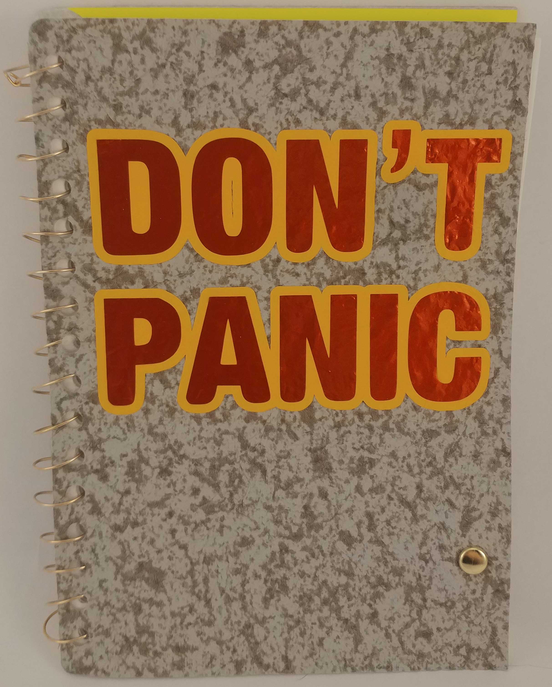
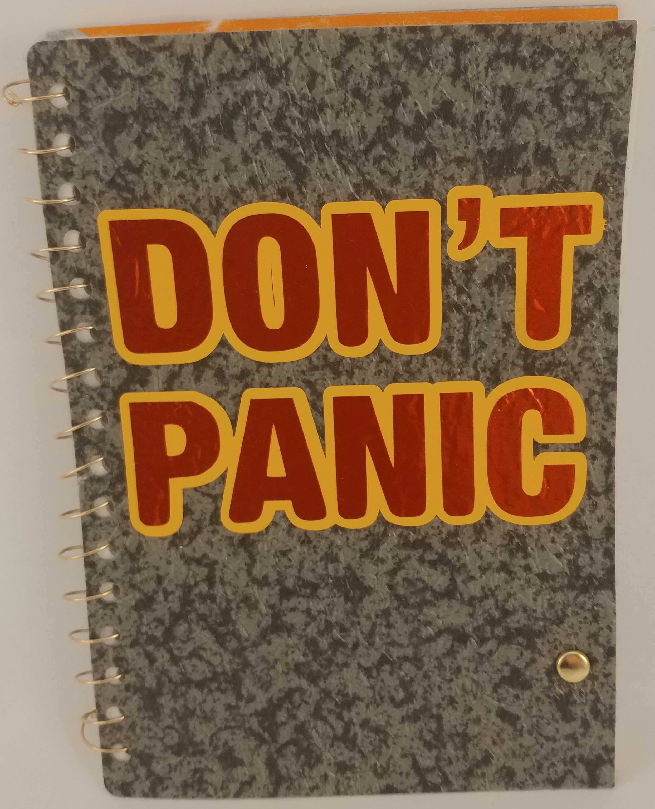
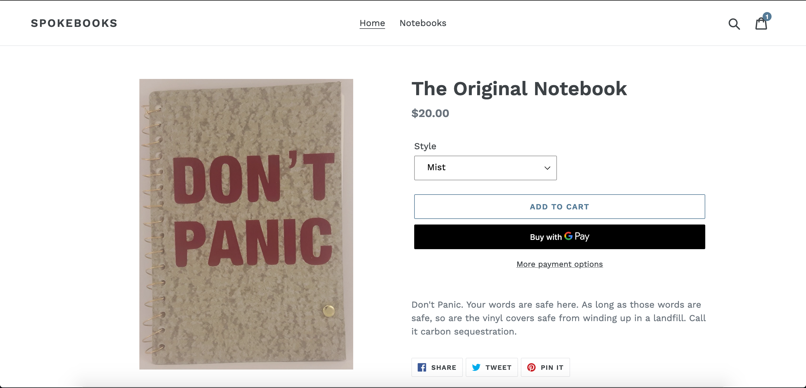
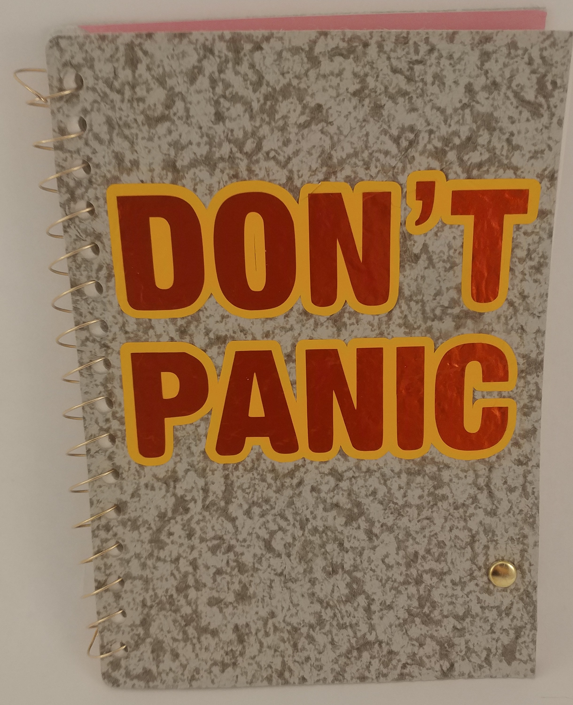
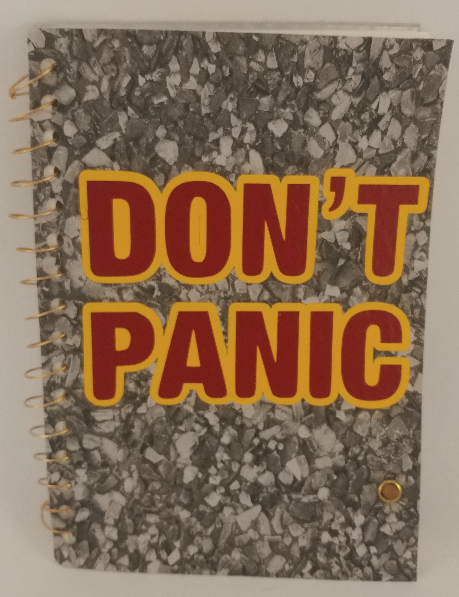
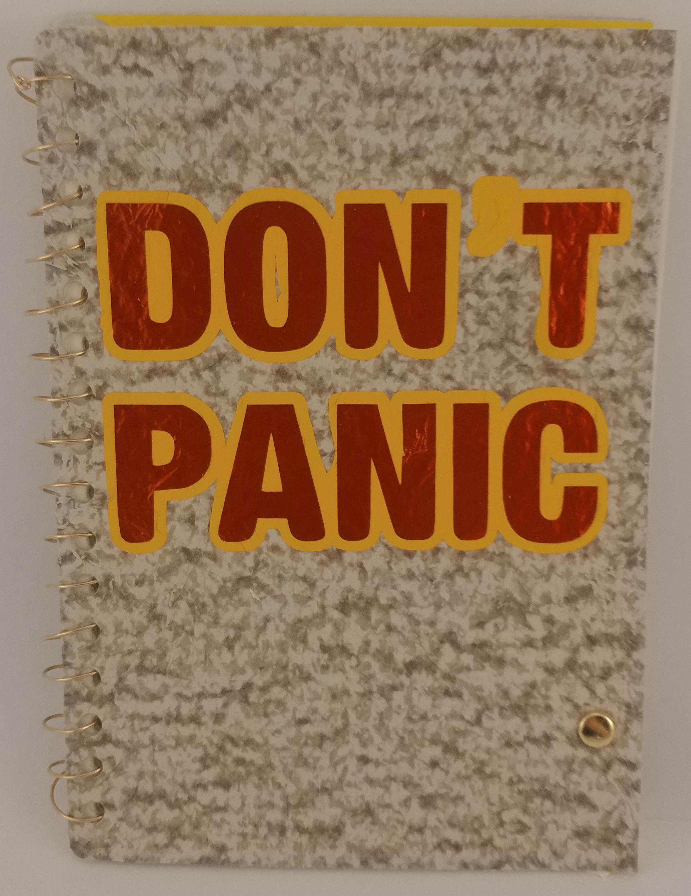

The question to build the perfect notebook.

It's an actual product that I built, and it's something that I use every day.
I iterated upon it until I had something I was really happy with, but never
successfully marketed it. The labour costs were too high, it was untenable, and
also marketing is effort, and I did things in the wrong order.

What this taught me was how long it can take to do good work. I did this for the
wrong reasons, basically, initially intending on something to make me mooney,
instead of simply appreciating the process, and seriously answering the question
of whether or not I can ever expect it to be profitable.

Nonetheless, I really like the notebooks. They measure 6" x 8 5/8" for the
covers. A bit smaller on the inside, so the colour on the inside of the covers
shows through. The paper is 24lb, which is strong enough to handle various sorts
of ink, although I use pencil. The covers are made out of expired vinyl flooring
samples, with heat transfer vinyl used to cover the felt, providing the exterior
of the notebook with a nice texture, and technically rendering it waterproof.

The entire thing is spiral bound in bronze, after punching holes and the covers with
an ancient commercial press. The press is actually the most time-intensive part
of the entire process. It has 8 punches, and requires pages to be punched twice,
supporting batch sizes of ~8. The commercial paper cutter I have has
dramatically improved the process of forming the pages themselves, if I had a
paper drill (or possibly even a calibrated drill press) I might be able to do it
faster.

As I said, I make these, and I actually use these. The newest version has 360
pages, on a 1 inch 14 ga bronze ring. Previous versions said "Don't Panic", but
the new ones haven't. I miss that message. It's presently up on my whiteboard
right now, and I think I might like to have that feature back in my life.

So, there's the story. I'd like to perhaps revise this, add pictures, etc, and I
can do that. But for now, there you are.

