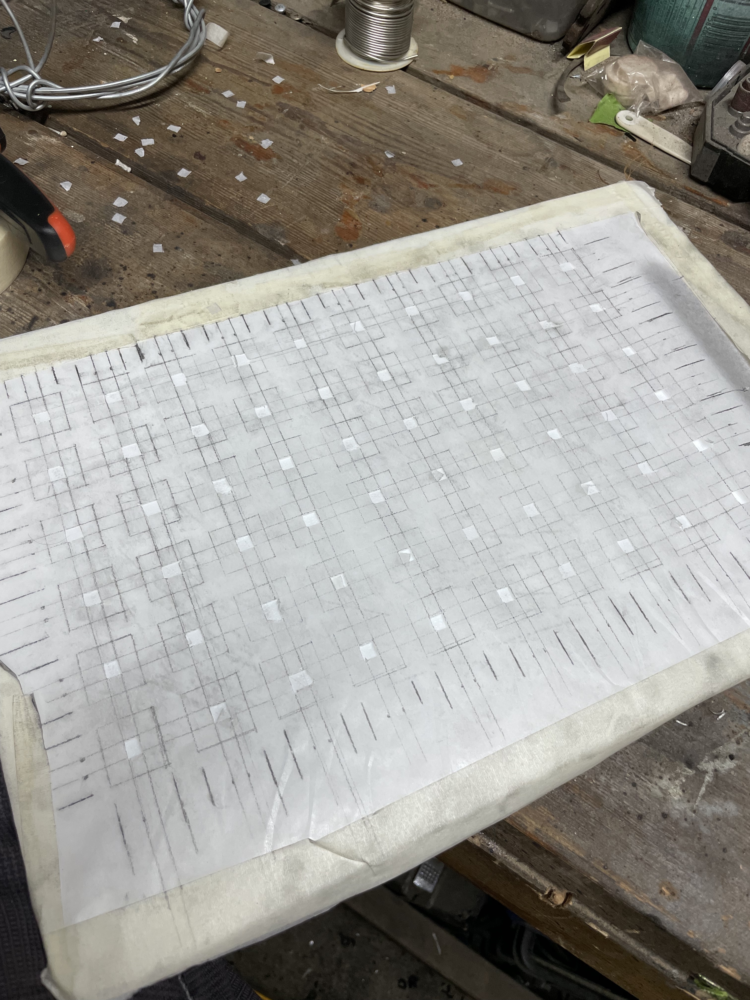
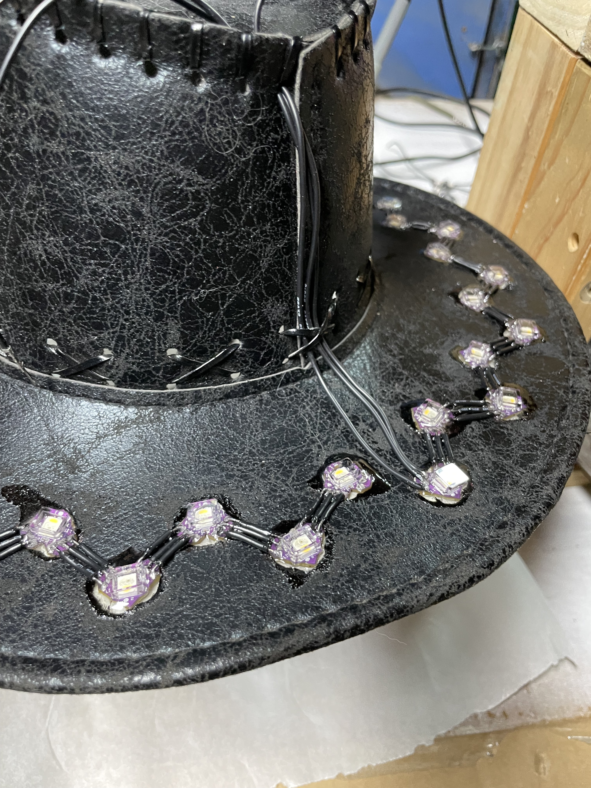

## Premise

This is not the first hat that I've made, nor is it likely to be the last -- the road to perfection is called repetition. 
What I sought to achieve here was to use the last remaining hat, and the same production methods as the last prototype, 
however to do so in a much more refined manner.

The primary failure of the last prototype had to do with weight - a substantial part of that was to do with errors 
I made during its construction, and so with consistent, steady efforts, over a period of days, I sought to do a good 
job, and make something worth having.

I feel as though I've succeeded. There are still lessons to be learned, however the body of the hat itself is 
quite solid, and I feel it to be a suitable vessel with which to test further iterations of the hardware.

## Construction

I was thankfully able to make use of my stepfather's garage, for this part (he is the artist/author of the dragon 
seen as the backdrop of the following photo).



The first step was to bore the holes, You're able to see the result of that above. Because the PCB's are not perfectly 
round, I first used an 11mm gauge punch on each of the existing holes, to increase the diameter, followed by a smaller punch on 
each corner, giving it the appearance of mouse-ears, but coincidentally making for a perfect fit for the Heart-Shaped PCB's I'm using for this project.

Once that was done, the next step was to mount the PCB's in each hole. Now these did fit somewhat snugly already, 
I opteed to go a step further, and apply masking tape to secure each PCB in its hole. Care had to be taken to ensure 
that each PCB was mounted with the correct side up (this was designed to alternate 1-2-1-2). 

The next step was to wire it up. For the last hat I used silicone-sheathed 22ga stranded core wire. I did so on the premise 
that flexibility was good, and that given this is a hat, it might be expected to flex. What I found in reality was that 
stranded-core wire likes to move around a lot, and given the short lengths being run, any benefits to be derived in terms of 
durability were rendered null, due to the solder wicking up into the cable, and thus rendering it into a solid state. Instead, I opted to use 
22ga solid black wire, which, though it had inferior insulation (and thus did become exposed during soldering) was vastly simpler to connect. This 
saved me countless hours, and vast frustrations in terms of the actual construction process, and was a very wise decision.

During stress-testing (taking this hat with me on a journey to the other side of the planet) I've not yet found the wiring to be a break-point. 
I did use stranded-core wire for the terminal connections, as these do move quite a bit more than the rest of them.

The final step was to secure the PCB's to the structure of the hat, add lenses, and apply waterproofing. To do that, I used 140° lenses I got off of 
Amazon, and placed them onto the top of the hat. I had 60 degree lenses as well, that I wanted to place on the bottom, however I wound up doing without. 
I used dollar-store epoxy to secure both lens to PCB, and PCB to hat. I took care to correctly mix them together, as the failure to do so last time (in a few cases) 
not only marred the structure of the hat visually, but also resulted in an extra ~50g of weight due to re-application of the epoxy. 
This was applied to the top, first, after which the hat was turned, and the process was repeated on the bottom.

I didn't use lenses on tbe bottom, as the diffusion provided by the epoxy itself is likely sufficient for my needs.





## Product
The end result was superior to my last attempt. I made use of the [power pack](/portfolio/3000-mah-power-pack) and 
[controller](/portfolio/esp32-s3-oled-led-controller) I'd made previously, which in theory should have worked fine, 
however instead wound up revealing certain deficiencies to my approach (which will be addressed later).

What was done well was my weight budget - I've worn this hat with me everywhere that I've been on this journey, 
and it's quite unobtrusive. This indicates to me that I'm on the right track.





## Lessons
I set out to make this hat in time for Shambhala, and by almost every metric I succeeded. I spent a couple of 
hours after work every day on it, took the time to do it right, and had it finished the night before I was due to leave.

The problem was that it didn't work. This has been a recurring problem - I took it with me despite its dysfunctional nature, 
and the first time it turned on properly was going through securing in Japan. It's worked sporadically during demo's since, 
however I've found that the firmware that I'm using, combined with the useremods that provide a UI have been very, 
very unreliable.

The hat itself is quite sound - the problem has now come to be with the supporting technologies.

A part of the problem with the firmware relates to the power system. Because 3.3V is being providede by a LDO regulator 
on the processor board, once the battery power drops too low below nominal (3.7V), there's no longer enough voltage to drop 
while maintaining a 3.3V output. Once it drops too much below that, corruption of the configuration files seems to be the 
inevitable result, and that results in a dead hat (at least, until I re-flash, and re-charge the unit).

The other part of the problem is with the firmware itself - it's experimental, and though I've gotten away with that for a while, 
it's come time to get back to something I can trust.

What this leavese me with is a solid body of work to pursue in the future, however I can rest easy, knowing that once 
that is done, I have a solid hat, suitable to graft these solutions onto, and continue down the path to turning this into a 
marketable product.

