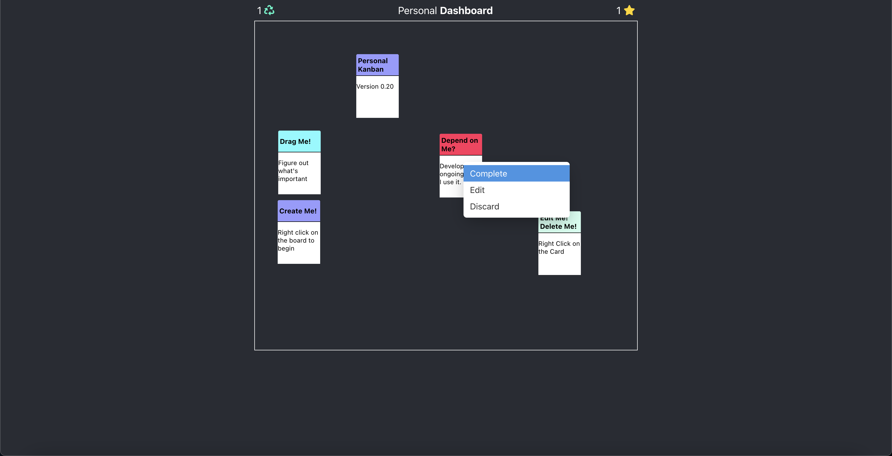
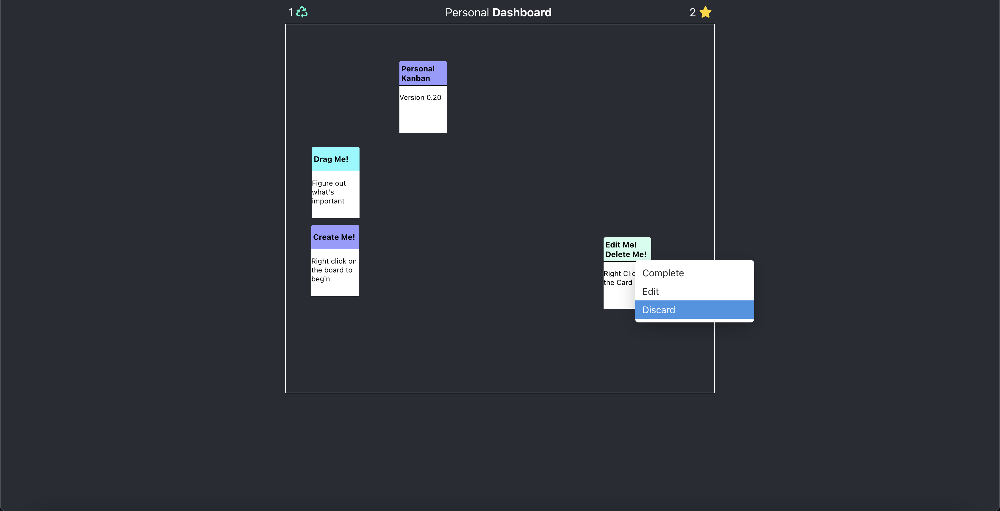
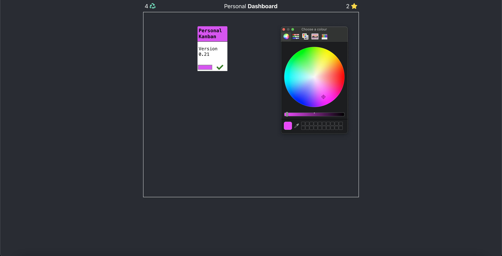

Now, why I made this is a little bit funny, and a little bit sad. I had applied
to a company called C.B.S. - Convenient Business Solutions. Wrote them a
heartfelt letter, and made it through two interviews. They turned me down,
because some gatekeeping nerd wasn't impressed with what I knew of React...

I saw that the job was re-posted, but, having just gotten rejected I was a
little bit low. I figured, fuck it, let's make something in a week that'll
change their mind.

I took that week, and what I made was not going to change anyones minds. So I
put another week into it, and another. What I wound up with was this:

Core premise is that it's a kanban board. That's not novel, you see those lots
of places. Asana. Trello. Etc... But this is different. Those tools all have
mandatory granular rows and columns... I find it to be limiting. I like to move
cards around, and I just so happened to have built the pocketbooks for the
cards, and the board was a set of blinds I'd acquired from a Goodwill in years
past.

So, I had these boards physically, but, in the process of making this Dashboard,
I had also given notice to my landlord, and still had no job. So, basically end
days. And I made this instea dof worry about it. I worked full time at this
project, and it's sad, because it's actually a little bit better than you can
find on the live version. I had more code, but I apparently never pushed it, and
that laptop wound up being wiped without it ever being uploaded.

It's okay. The story continues with the next slide. I got a job, and everything,
and it was cool.
