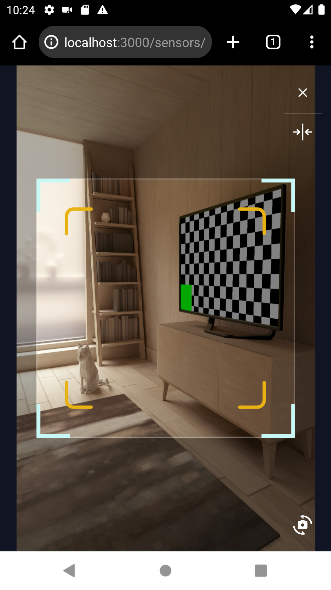
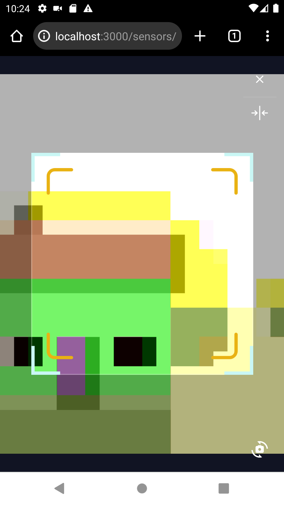
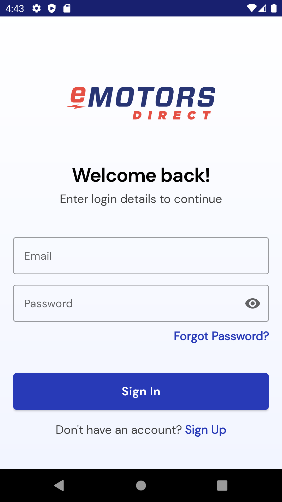
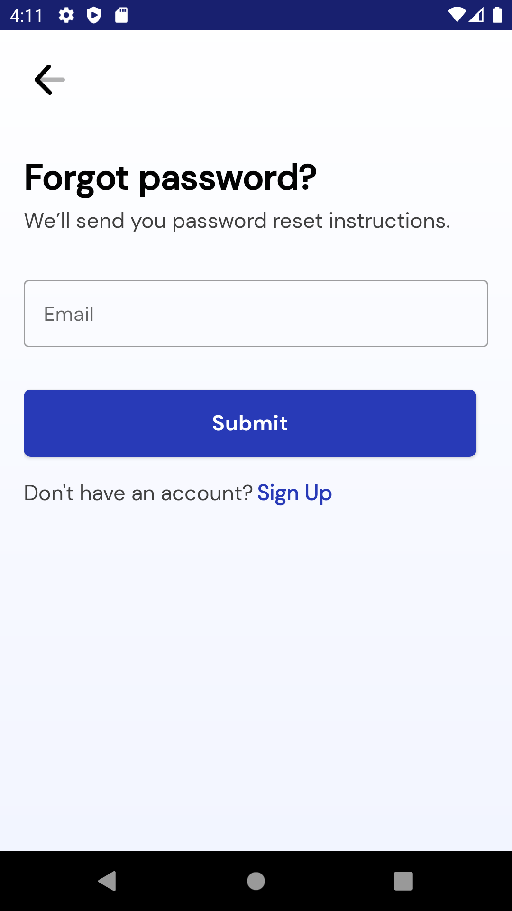
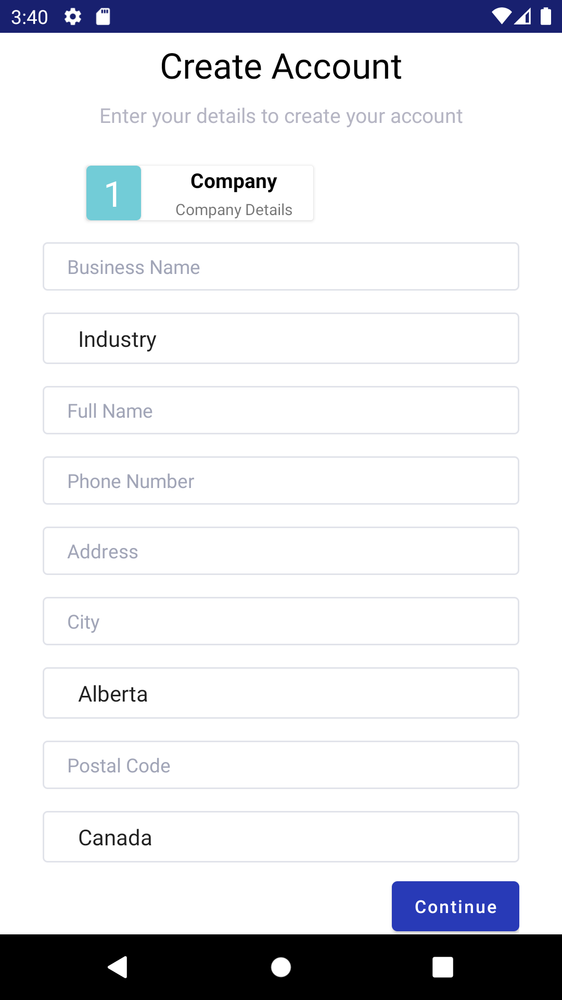
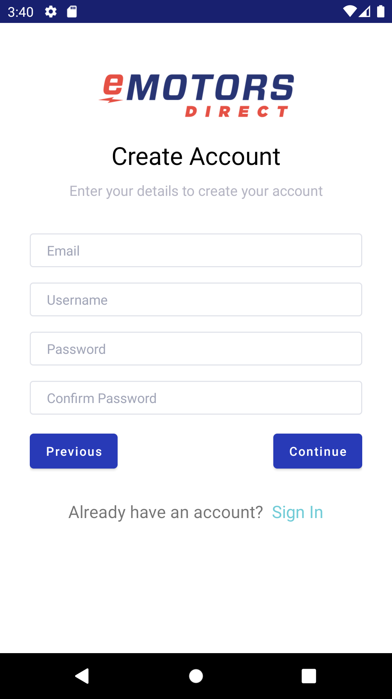
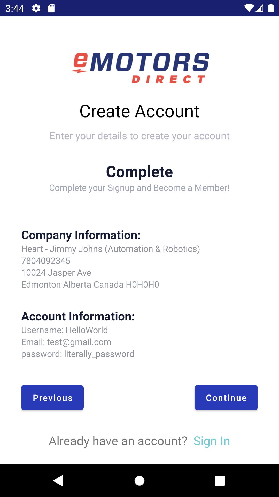
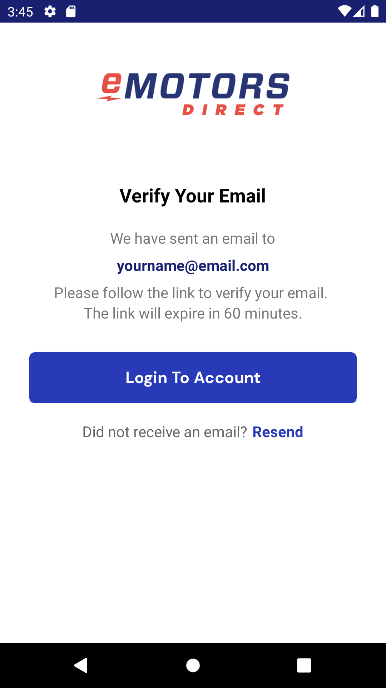

## Foreword
I joined eMotors in May of 2023, after applying for an Intermediate-Senior Front-End Developer position. This 
was not a concerted application - it was borne of a flurry of applications, itself borne out of utterly dire 
financial straights. However, upon learning about what the work entailed, and after a single interview with 
Andrey, the CTO, I realized that what we were doing was in fact very closely aligned, and I said as much in a 
follow-up e-mail that I sent to Andrey. 

He offered me a position with the company as an Intermediate Full-Stack Developer. I made several mistakes, 
however, before I'd even begun, and I'd like to point these out, as a vehicle for my own growth, as well as 
to provide anyone who might be reading some lessons to take home.

### Negotiation
The first I made was in not negotiating upon the terms of the contract. This is something worthwhile to do with 
every position you're looking to start, because as much as you might like to imagine that, in 6 months, with 
more experience, you'll be suitably rewarded for the improvements in your skills, and alignment with the project, 
this is unlikely to be the case. You're going to wait a year before your circumstances will materially be 
improved, and it's importing that, if you're going to say yes, you're saying yes to something you're genuinely 
excited about - not just now, while you're desperate, but also in 6 months, when you'll be looking at other 
positions, in other companies, and won't necessarily feel some terribly sense of lack, on account of a lack 
of initial negotiations.

#### Salary
The offer I received was fair. The position I applied to was listed as being from $60,000 - $80,000 a year, and 
the range that I provided was from $60,000 - $90,000. They split it in the middle, and that was fair, however 
I could have negotiated a bit harder, and asked for $80,000. In fact, I found myself running broke off of $75,000, 
when my outside pursuits were factored in, and though it seems small, an extra $416.77/mo (before tax) every 
month would have easily been the difference between living comfortably, and feeling like I didn't have enough. 

Unfortunately, there were several points during my employ where my feelings aligned with the latter, making 
this my first mistake.

#### Vacation
The offer that I signed provided me with 2 weeks of vacation per year, with the possibility to work extra 
hours, and bank time if I wanted more. That's "standard", if you're in America, however it's not good enough. 
Two weeks of vacation per year says that you don't deserve to have fun, and that's bollocks.

That being said, the opportunity to bank time was in fact quite reasonable, on account of the Family Values 
that the company upholds. They don't want you to work overtime, or weekends (and in fact, doing so is actively 
discouraged)Two weeks of vacation per year says that you don't deserve to have fun, and that's bollocks.

That being said, the opportunity to bank time was in fact quite reasonable, on account of the Family Values 
that the company upholds. They don't want you to work overtime, or weekends (and in fact, doing so is actively 
discouraged). Those are very positive votes, on the topic of culture, and I commend them for that. Nonetheless, 
my 2nd mistake was in not pushing for 3 weeks of vacation from the outset.

Saying that, I'm fairly sure that number would have gone up after a number of years of service, but that's 
besides the point, unless that number of years of service is no more than one. While this may have been a 
standard contract, that was not enough vacation time for me to live in a manner that I'd consider healthy, 
and regardless of whether everyone else said yes to it, I was mistaken not to ask for what I actually needed.

#### Remote Work
This is perhaps the most egregious mistake of all. The whole I got into tech was to provide myself with the 
faculty to work remotely, and travel while I did it. I was asked, during the interview, if I was looking to 
go into the office, or work remotely, and I sold myself out, and said Hybrid.

I was scared. I desperately needed this job. I was afraid that if I asked for what I actually wanted, that I 
would be rejected, and so I said something that I thought was wanted to hear. I then proceeded to sign a 
contract that obligated me, very specifically, not to live my dream. While I was desperate, that was okay, 
but that desperate didn't last long, and I've found that in very instance in which I've said yese to something 
that fails to meet my needs, the psychological effect is absolutely corrosive on my health, wealth, well-being, 
and happiness.

What's more, what I wanted was in fact quite reasonable (just look at the way that Digital Nomad has entered 
into our public vernacular). On my 2nd day, I spoke to Andrey about it, but even then, I sold myself short, 
and said that despite what I'd claimed in the interview, I was looking to travel abroad, and work remotely 
for a month. He said I just neeeded to talk to him (reasonably man, that he is), however even that wasn't 
entirely true. My journey has now stretched for 3 months, and is unlikely to abate soon, and this is what 
I really wanted to do.

Could I have done it while working here? Had I been honest about what it was I wanted, I truly believe 
that the answer was yes. By failing to ask for it, I allowed a maelstrom to brew within my psychological 
condition which would ultimately lead me to get nothing that I wanted. This has been a recurring theme.


## Camera Switcher
The first week of the job, I was assigned to add a feature to the React front-end. The way that it initially 
worked was to use the rear-facing camera to scan for a QR Code, which was then used for device provisioning.

The feature request came from the Project Manager. His phone had multiple rear-facing cameras, and he was 
having trouble correctly registering the QR Code. I was tasked with implementing functionality to change between 
the different cameras available on the device.


  
  


The feature was implemented within the bounds of what's possible - that didn't turn out to be choosing between 
multiple rear-facing cameras. In theory, it should have been - there were multiple cameras on his device, as 
well as on the device I was using to test. Unfortunately, the device I was working on was a Huawei P20 Pro, which 
turned out to present issues, when it comes to addressing those cameras. What I was able to do was to implement 
functionality to switch between the front-facing, and rear-facing cameras. This seemed to be possible to do 
accross a wide swath of different devices, using a fairly standard set of API's.

The feature was successfully delivered, although in retrospect, I'm not sure that it was done so in an 
entirely satisfactory manner. I do recall the desired functionality being technically possible, however it was 
largely limitations borne of hardware that kept it from being implemented. Had I dropped several hundred dollars 
on a new phone, with which to test this niche feature during my first week on the job, it might have been 
possible to implement more fully.

### Code Samples

#### React
```javascript
import CameraSwitchIcon from '@mui/icons-material/Cameraswitch'


useEffect(() => {
     const getFacingMode = async () => {
        const devices = await navigator.mediaDevices.enumerateDevices()
        let deviceIds: String[] = new Array()

        devices.forEach((device) => {
            if (device.kind === 'videoinput') {
                deviceIds.push(device.deviceId)
            }
        })
        if (deviceIdList.length === 0) {
            setDeviceIdList(deviceIds)
        }

        if (deviceIds.length === 1) {
            setFacingMode('user')
        } else {
            setFacingMode('environment')
        }
    }
}

const switchFacingMode = async () => {
  if (deviceIdList.length <= 1) {
    return
  }
  if (facingMode == 'user') {
    setFacingMode('environment')
  } else if (facingMode == 'environment') {
    setFacingMode('user')
  }


<>
  <div className='qr-reader-bottom-options p-4'>
    {/* Switch Front/Back Camera */}
    <div>
      <button
        type='button'
        onClick={() => {
          switchFacingMode()
        }}
      >
        <span className='sr-only'>Switch Camera</span>
        <CameraSwitchIcon/>
      </button>
    </div>
  </div>
</>
}
```

#### SASS
```sass
.qr-reader-bottom-options {
  position: fixed;
  bottom: 0;
  left: 0;
  width: 100%;
  z-index: 1;
  //align-items: end;
  justify-content: end;
  display: flex;

  button,
  button:focus {
    position: relative;
    color: #fff;
    svg {
      font-size: 2rem;
    }
  }
}
```

## Upper Bound
Initially, the plan as that I come into the office, and slowly work up to the prospect of being remote. Luckily, 
my 2nd week of employment was the Upper Bound conference, and I had a ticket. Not only that, but Andrey, and 
another developer, Leo, were both going. I sensed that my presence there wasn't exactly planned - that this 
was something awarded as a result of priviledge, and seniority, however I clearly managed to jump the shark.

This was my first foray into AI, and I took a lot of notes. I attended a lot of talks. I made a lot of connections, 
and I learned a great deal about what, exactly, AI is, how it's done, and what you can get out of it.

There were two main directions that I saw it going - academic, and practical. On the academic side, you had 
well-funded teams of students, professors, alongside sponsoring companies who measured their progress based upon 
how effective their model was at playing video games. This is a useful model - it's something a person can 
do, get better at, and play competitively. What I saw was that, at least in the exceptional cases, that these 
models were in fact capable of becoming very, very good at what they were tasked with; even beating humans.

On the practical side, I saw businesses who, after investing substantial quantities of money, and man-power, 
were able to leverage the technologies for practical applications. Given that this was a venture eMotors 
themselves were intending to leverage, I found this to be the more interesting avenue.

### Team Building
We took a break from the conference for half a day, and met up at the office for pizza. Pizza gets a bad rap, 
when it comes to the workplace - I see memes about pizza parties being provided in lieu of adequate compensation, 
or any fungible (monetary) reward. I'll beg to differ here - it was genuinely a pleasure to spend time with 
the rest of the company, get to know them, and to get fed in the process. We had pizza, and wings, and soft 
drinks, and we got to know each other on a level we otherwise wouldn't, on account of the disparate nature 
of our departments.

This is pertinent because, though eMotors Direct was something of a startup, it was grafted on top of the 
existing business - Universal Rewind. The company was founded by Chris Beaton, some 20 years before I 
ever got to become a part of it, and it had continued to grow from there. The original order of the business 
pertained to electric motor repairs, which, if you know anything about motors, can entail rewinding them 
with copper (hence the name). From that business was borne eMotors Direct, the premise of which was to serve 
the primary market, arranging for sales of the motors from their suppliers, and making sales, which would 
then ultimately serve to feed back into the core business of reparing those very motors.

What I did was in fact somewhat isolated from these core businesses - I worked on the tech side, which was 
utterly dwarfed by the number of people working in sales, and what's more, i was working on a new product, 
still in development, and so the number of people I had to speak with, on a day to day basis was but a 
handful.

After pizza, we went to Activate, and we had fun. We split up into teams, were given fobs, and spent the next 
couple of hours working together to accomplish a variety of meaningless, enjoyable feats. Sometimes we tossed 
balls, sometimes we climbed rocks accross a chasm. The most fun that I remember having was akin to playing 
"The Floor is made of Lava" as a child, where we had to navigate through a series of levels, avoiding the 
bad blocks, knocking out the good blocks, all while avoiding certain death, and respecting the time limit. 

We went hard. I was on a team with Jill Wallace, and we kept going until we were all out of breath, trying, 
and trying again, and doing our damnedest to beat every level they threw at us. I won't pretend that we 
succeeded, however this game was our very last of the day, and on some level, we all knew that, and enjoyed 
it to it's very fullest.

These are memories I hold fondly.
### The Party
I didn't actually wind up seeing Andrey and Leo for most of the conference - I was late in my application 
for the talent bursary, and by the time I went to book my sessions, the main sessions for several of the 
talks were already full, leading me to join the televised "side-session". We ran into each other at a few 
different moments, however I found our footprints to be quite distinct. They went together, as representatives 
of the company, while I walked alone, attending what I most saw fit, and interacting with a great many more.

Perhaps the choisest of the interactions came about during the party. If you've ever attended a conference 
before, you'll know they throw sick parties, and Upper Bound was no different. I didn't run into my 
co-workers there - Andrey had a family, and Leo had a girlfriend (wife???). I am... untroubled by these 
considerations, and even if I was, I'm still not one to say no to a party.

The venue was sick. They provided a free drink, to which I imbibed, and I enjoyed the wonderful opportunity 
that is talking to the next generation of developers; the students, still deciding on what it is they're 
looking to do with their lives, and careers. I shared accumulated wisdom, concerning the difference between 
going corporate versus a startup, and talked about my own venture. The choicest question I remember being 
asked was hwo I managed to balance working a full-time job, alongside working on my own project/company.

I'm not sure that I really did. There were many days where I got 4 hours of sleep, having worked for 8 hours 
working my job, hitting every networking event that existed, and then working to realize my own vision, on 
top of it all. There's a reason I was at the party, but none of my co-workers were... they had someone to 
go home to.

#### Kobold Completions
One of the [talks](https://www.youtube.com/watch?v=Ilza3KuRHKg) that I attended, concerning the practical applications of AI was given by David Cooper, of 
Kobold Completions. I just so happened to run into him at the party, playing a game of Pong. I introduced 
myself, and upon finding out who he was, told him how great it was to hear from someone who'd practically 
applied AI to solve an actual business case. We talked for a while, and he expressed an openness to connect 
further, having expressed that the company I worked for was likewise interested in the applications of 
machine learning/AI.

Why does this stick out? Because sometimes the best way to get to know someone isn't in the office. Sometimes 
the best way to connect is when everyone's had a couple drinks, inhibitions are lowered, and mingling comes 
more freely. A lot of people in tech are not so inclined - they might not feel themselves suited to speak 
with customers, nevermind the speakers at a conference. I do not suffer this problem, being something of a 
brave butterfly in the circles I run in.

## Java (Android)
The actual task at hand was the implementation of Push Notifications on Android. This was a single card on 
the Scrum board, however given that there was no actual faculty to figure out which user was using the 
application (and thus, who to send these notifications to) the obvious first step, to me, was to setup 
Authentication.

### Authentication
To do this, I used Hilt for Dependency Injection, RxJava3 to make use of Async functionalities (as opposed 
to doing it with Kotlin coroutines), Retrofit and OkHTTP for handling API calls. Kotlin was installed, primarily 
because I was getting errors withoutit, and then Lifecycle was set up to avoid memory leaks in the process.

The simpler way to go about this would have been using Kotlin - however given that the application itself was 
otherwise written in Java, and I was also new to Java, I decided against adding a new language to the mix, 
and figure out how to implement everything using Java.

The pattern I used for implementing the feature can be found [here.](https://proandroiddev.com/jwt-authentication-and-refresh-token-in-android-with-retrofit-interceptor-authenticator-da021f7f7534\#27c4
https://proandroiddev.com/jwt-authentication-and-refresh-token-in-android-with-retrofit-interceptor-authenticator-da021f7f7534\#27c4)


  
  


### Architecture
The tricky part about this is that, given I was new to Android/Java, the natural place that I'd look to find out 
how it's actually done is to read the documentation. The documentation for Android listed a series of Best 
Practices. None of these were actually implemented within the application, given it was based upon a project 
released by EspressIf, and subsequently worked on by a bunch of Juniors (read: no consistent pattern to follow).

To resolve this, I set about to implement the bulk of the best practices I was able to find. This included 
MVVM, Single-Activity, Multiple Fragments, NavGraphs, and pretty much everything else I was able to find 
out by reading the official Android documentation. This wasn't immediately done - over the span of three 
months I ultimately wound up re-architecting the entire application, cleaning up the code, and laying down 
solid patterns composed of officially recommended Best Practices.

This was done incrementally. Initially I setup the Authentication feature to make use of its own Activity, 
with several Fragments, and then passed it on to the main Activity, which handled the rest of the application. 
To handle the shared data I created a Singleton ViewModel with Application scope, to ensure that authentication status 
was capable of being passed between the different levels of the application.

### Settings
This feature already existed when I got here, however there were inconsistencies in the layout that nobody 
really cared to have resolved, so I learned what I needed to get it there, and fixed what I found faulty.

I also used this feature as a test-bed for what it would take to re-architect the rest of the application to 
make use of the single-Activity, multiple Fragent pattern. This initially lead things to be somewhat disparate 
- there was a Settings Activity, a Login Activity, and then a Main Activity, with everything else. Because 
of the Singleton being used for Authentication, this wasn't actually a problem, and I implemented a NavGraph, 
child Fragments inside of the Activity, annd a fuller use of the Preferences component.

This didn't actually take long, and I left the feature in a much cleaner state than I found it.

### Reset Password
I added Fragments for a Reset Password feature, and added them to the Login NavGraph. This didn't take long, 
in part because this was functionality already implemented on the back-end. At the same time, I improved the 
layout for the Login page to follow the styling of the primary web-app.

  


### Registration
Given that I'd implemented everything else to do with the Authentication flow, the logical next step for me was 
to provide a faculty for Registration. I actually did most of the work here, nestling the functionality within 
its own NavGraph, which meant that once the Registration flow was exited (either through a completed registration, 
or through exit back to the login) all entered/stored data was rendered null. This was very convenient for UI 
purposes.


  
  
  
  


It's also at this point that I realized I may have gone astray of the intention of the feature, as when 
providing details of my progress during one of our standups, Andrey "subtly" indicated that this was something 
he saw no value in, rather being fine with forcing our users to Register using the WebApp, and only then being 
able to sign in to the Android app.

I nonetheless left it in, as substantial work was done on my part to enable clean handling of the provided 
data. It was at this point that I'd roughly mastered making use of ViewModels, moving the data around, and 
passing it to wherever it needed to go within the Application. Work remained to be done with regards to 
actually Validating the provided information - had this work been valued, I could have continued onwards, 
and done a great job, however given the provided direction, I decided instead to stow the work, and move on.

### Push Notifications
It's at this stage that there was actual back-end work being required, and this work was largely done 
simultaneously for the implementation of this feature.

I modified the Login flow to contact the API Server, and hit the created Device Registration endpoint 
on Login. This worked to register the device, however due to the initial way that the feature was 
designed, it did not allow for the device to be unregistered (and thus the knowledge of notifications not 
to be sent to be gleaned).

That required re-structuring the Authentication feature. In the process of doing this, I cleaned up all 
of the other works-in-progress. I cleaned up the code for everything that I had written, making it easy 
to follow, and I implemented a LoadingFragment to serve as a bridge between the Authentication flow, and 
the rest of the Application (so as to enable we had a middle point that still had access to all of the data 
we needed when logging out, to ensure that notifications wouldn't be sent to people who no longer wanted them).

##  PHP (Symfony)
Up until now, the work that I'd been doing was relatively isolated. I was working on an Android app, and though 
I did have some help, it was primarily with the UX by Marjorie, one of our new hires. I did my best to give 
her what she needed to succeed (which was precisely what I wished someone would give me, when working 
together).

My experience on the back-end was something else. Initially it was fine, or at least it seemed fine, but 
that was because I was working off of a branch that hadn't been updated since December (and it was late June 
when I began work on this segment in earnest). It took a few weeks before I realized the discrepency, 
however this was only the beginnings of the problems. Unlike work on the Android side, I was given the 
opportunity to collaborate with Leo, another developer, on the back-end, and unlike my experience working 
with Marjorie, we really didn't get along.

Not that I disliked him as a person. Rather, it's more that our relationship devolved into what I would 
best describe as petty passive-aggressiveness. Communication was poor, slights became mutual, and various 
cultural dysfunctions were revealed. 

Could I have done better? Absolutely. What struck me most was the difference in my experience in collaborating 
with Marjorie, versus Leo. I went out of my way to give Marjorie everything that she needed, and in the event 
I failed to do so (and let her down), I was incredibly motivated to resolve this deficiency.

We are all, however, different people, and as I said, I found my experience in callaboration on the back-end 
side of things quite different/difficult.

### Annotations and Attributes
One of my first orders of business was borne out of beauty - upon starting the back-end server, I saw a 
plethora of warnings pertaining to annotations being depricated, and unsupported. I, meanwhile, looked 
at the code, and saw the currently implemented annotations as being quite unsightly, in contrast the relatively 
more "beautiful" attribute syntax.

So, I set out to fix that. The logic was that, given we were presently operating on an unsupported version of 
Doctrine/ApiPlatform, and that any supported version required making the switch from annotations to attributes, 
that this was work that needed to be done eventually.

Obvious, to me now, is that it's quite common for production applications to continue operating with this 
plethora of warnings, and so long as it works, then the tendency is not to touch it.

I decided to touch it, and I was very careful in so doing. I updated the version to one that supported both 
annotations, and attributes, and then used Rector, in combination with a configuration I sourced from the 
community to convert all of the annotations, throughout the application, into attributes. I then proceeded 
to exhaustively test every listed API endpoint in ApiPlatform, and ensure that it still worked as expected 
after the change.

There weren't automated tests for this, so it took me a solid day, but in so doing, I did come to understand 
the infrastructure quite well, and I confirmed that, as expected, I'd done a good job.

The problem here was that, because I was working on an old version of the application, these changes were not 
ready to commit until 3 weeks later. That merge was hell, however I resolved all of the conflicts, applied 
these changes to anything that had changed in the six-month gap since, and made it work well.

The problem here is that this was a fairly major change to the codebase. I was conscious of this as I did it, 
and I made that change successfully. I'm fairly certain that Andrey (our CTO) then proceeded to spend another 
day of his own time, verifying everything that I'd already verified (because there were issues with trust on 
this team).

He wasn't exactly happy that I'd done this - nobody had asked, after all. I'm the sort who takes initiative. 
I do so conscious of the risks that it entails, and I successfully mitigated those risks. 

Near as I can tell, Andrey then proceeded to ask Leo to do fundamentally the same thing as I'd already done, 
only he did so poorly, and proceeded to wipe the annotations from the entire application. The problem with 
that, is that not all of the annotations pertained to ApiPlatform. There were others that were for PHPDocs, 
which provided Type information to be intuited, and thus were still quite useful. Out of his ignorance, he 
programatically wiped them all.

### Device Registration
In order to implement Push Notifications, I needed to provide endpoints that allowed for Device Login/Logout.

The obvious solution was to use Controllers, which was the pattern I saw being used throughout much of the 
application. The problem with this is that, when doing so, these endpoints weren't being documented automatically 
using ApiPlatform. I found this automatic documentation to be very helpful when testing my changes to the application, 
so I read through the documentation, and found out how to implement this feature in a manner that retained 
this benefit of ApiPlatform.

I used Actions, instead of Controllers, and ApiResource attributes to ensure that custom endpoints are 
documented in teh same fashion as the automatically generated endpoints. I then proceeded to change the 
annotation keyword and types, enabling a custom summary and description of the endpoints in the OpenAPI Documentation. 

I then took this a step further, using a Controller to handle the response, a Repository for record lookup, 
a Service for record modification/storage, and Entity for a model. The Controller was structured using 
Actions, which enabled the defintion of routes on the Entity class, instead of within the controller. This 
enabled the OpenAPI Documentation to include the custom endpoints, while also ensuring a separation of 
concerns.

### Create Super User
Coming from a RAILS background, and being used to the ready availability of certain convenience methods, 
accessable from the command line within the root directory, I found that it was possible to provide 
the same features by defining a Command within Symfony.

This was the initial command that I found lacking, and the first that I created. For expediency, I didn't 
totally implement this functionality, instead requiring that an account is created through the registration 
flow on the front-end, and then running the `php bin/console app:createsuperuser <email>` command. If the 
account is not yet verified, then it will be marked as verified, and in addition, it will be provided with 
super-user privileges.

### Documentation
Documentation of this application was very scarce, and I found this to be problematic, because actually, 
it was quite complex, consisting of two different front-ends, a back-end, mobile, as well as a few 
microservices. I documented how these parts interconnected, and the steps required to bring the local 
environment up to a level where it was possible to test features locally, instead of doing so in production.

This took a lot of work - I had to talk to a lot of people, find out how the manufacturing flow worked in 
production, and figure out which applications talked to which applications to create the required models 
in the required places to enable the application to work as designed.

I succeeded in doing this, and then I documented it in the README, so that anyone coming afterwards would 
have a very low barrier for entry into understanding how the application worked, as well as setting up their 
local environment such that they were capable of locally testing their changes.

Additionally, during the process of documenting this, I also converted many of the endpoints to use the 
ApiPlatform Actions syntax, which resulted in any endpoint I touched being provided with automamtic 
documentation, and the easy means to exercise/test the endpoint.

### Push Notifications
With every conceivable improvement having been made to the patterns encountered, I set to work actually 
implementing the Push Notifications. I started with Temperature, and Low Battery, which were fairly 
simple to implement, tested, and found to be working.

The remainder of the functionalities proved more difficult to test. They pertained to triggers that came 
about from data that was programatically processed using the ProcessSensorDataQueue command.

The result of this is that I had implemented the functionality, however I had no way of knowing if it actually 
worked.

#### QueueSensorData
To solve this problem, I created the QueueSensorData command. I used the ZenStruck Foundry package to 
programatically instantiate thousands of models with data of the correct type, such as to be correctly 
processed by the system, and ultimately enable me to exercise the functionality I'd created.

Doing so requitred me to understand, from top-bottom, what messages were being passed, what the data looked 
like, and then to create it programatically.

I did this, and I successfully exercise my code. In so doing, I discovered that only a part of the feature 
was working. The problem was not with anything I wrote, but rather was a hidden defect in the code that I 
was depending upon, written by Leo.

#### Quality
This was a problem, because this code was absolutely dreadful to read. The logic was contained within 7 layers 
of nested if/for statements, and what's more, the way that it was architected, it was actually impossible to 
change the notification emails that were being generated without completely refactoring the logic.

I set out to do this, but it was a thankless job, and the more that I did it, the more I started to hate myself. 
Deep inside I felt a rot. I'd been putting in vast amounts of effort to make use of Best Practices, thinking 
through my changes, and documenting them, so that others wouldn't suffer unduly.

This wasn't a sentiment that was shared, but what's more, this work that I was doing wasn't really valued. 
I tried very hard to do the things that I viewed as important, as a Developer - every forward thinking 
thought that came to mind. I sought ot be considerate for the other members of my team, treating the improvements 
that I made as learnings to be shared, with justifable value to support their use.

None of this was returned. It bothered me.

#### Notifications
By virtue of the previously mentioned, absolutely soul-crushing refactoring, I enabled the improvement of 
the email notifications being sent. I took some time to improve the layout, clean them up, and raise the 
level of quality to something I could take pride in. I fixed the typos, fixed the bugs, and delivered a 
good feature.

## Lessons
The last commit on record was on Sept. 11 - I'd finished everything that I was working on, fixed everything 
that I'd found wanting, and taken responsibility for a plethory of things that were not actually mine.

This was a problem, actually. I wasn't the C.T.O. -- I wasn't even a Senior Developer. I was tasked with 
delivering a feature, and what I delivered was far greater than what I was tasked with. I delivered Best 
Practices. I delivered useful patterns. I chronicled everything that I did in the git logs (and in fact, 
it's those very logs that have given me the context needed to tell this story now).

I did my very best, upholding the values I'd internalized since the very beginning of my journey into 
Development. Nobody told me not to - these are obviously valuable things, but the subtext I felt was that 
what I was doing was not, in fact, valued. This had a corrosive effect on my mental health, and that's 
ultimately what killed this position.

Now, any reasonable person, should they be suffering unduly in a job, they'll simply look for another job. 
I struggled with this, instead seeking to make things better where I was, but in reality, this is something I've 
learned it's not worth doing.

As one person, and most especially as a new hire, you're unlikely to see success in changing the culture. And 
what pained me most about my time here was the culture. There were no code reviews, little support, and I felt very, 
very alone the vast majority of the time. I found my relationship with longer-tenured developers devolved into 
active antagonism, and there was no-one around in a leadership role with the time to do anything.

The reason is that the CTO, despite being in that leadership role, spent the bulk of his time developing. 
This isn't necessarily on him, though - it's the nature of startups, at an early stage, with limited staff. 
Support is a luxury that isn't often afforded.

## Legacy
What I left behind is code that I feel proud of. Anything new that I did was documeented, either in the code, or 
in the README, and this was done intentionally. I sought to make myself replaceable - because that's what a 
Good Developer does. A Bad Developer writes code that no-one else can maintain, understand, or extend, and in 
so doing they derive a certain sense of job security. It actually becomes painful to replace them.

It might have served me better, to have set into that mold, but that's not my style. I write good code, I 
lay down good patterns, and I document my learnings so that nobody need suffer in the same style as me.

I'm confident that my work here was qutie good. My failings are much more to do with culture, and finding 
that it's not so simple as finding a job that pays well. A cultural fit is essential, and the development 
culture is something quite removed from the culture of the company itself (which I touched on earlier in this 
article). 

In this case, I didn't quite fit.


