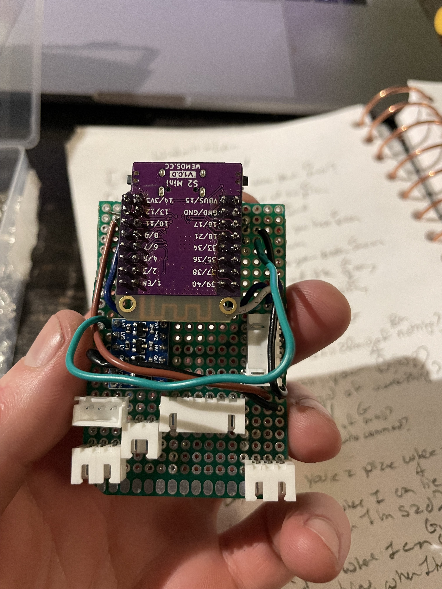

This is another bunch of words. Obviously, OBVIOUSLY, **obviously** in need of some 
actual word-content. It's just that there's SO MUCH TO BE SAID. It's obscene how much 
work I put into this project, and the fact that none of it has been documented has meant that 
it's been weeks of efforts, poring over every thing that I ever did, finding evidence in every 
place that it can be found, and bringing it all together, just for you to look at.

## Prototype ESP32-S2





### Breadboarding




### Assembly





### Power Pack




### Installation






