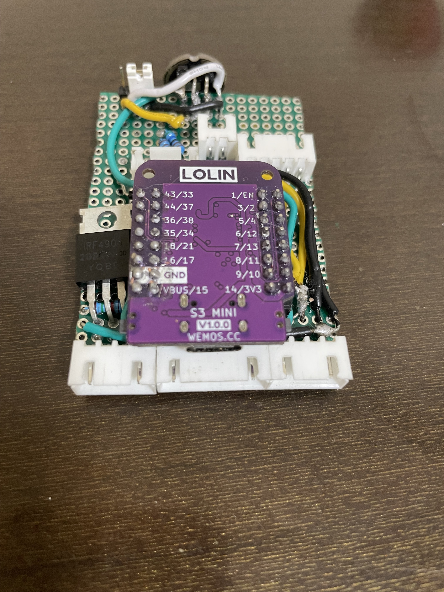

## Reason
The reason that I'm making this is because, in order to properly test network functionalities, I required additional units. Unlike the mobile prototypes, these 
were designed to be mounted to walls, and serve as fixed installations. Prior devices have used alternative microprocessors, both of which I found to be quite 
limiting. Additionally, the Rotary Encoder present on the [S2 variant](/portfolio/ESP32-S2_LED_Controller) proved to be of relatively little use without a display with which to pair it.

The work for the UI was readily available as a [WLED Usermod](https://mm.kno.wled.ge/usermods/Rotary-Encoder/), making the bulk of the work for this project related to hardware. I thought that, rather than re-inventing 
the wheel, I'd be best served by trying out the off-the-shelf solution, and finding out if it was suitable for inclusion in future projects.

## Breadboard




What we have here is as follows:

- (1) [IRF4905 P-Channel Mosfet](https://www.amazon.ca/dp/B08WRY3HBV). This is being used as a relay to control the power being output to the LED's. This is done because each addressable LED has an IC that draws power, regardless of whether the LED is switched off, or on. By having that power gated by this mosfet, I can reduce the power draw by 1mA for every LED connected.
- (1) [SSD1306 0.96" OLED Display with I2C interface](https://www.pcboard.ca/oled-128x64). This is being used to provide a hardware UI, when coupled to the rotary encoder. The SCK and SDA pins are both configured with pull-up resistors here, because you need that for I2C to properly function.
- (1) [KY-040 Rotary Encoder](https://www.amazon.ca/WayinTop-Degree-Encoder-Development-Arduino/dp/B07T3672VK). This is being usede together with the OLED display to allow the effect, colour palette, and brightness to be controlled from the device itself, without requiring network connectivity.
- (1) [INMP-441 Omnidirectional Microphone](https://www.amazon.ca/dp/B09G4RNT3G?ref=ppx_yo2ov_dt_b_fed_asin_title). This is connected via I2S, and with the aid of the ESP32-S3's dual cores, and ample processing power, is used to run fourier transforms, and thus produce cool, audio-responsive visuals.
- (1) [2-Channel Logic Level Converter 3.3V-5V with 3.3V LDO](https://universal-solder.ca/2-channel-logic-level-converter-3-3v-5v-with-3-3v-ldo/). This didn't actually make it to the final product (I used [another level converter, without the LDO](https://www.amazon.ca/dp/B07V1YY8FH)), however it's nonetheless a wise addition, as it enables reliably connecting the 5V logic level of the LED's to the 3.3V logic level of the ESP32-S3.
- (1) [Lolin S3 Mini](https://www.wemos.cc/en/latest/s3/s3_mini.html). These are cheap (\~$6-7) compared to the [official EspressIf development board](https://www.mouser.ca/ProductDetail/Espressif-Systems/ESP32-S3-DevKitC-1-N8R8) (~$20). They are somewhat limited (4MB Flash, 2MB PSRAM, compared to the 8MB/8MB I had available on the Alpha), however I was able to make do. 
- (1) S3 Mini Adapter Board. This is a custom design, as these are somewhat tricky to bread-board. The adapter board takes the two rows of pins, and lays them out lengthwise, so that only one pin correesponds to one row on the breadboard (thus avoiding a short).
- (1) Battery Port. This is again a custom design, and it's set up with a voltage divider, which enables polling the battery voltage using an Analog Pin, despite the fact that the battery has, nominally, more than the 3.3V limit on such a pin. This enables the circuit to be tested when the USB power through the programming port is disconnected (both must never be connected, or else you will let out the magic smoke).

## Case
The case for this was re-purposed from the [ESP8266 LED Controller](/portfolio/esp8266_split_rail_led_controller). This was done mostly out of habit - I put 
in work on the designs for a proper case, however in the interests of getting it done, and under the premise of 
this being a one-off, I thought it easier to continue working with what I had available.

This seemed like a good idea at the time, but as you'll see as we progress, I've packed an excessive amount of 
kit into here, and unlike the previous iterations, it doesn't quite fit... properly.

## Layout
I'm using JST-XH connectors for the peripherals. This is done so that I can disconnect everything, take it aprat, 
and hold the board in my hand. As to where these connections should go, that took a bit of experimentation.

The microphone needs an outside facing hole, so it's mounted at the very top of the board, and has been provided 
with a very generous hole, so even if it's not perfectly lined up, it still has a path for sound to enter.

Power is provided with a 6 pin JST-XH connector on the rear, with a 4 pin JST-XH connector on either side. I'm using 
4-pin, instead of 3-pin, partially because I ran out, but partially to enable this controller to later be re-purposed 
for driving the faster LED strings that require a separate line for serial clock.

None of the following examples are exactly what I'd call final, but I'm including them to show what my process looked like.




## Protoboard
Here we can see what the final circuit looks like. I've got the S3-Mini mounted on two rows of 2.54mm spaced pins. 
It's mounted such that it should be obvious which way that it goes. If it goes in backwards, there's liable to be 
somme smoke.

Everything here is wired by hand using 22GA solid-core hookup wire. I've tried using magnet wire in prior builds, 
however found that it required an obnoxious amount of heat to burn off the insulation. I've likewise tried using 
silicone-sheathed stranded core wire, but found it to be hellish to keep in place. The insulation on this wire is not 
silicone, and it does tend to burn off when soldering, however I managed to complete this project without any shorts.

I've added a jumper switch at the top, next to the microphone. That's there to switch which channel that microphone is 
configured to use (3.3V/G to switch between L/R).

There's a 5 pin JST-XH connector for the Rotary Encoder, and then a 4 pin connector for the I2C Display. Additionally, 
there is a 2 pin connector that is set up to connect a brightness sensor (light-dependant resistor). That's not implemented 
in the final build, however the circuitry for it is there.





## Product
As you can see, this didn't all fit... Nonetheless, I did make it work.




### Todo
Add a video of it operational. It's curiously missing from the content I pulled together to make this article.
