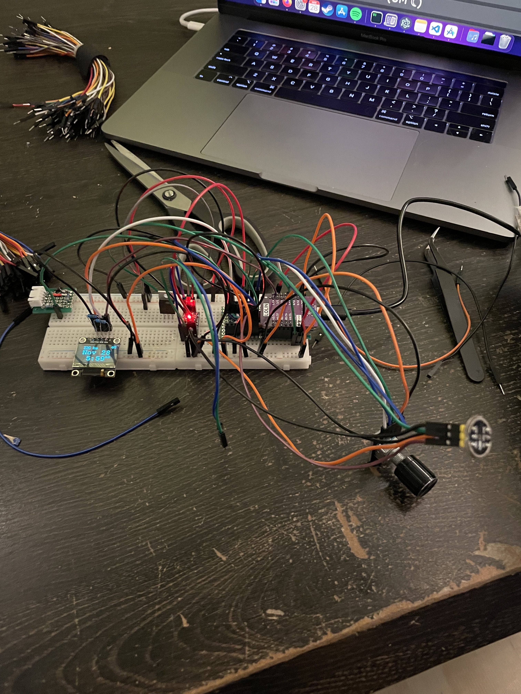
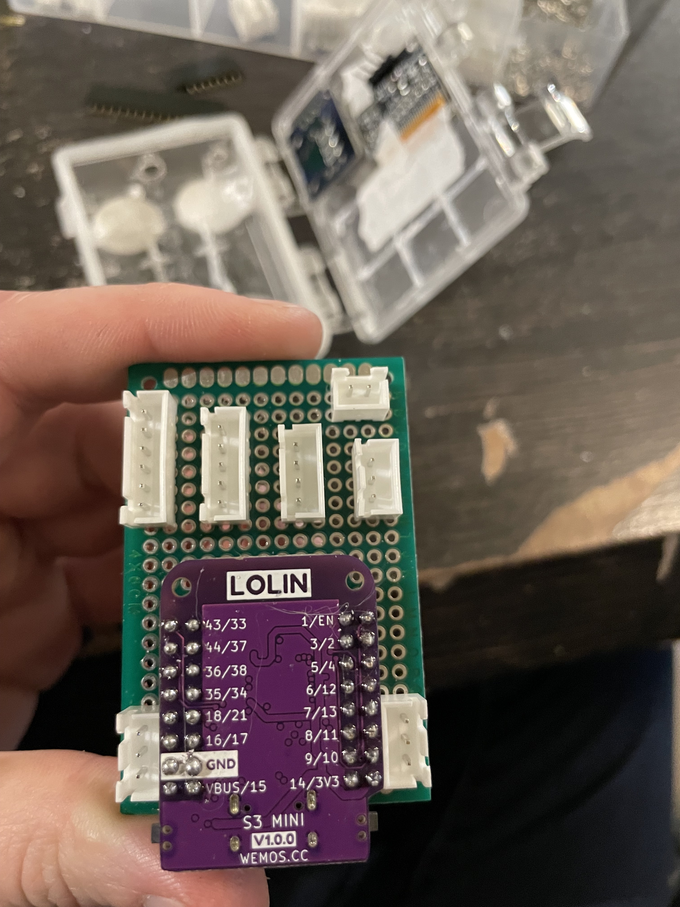

## Prototype ESP32-S3

This is a bunch of words, so that the formatting might stick. There's other problems seen here, and I'll have to 
work on them, but for now this is going to have to be alright.

### Breadboarding




### Protoboard





### Setup





