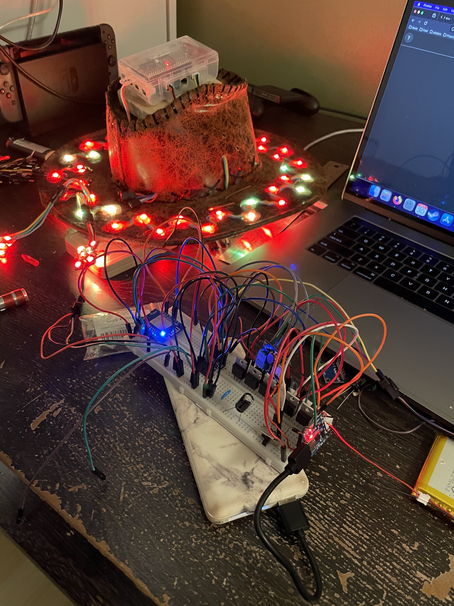
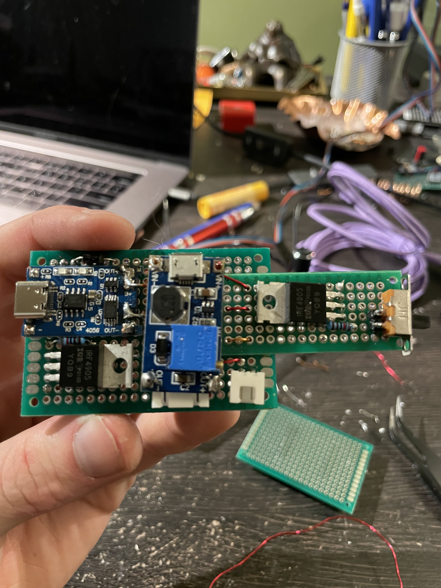
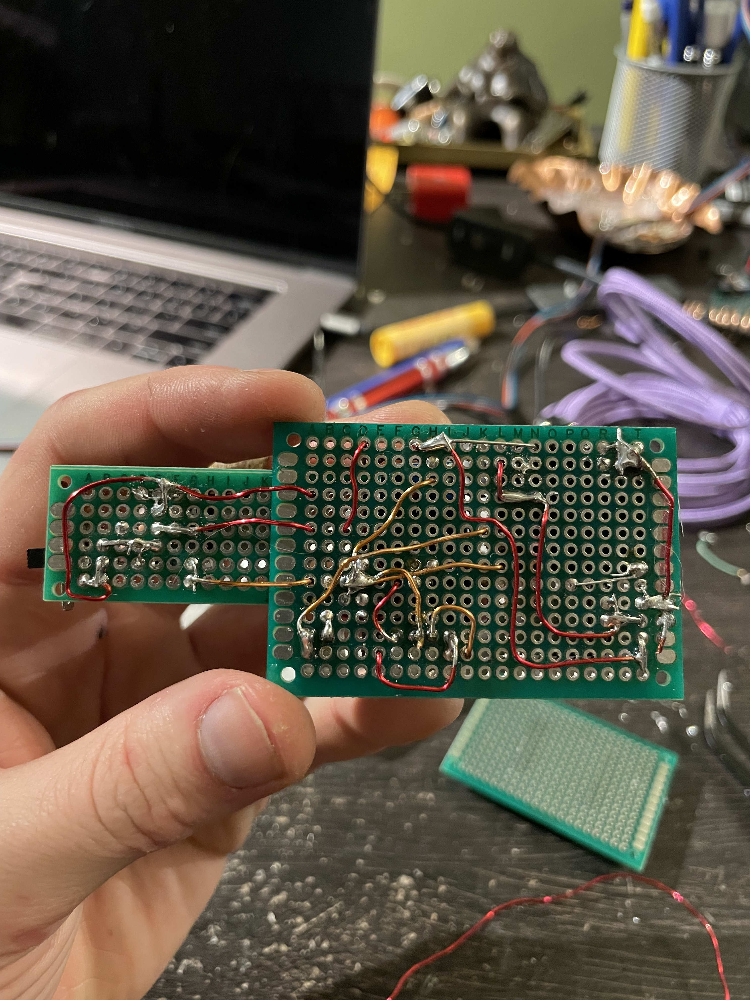
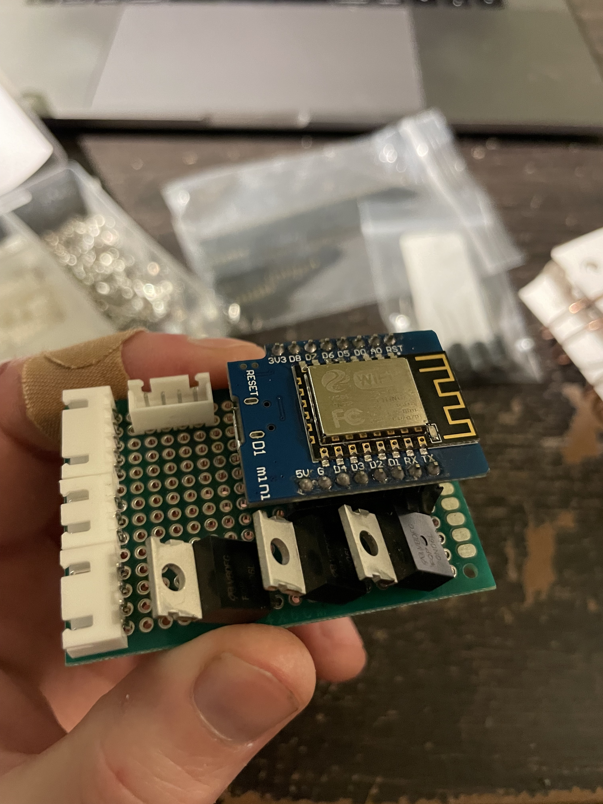
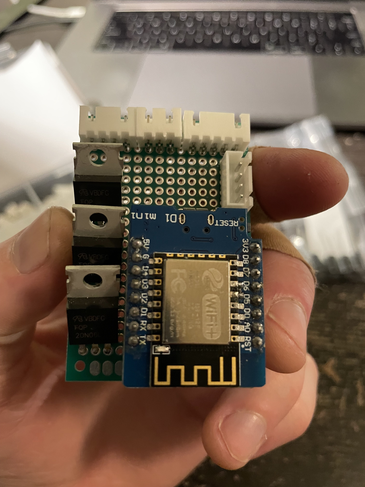
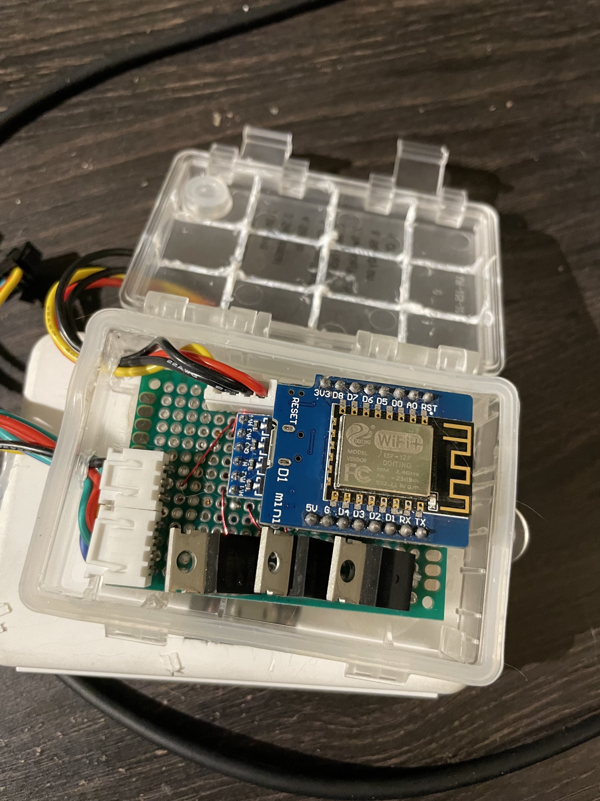

This is a bunch of text to get the image formatting to work right. It needs to be long 
enough to go for a full line, so that everything else at least looks passably decent.

## Prototype ESP8266

### Breadboarding




### Power Supply





#### Noise


### Mainboard




### Installation






