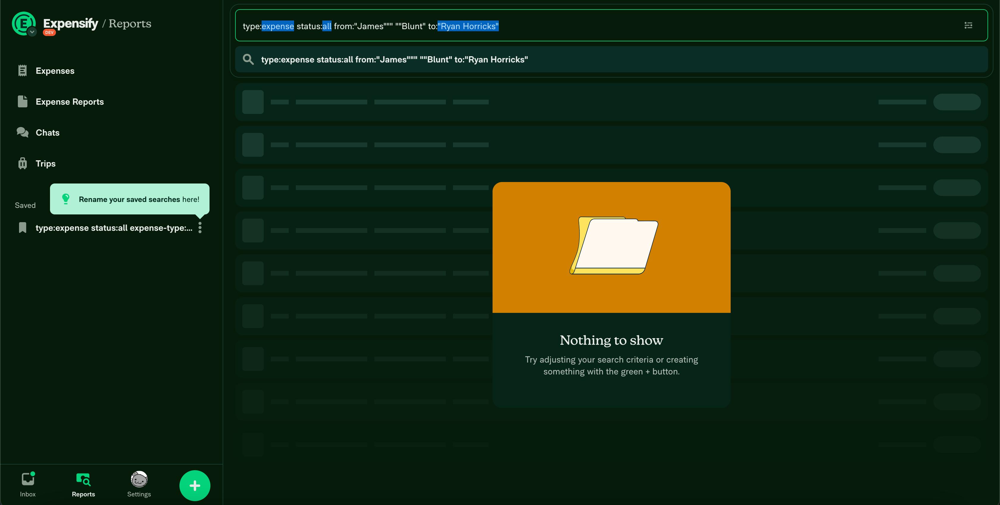
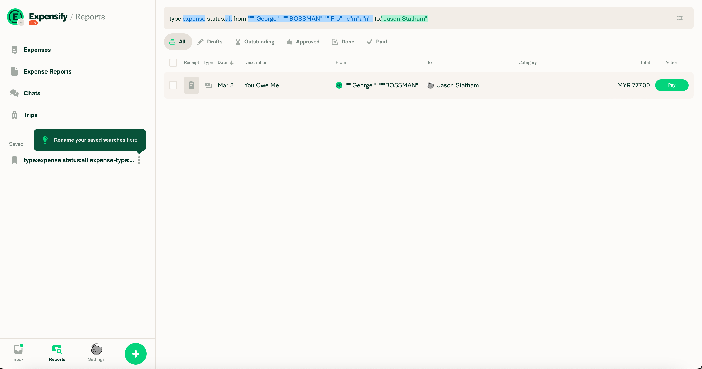

**Project:** Expensify – Search Parser Double Quote Handling  
**Role:** Contract Software Developer (via Upwork)

## Overview
In this contract for Expensify, I tackled a subtle but impactful parsing bug in the “Reports” search autocomplete.  

When a user’s display name contained embedded double quotes (`"`), the search would fail to match or highlight their name correctly. This issue affected users across desktop, mobile web, and native mobile platforms.  

The fix required targeted grammar changes in the **Peggy.js** parser, new unit tests, and careful collaboration with the team to maintain compatibility with existing search behavior.

## Challenges and Objectives
- **Edge Case Parsing:** Modify the search autocomplete grammar to allow double quotes inside quoted strings without prematurely terminating them.
- **Cross-Platform Consistency:** Ensure fixes worked identically on desktop, mobile web, and native apps.
- **Backward Compatibility:** Scope changes to avoid regressions in other parser-dependent features.
- **Professional Code Review:** Navigate multi-stage peer review with feedback from multiple engineers, adhering to team style and test requirements.

## My Contributions

### 1. Grammar Refinement
- Updated **Peggy.js** rules to support nested double quotes within quoted strings.
- Ensured only true closing quotes ended a string, preventing mid-string truncation.

### 2. Targeted Testing
- Created unit tests for usernames containing quotes in various positions (start, middle, end, and uneven counts).
- Verified behavior both with and without operators in the query string.

### 3. Scoped Implementation
- Applied changes only to the autocomplete parser to prevent unintended changes to other search flows.
- Maintained original behavior for standard queries.

### 4. Collaborative Review Process
- Incorporated detailed feedback from multiple reviewers, addressing style, linting, and type checks.
- Learned best practices for maintainable test structures and naming conventions.

## Outcomes and Results
- **Bug Eliminated:** Search now correctly matches and highlights usernames containing double quotes.
- **Stronger Test Suite:** Added robust, reusable test cases for future regression prevention.
- **Professional Growth:** Gained hands-on experience in a production-scale review process and parser-level debugging.

## Reflection
Although this was a short engagement, it marked a milestone in my development career.  
It was my first time contributing to a production-scale codebase under active peer review, and I learned how small, precise fixes can have a broad user impact.  
The process sharpened my attention to detail, taught me to anticipate side effects in complex systems, and gave me new confidence in writing maintainable, test-driven code.

## Technical Summary
- **Skills:** Parser Development, Unit Testing, Cross-Platform Debugging, Code Review Collaboration
- **Tools:** Peggy.js, Jest, React Native, ESLint, GitHub
- **Specialized Tasks:** Grammar Refinement, Edge Case Handling, Backward Compatibility, Targeted Test Writing

## Gallery



