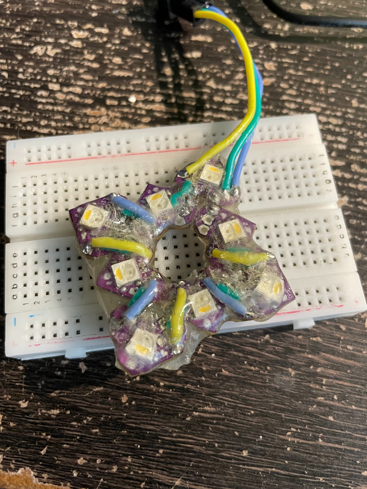
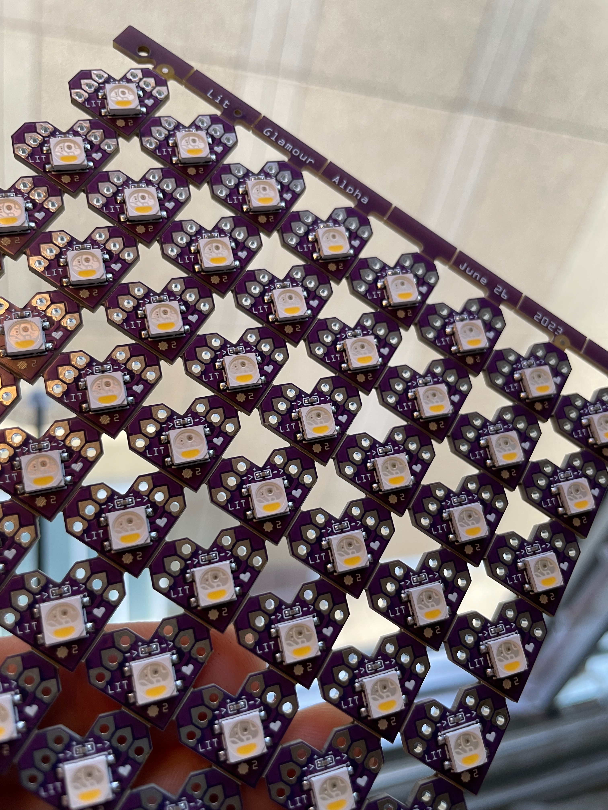
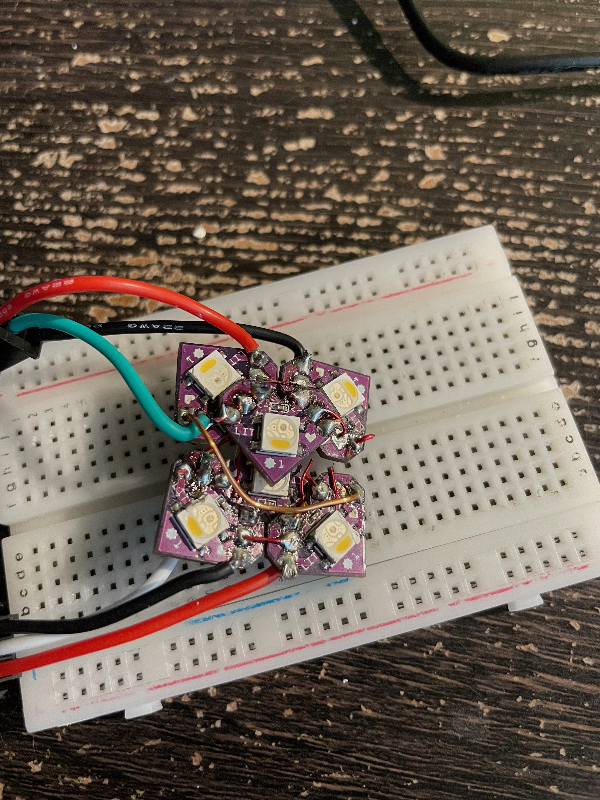
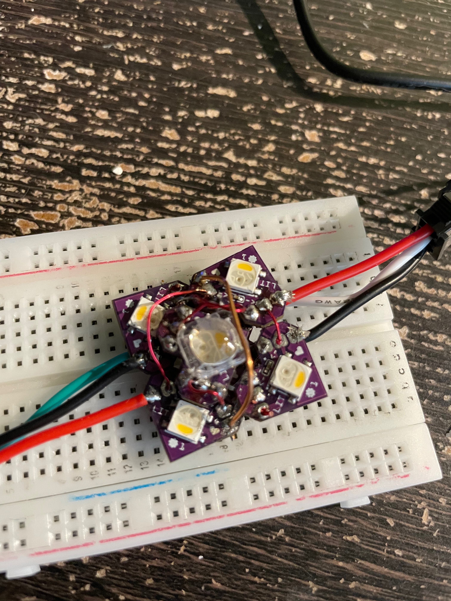
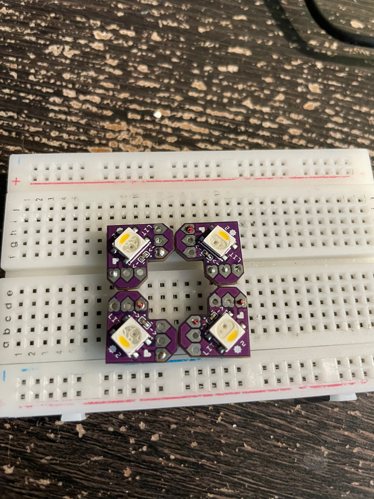

This project started, in its current iteration, on New Years Eve, 2022. In fact, it began 3 years earlier, in 
2019, when I made my first hat and found EVERYONE loved it.

This is just some text to start things off. Clear out the formatting. Make it look PRETTier than it otherwise 
would, until I've started to put in some actual content.





