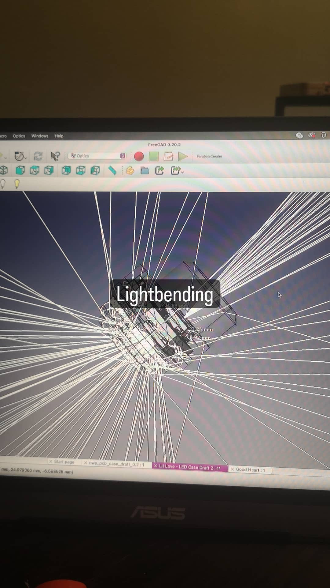

This project started, in its current iteration, on New Years Eve, 2022. In fact, it began 3 years earlier, in 
2019, when I made my first hat and found EVERYONE loved it.



## Iteration 1

### Battery Charging




### Controls




### All-Together






### Sound Reactive Test



The device, at this point, is still based on the ESP8266, and is thus limited in its processing power. Despite 
that fact, it's nonetheless capable of wireless networking, and so I was able to connecting with with the 
Xlights application, which runs the processing on my local device, and outputs it over the network.

It looks amazing... And looking at it, I realize that, even now, the device I've created is not the very same 
as the one that had inspired my drive towards sound reactivity...

## The Lights
See, up until now, I was using a string of SK6812 RGBW LED's that I was able to acquire commercially. I went with 
these because they were IP68 rated -- meaning they'd be waterproof, dustproof, and perfectly capable of weathering 
the adverse environments prone to occur at a festival.

There was  problem, though -- they were very heavy. They served me well enough, in testing out my concept, and 
trialing out the lights, however the string in and of itself weighed in at over a pound. Weight has proven to be 
something of an albatross with this project, and so something needed to be done.

There was something more, though. The hat's came with 40 holes, however the strings contained 50 lights, and so what 
I did was to take the last 10 lights, and have them facing upwards, and what I found was that it was an effect 
I quite liked. This proved to be something of an inspiration for the next phase of the project:

### Double-Sided LED's




### Optical Simulations
At this juncture, given my aim was to completely in-source the weighty LED strings I'd been using, I'd beene planning 
to 3D print some optics. I went on a tangent here, and I satisfied a curiosity, as to how to go about simulating 
what the optics were going to do, without actually building them (because that seemede hard, and I still hadn't 
actually gotten into 3D Printing, at this point).

I drew inspiration from (this)[I cant Find it Right now, check history] blog article by (a cool sculptor guy), 
which lead me to try out Rhino3D. He suggested 3DOptix, however they seemed to want my money, so I wound up 
settling on FreeCAD instead, making use of the OpticsWorkbench plugin to trace my rays.





## Iteration 2





## The Final Countdown




## Bunch of Random-Ass Images





