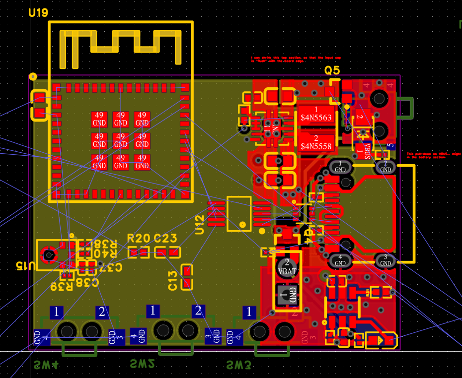

**Project:** Little: Power Section  
**Role:** Developer  

## Overview

**Little** is a custom ESP32-based PCB designed for a wearable LED project, with an intended battery capacity of 600-1200 mAh. 
The **Power Section** includes a BQ21040 Li-Ion charger, TPS63001 switching regulator, USB-C port with pass-through diode and USB2 
data lines, as well as an I2S microphone and control system. Due to the high density of thermally active 
components and the space-limited form factor, the design limits charge and discharge current individually to 600 mA.

## Challenges and Objectives

- **Miniaturization:** Achieve a target footprint of 1.35 x 1.00 inch (1350 x 1000 mil), against a physical floor set by thermal dissipation rather than component dimensions — past a point, smaller parts did not yield a smaller board.
- **Thermal Management:** Limit heat dissipation at the point where the charger's internal linear regulator and the USB passthrough diode both operate maximally — a depleted battery charging at 600 mA while the system draws another 600 mA through the passthrough.
- **Power Efficiency:** Supply an ESP32 alongside 24 SK6812 LEDs from a 600-1200 mAh battery, while keeping system draw under 600 mA. The LED load uncapped would far exceed that ceiling, requiring firmware-level brightness caps.
- **Noise / Signal Integrity:** Contain switching noise from the 3V3 regulator — a deliberate trade-off against a linear alternative — and provide a fallback to drive the LEDs from VSYS if the regulator cannot stabilize under the system load.
- **Engineering Rigor:** Meeting the thermal, layout, and signal-integrity constraints required study of the underlying principles and a subsequent redesign of the board.
- **Cost & Manufacturing:** Miniaturization pushed the design towards progressively finer pitches, and each step up in assembly capability added cost. The current design sits at that crux — the 0201s and Pico require machine assembly, but the backside switches and LCD can be mounted by hand, trading labour for a lower assembly bill.

## My Contributions

### 1. Conceptualization and Sourcing

- Inspired by a set of 20 baht cat ears I purchased on New Years Eve in Bangkok, I looked at the form factor and saw an opportunity to go beyond the fairy lights and button cells in the original.
- Utilized a set of 6 double-sided SK6812 RGBW LED PCBs that I produced for an earlier project, and arranged them in a manner that afforded a total of 12 LED's per ear.
- Identified a power source in scavenged disposable vape batteries (600 mAh 12650 cells), enabling both waste reduction, and a lower cost of development.
- Sketched outlines based on the original set of ears, and laid out LED's within it to create a shape that could be 3D-Printed, and make use of the highest degree of on-hand components.

### 2. Custom PCB Design

- Determined that modular assembly was not viable at the required scale, necessitating a fully custom board.
- Selected the **BQ21040** charging IC for its compact size, paired with a **TPS63001** 3V3 switching regulator.
- Included USB-C for charging and an I2S microphone for future audio features.
- Chose dimensions equivalent to a Lolin S3 Mini, but with significantly more circuitry packed into the same footprint.

### 3. Engineering Discipline

- Recognized the transition from "full-stack developer with a soldering iron" to genuine electrical engineering.
- Read *High Speed Digital Design: A Handbook of Black Magic* (Howard Johnson) and the *Printed Circuits Handbook* end-to-end.
- Applied lessons from these references to reevaluate prior design decisions with proper math and thermal analysis.

### 4. Thermal Analysis and Redesign

- Identified two major heat sources: the linear regulator inside the BQ21040, and the USB passthrough diode.
- Determined that peak thermal discharge would occur when both sources operate maximally, at the point of peak system load.
- Redesigned around a **600 mA maximum dissipation** target per section, accepting that exceeding tolerances would trigger thermal throttling of the charger (fail-safe behavior).
- Swapped the USB passthrough diode for a part with superior thermal characteristics and lower voltage drop.
- Confirmed that the 3V3 switching regulator contributes minimally to thermal load, and in fact improves efficiency by requiring lower current draw at 5V to maintain 600 mA at 3.3V.

### 5. Future Improvements

- Researched PowerPath IC options that combine a switching charge circuit with a switched system output; found that this combination does not currently exist as a single solution.
- Identified a pathway to improved thermal performance: using a switching regulator for battery charging, and leveraging available PowerPath ICs to potentially eliminate the USB passthrough diode.

## Outcomes and Results

- **Functional Power Section:** Delivered a thermally-considered, space-constrained PCB that meets the project's miniaturization goals.
- **Engineering Competence:** Transitioned from hobbyist assembly to proper electrical engineering practice, informed by industry references.
- **Documented Thermal Limits:** Established the design's current constraints (600 mA per section) and the failure modes that protect the hardware.
- **Clear Path Forward:** Identified concrete next steps for thermal performance, including switching regulation and PowerPath integration.

## Reflection

Little: Power Section marked a transition point. Prior work—the hats, the modular builds—was within reach of a full-stack developer with a soldering iron and enough patience. This project was not. Packing a charger, a regulator, USB-C, and a microphone into a footprint the size of a dev board demanded actual electrical engineering, and that demanded I stop treating the field as black magic and start treating it as a discipline. Reading *High Speed Digital Design* and the *Printed Circuits Handbook* was less about finding specific answers and more about learning the shape of the questions I should have been asking all along. The thermal problem was the real test: identifying the two heat sources, understanding when they'd peak simultaneously, and redesigning around a hard 600 mA budget. The design works, and it fails safely—which is more than I could say for earlier iterations. The next step is already mapped: switching regulation, and PowerPath integration where available.

## Technical Summary

- **Skills:** PCB Design, Electrical Engineering, Power Management, Thermal Analysis, Wearable Design.
- **Tools & Components:**
  - *Microcontroller:* ESP32
  - *Charging IC:* BQ21040
  - *Regulator:* TPS63001 (3V3 switching)
  - *Connector:* USB-C
  - *Audio:* I2S Microphone
  - *LEDs:* 12x SK6812 RGBW (double-sided)
  - *Battery:* 2x 12650 (600 mAh, scavenged)
- **Key Features:** Space-constrained layout, thermal-aware power delivery, USB passthrough, battery charging, wearable form factor.

## Gallery




