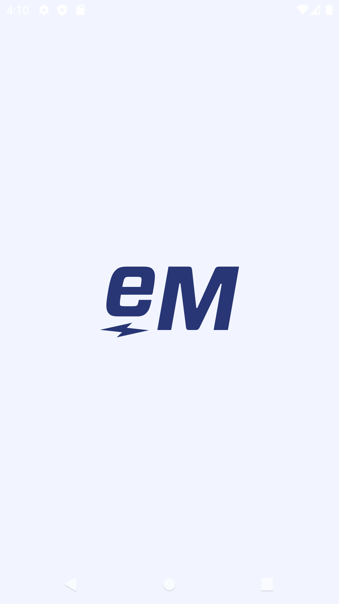
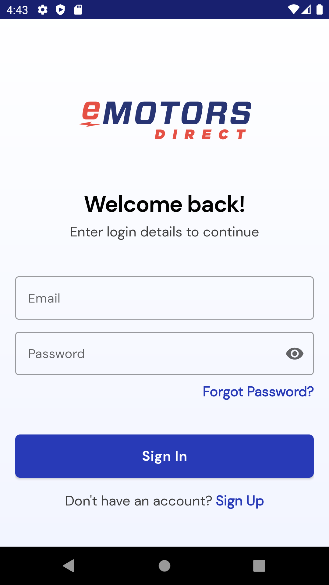
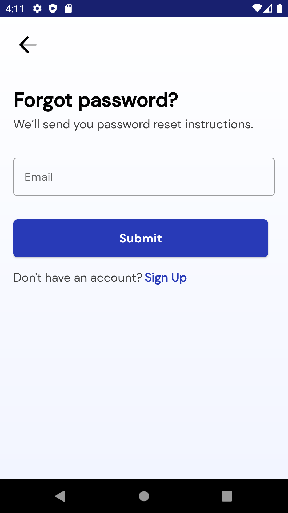
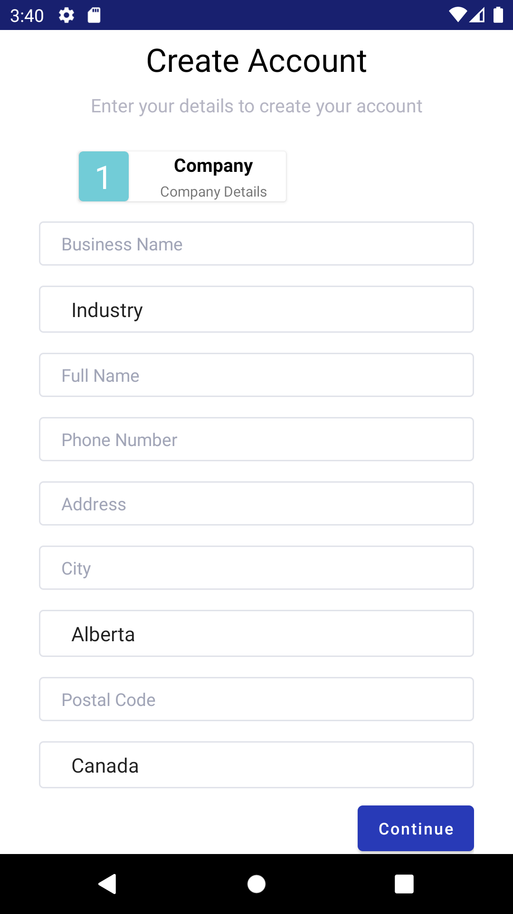
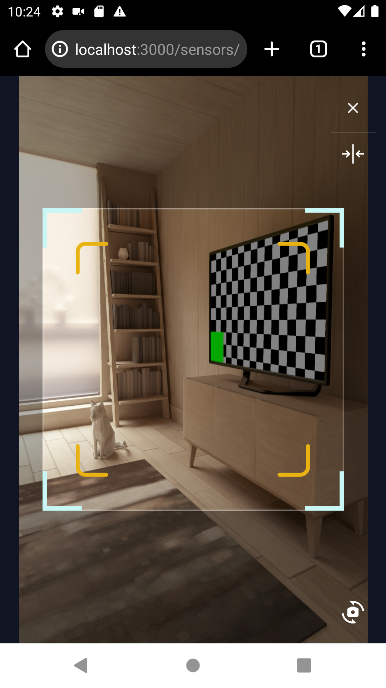
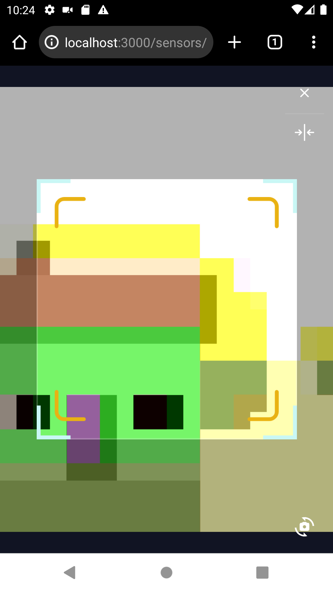

Client: eMotors Direct | Role: Intermediate Full-Stack Developer

## Overview
During my time at eMotors Direct, I contributed to the development of the Motiometer, a next-generation IoT device designed to monitor and analyze motor performance in real time. 
This innovative project was a departure from their existing e-commerce offerings, emphasizing my ability to tackle new technical challenges and deliver impactful solutions.

My responsibilities spanned full-stack development, with a particular focus on back-end architecture, API integration, and Android application enhancements. 
The Motiometer project presented opportunities to collaborate within a cross-functional team, solve complex technical problems, and build robust systems tailored to real-world use cases.

## Challenges and Objectives
The Motiometer required a seamless blend of hardware and software to deliver reliable data processing and user-friendly interfaces. Key challenges included:

- Designing a scalable back-end architecture to support real-time device communication.
- Integrating device registration and management capabilities into the Android ecosystem.
- Enhancing user experience through efficient push notifications and streamlined workflows.
- Ensuring the codebase adhered to high standards of maintainability and performance.

## My Contributions

### 1. **Back-End Architecture**
- **API Development:** I implemented robust APIs within the PHP (Symfony) framework to facilitate secure communication between the Android application and the Motiometer devices.
- **Device Management:** Designed and deployed features for device registration, enabling seamless onboarding of new hardware into the system.
- **Local Testing Framework:** Created object factories in PHP to generate data closely resembling live production data, enabling comprehensive testing of all functionalities and improving system reliability.
### 2. **Android Application Enhancements**
- **Authentication Setup:** Implemented user login, registration, and device registration functionalities, enabling secure and seamless access for users.
- **Asynchronous Operations:** Utilized **RxJava** to handle asynchronous tasks efficiently, improving the app's responsiveness and performance.
- **Architectural Overhaul:** Revamped the Android application's architecture by implementing the Single-Activity pattern and adopting the **MVVM architecture**, ensuring the codebase adhered to current Android best practices and was easier to maintain and scale.
- **Push Notifications:** Integrated push notifications to provide real-time updates to users, enhancing engagement and communication with the app.
### 3. **Front-End Development**
- **Camera Switcher Implementation:** Developed a camera switcher feature in the React app, enabling seamless toggling between front and back cameras for scanning QR codes. This addressed usability challenges identified by the Product Manager and improved device identification accuracy.
- **Cross-Team Collaboration:** Worked closely with front-end developers to align functionality with design requirements, ensuring a cohesive and user-friendly interface.
### 4. **Documentation and Onboarding**
- **Reverse Engineering:** Undertook the challenging task of reverse engineering undocumented processes across the entire project lifecycle, including manufacturing, IoT device provisioning, and data processing workflows.
- **Process Mapping:** Systematically stepped through and analyzed each stage of the project—from administration tools used in manufacturing to the data pipeline for field devices—ensuring no detail was overlooked.
- **Comprehensive Documentation:** Created clear, precise, and thorough documentation that detailed every step and process, providing an invaluable resource for understanding the project’s architecture and operations.
- **Knowledge Transfer:** By the time I departed, I left behind a robust knowledge base, enabling seamless onboarding for new team members and empowering the team to maintain and scale the project effectively.
### 5. **Quality Assurance**
- Personally ensured the application met high standards of quality, independently identifying and resolving bugs throughout the development process.
- Collaborated with Junior Developers to triage and address issues, mentoring them while improving overall code reliability and maintainability.

## Outcomes and Results
- **Streamlined Device Management:** My work enabled users to register and manage Motiometer devices with ease, laying a strong foundation for scalability as the product evolves.
- **Improved User Engagement:** The introduction of push notifications enhanced real-time communication, improving user satisfaction and engagement with the platform.
- **Enhanced Testing and Debugging:** The local testing tools I developed accelerated development cycles and reduced the likelihood of production issues.
- **Knowledge Sharing:** Comprehensive documentation improved team productivity and ensured continuity for future development efforts.

## Reflection
Working on the Motiometer project was an opportunity to push the boundaries of what I could deliver as a developer. 
I honed my skills in back-end development, API design, and Android application programming while gaining insights into effective team collaboration and the intricacies of IoT-driven projects.

This experience reinforced the value of adaptability, attention to detail, and clear communication—traits I strive to bring to every project I undertake.

## Technical Summary
- **Languages:** PHP (Symfony), Java (Android), JavaScript (React)
- **Tools & Frameworks:** Android SDK, Firebase Cloud Messaging, Nuxt.js, Local Testing Tools
- **Key Features:** API Development, Device Registration, Push Notifications, Documentation
- **Soft Skills:** Team Collaboration, Problem Solving, Documentation

## Gallery

    
    
    
    
    
    
    
    


