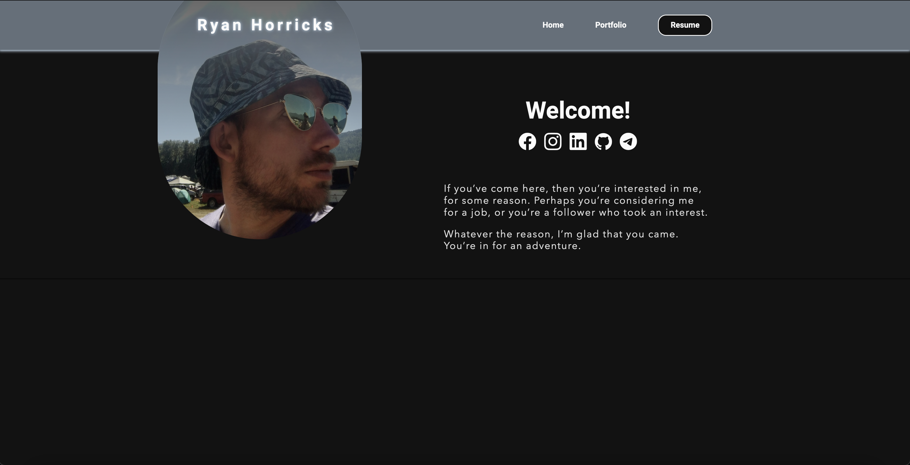

[Live URL](https://2022.ryanhorricks.com)
[GitHub](https://github.com/codekane/ryanhorricksv2)

## This is what happens when you actually take the time, to make something good.
My last portfolio was not good... It served it's purpose, which was to check a box, however it wasn't nice to 
look at, it wasn't nice to use, and it wasn't something I was proud of. It was hard to justify working on it to
myself, really. Why does it matter?
