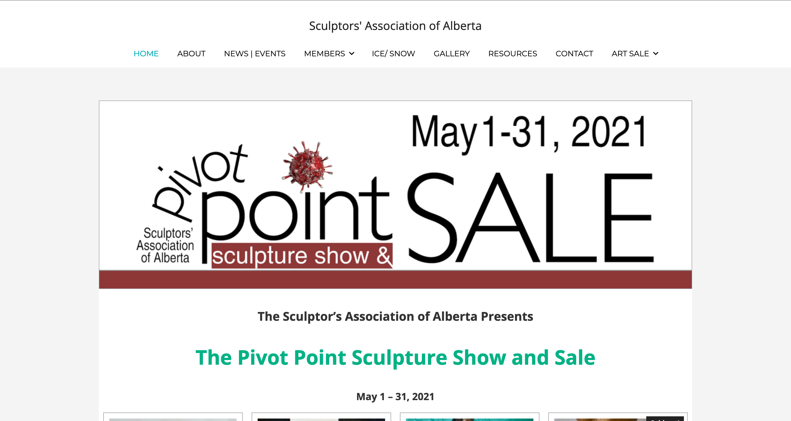

**Client:** Sculptors Association of Alberta  
**Role:** WordPress Developer

## Overview
For the Sculptors Association of Alberta, I developed a dynamic Member Gallery and a custom e-commerce 
storefront using WordPress and WooCommerce to support the Pivot Point Art Show & Sale during the COVID 
lockdowns. This project addressed the association's critical funding shortfall while showcasing its members' 
artwork to a broader audience. Additionally, I implemented advanced member management functionality, enabling 
members to update their profiles and link their external websites or social media accounts, while integrating 
access controls tied to membership dues.

## Challenges and Objectives
- **Addressing a Funding Shortfall:** Supporting the association's efforts to replace in-person art shows with an online alternative and mitigating financial losses.
- **Customized Member Gallery:** Developing a gallery that linked profiles, external links, and other site elements while enabling self-management for members.
- **e-Commerce Integration:** Building a cost-effective storefront for the Pivot Point Art Show & Sale to generate revenue.
- **Site Performance Optimization:** Enhancing site speed and scalability to accommodate increased traffic during the event.
- **Custom Theme Development:** Implementing a Child Theme to ensure site modifications were robust against future updates.

## My Contributions

### 1. Customized Member Gallery
- Developed a responsive Member Gallery using **CSS**, **HTML**, and **PHP**, enabling members to showcase their work while providing links to personal websites or social media profiles.
- Created a self-service member profile system, allowing members to log in, update their details, and have changes reflected in real-time for visitors.
- Integrated membership-based access controls, ensuring visibility and access were limited to those with active, paid memberships.

### 2. Pivot Point Art Show & Sale
- Developed a custom e-commerce storefront using **WooCommerce**, integrating it seamlessly into the existing WordPress site.
- Provided intuitive navigation and secure payment processing to enhance the shopping experience for over 1,000 visitors during the event.

### 3. Performance Optimization
- Identified performance issues due to shared hosting limitations and worked with the hosting provider to upgrade to a more suitable plan.
- Implemented caching and other optimizations to ensure the site could handle increased traffic without downtime.

### 4. Custom Theme Implementation
- Developed and implemented a Child Theme, allowing for robust and maintainable customizations using **CSS** and **PHP**.
- Used FTP to efficiently manage file uploads and updates, ensuring seamless integration with the live site.

## Outcomes and Results
- **Successful Art Show & Sale:** Attracted over 1,000 unique visitors during the event, generating over $5,000 in sales and $2,500 in revenue for the association.
- **Enhanced Member Functionality:** Delivered a self-service Member Gallery with linked profiles and external links, improving visibility for individual members and tying access to active memberships.
- **Enhanced Site Performance:** Resolved critical hosting and performance issues, ensuring smooth operations during the high-traffic period.
- **Robust Customizations:** Delivered a flexible and future-proof WordPress solution using a Child Theme, simplifying ongoing site management.

## Reflection
This project highlighted my ability to deliver impactful solutions under tight constraints, blending 
technical expertise with an understanding of the art community's needs. From addressing performance 
challenges to creating a feature-rich Member Gallery and e-commerce experience, I contributed to the 
Sculptors Association of Alberta’s success during a critical time.

## Technical Summary
- **Skills:** WordPress Development, e-Commerce Integration, Member Management, Responsive Design, Performance Optimization
- **Tools:** WordPress, WooCommerce, CSS, HTML, PHP, FTP
- **Specialized Tasks:** Customized Member Gallery Development, WooCommerce Integration, Hosting Optimization, Custom Theme Development





