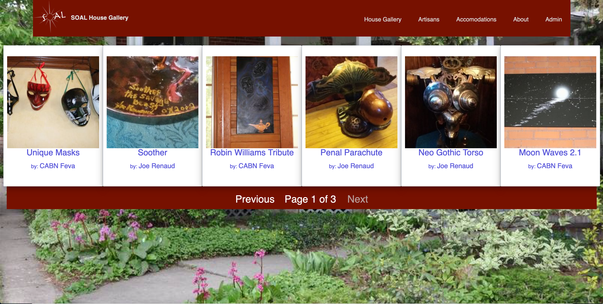
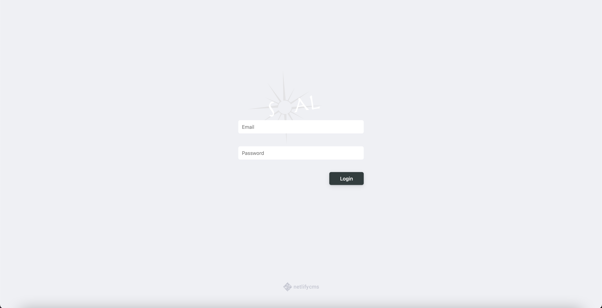

**Project:** SOAL House - Shepards of Abundant Living  
**Role:** Volunteer Developer

## Overview
SOAL House was a unique blend of community, art, and hospitality. As a volunteer developer, I built a static 
site using **Jekyll** to support its mission, featuring a custom-designed online storefront, admin panel, room 
booking functionality, and artist profiles. This project utilized **Liquid** templates, hand-written **CSS**,
and third-party integrations to create a cost-effective and functional platform. While the house itself is no 
longer operational, this project served as an early exploration into JAMstack development and 
community-driven web solutions.

## Challenges and Objectives
- **Static Site Development:** Building a fully custom theme from scratch using **Jekyll** and **Liquid** templates.
- **Feature Integration:** Enabling e-commerce, room bookings, and artist profiles via third-party integrations.
- **Cost Efficiency:** Delivering robust functionality within a $10/month budget for hosting and e-commerce tools.
- **Administrative Simplicity:** Creating an admin panel to streamline management for non-technical users.

## My Contributions

### 1. Custom Theme and Static Site Development
- Designed and implemented a responsive, fully custom theme using **Liquid**, **HTML**, **CSS**, and **JavaScript**.
- Built the site from the ground up without relying on pre-existing templates, ensuring a unique and tailored design.

### 2. E-Commerce and Integrations
- Integrated an affordable e-commerce solution to facilitate art sales, keeping costs under $10/month.
- Enabled seamless integration with third-party tools for room bookings and artist profile management.

### 3. Artist Profiles and Community Features
- Developed a dynamic artist directory, allowing each artist to showcase their work and provide links to external sites or social media.
- Linked artist profiles to the storefront, enabling a cohesive browsing and purchasing experience for visitors.

### 4. Admin Panel Implementation
- Created an intuitive admin panel for managing content, including art listings, room availability, and artist profiles.
- Focused on simplicity and usability to accommodate non-technical users.

## Outcomes and Results
- **Functional Community Platform:** Delivered a static site with integrated e-commerce, room booking, and artist profile features.
- **Cost-Effective Design:** Achieved full functionality while adhering to strict budget constraints.
- **Skill Development:** Expanded my expertise in JAMstack development, third-party integrations, and responsive design.

## Reflection
SOAL House was more than just a technical project—it was a personal chapter and a creative outlet. This 
experience taught me the value of designing for diverse needs within tight constraints and laid the 
groundwork for future projects, such as my work with the Sculptors Association of Alberta. The challenges of 
building a unique platform on a limited budget deepened my understanding of static site architecture and 
community-driven web development.

## Technical Summary
- **Skills:** Static Site Development, JAMstack, Responsive Design, Third-Party Integration, E-Commerce
- **Tools:** Jekyll, Liquid, HTML, CSS, JavaScript, Netlify
- **Specialized Tasks:** Custom Theme Development, E-Commerce Integration, Artist Directory Creation, Admin Panel Design

## Gallery





