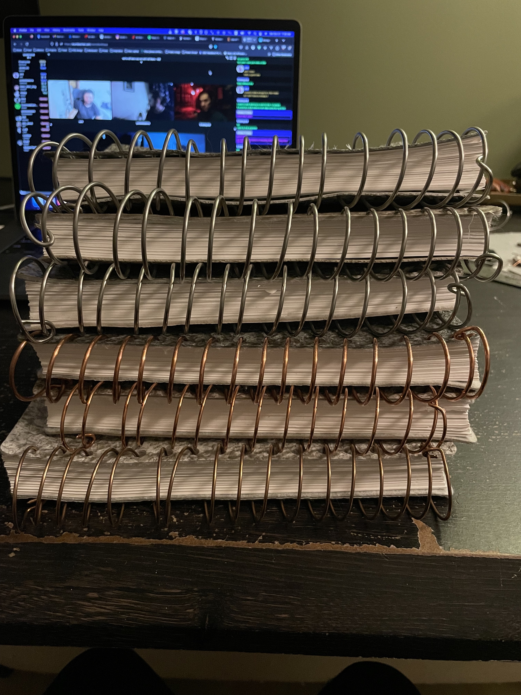

**Project:** SpokeBooks - Bespoke Notebooks  
**Role:** Creator and Developer

## Overview

SpokeBooks is a handmade notebook product born from a desire to create the perfect writing companion. Using 
upcycled vinyl flooring samples for the covers, high-weight paper, and bronze bindings, I designed a notebook 
with aesthetics, durability, and functionality in mind. To complement the physical product, I developed 
Pages, a companion app that generates custom page layouts (lined, dot-grid, etc.) using **CSS**, **SVG**, 
and **Liquid** templates for laser printing. This project was a journey of iteration, creativity, and 
problem-solving, blending design, craftsmanship, and software development.

## Challenges and Objectives
- **Handcrafted Notebook Design:** Creating a high-quality, upcycled notebook that balances aesthetics and practicality.
- **Iterative Product Development:** Refining the design through successive iterations to improve usability and durability.
- **Custom Page Layout Generation:** Building a tool to generate pixel-perfect page designs for print, tailored to the notebook’s specifications.
- **Efficient Production Workflow:** Overcoming time-intensive manual processes to streamline production without compromising quality.

## My Contributions

### 1. Notebook Design and Manufacturing
- Crafted notebook covers from expired vinyl flooring samples, using heat transfer vinyl for a textured and waterproof finish.
- Selected 24lb paper for durability, accommodating various writing styles, including ink and pencil.
- Developed a spiral binding process using 14-gauge bronze rings and a commercial press for precision hole punching.

### 2. Pages – Custom Notebook App
- Designed and developed a **Jekyll**-based tool for generating customizable page layouts using **CSS**, **SVG**, and **Liquid** templates.
- Supported pixel-perfect print outputs for designs like lined, dot-grid, and blank pages, tailored to SpokeBooks’ dimensions.
- Integrated a simple and intuitive workflow, enabling quick adjustments to page templates for personal or client needs.

### 3. Workflow Optimization
- Improved production efficiency with tools like a commercial paper cutter and a calibrated hole punch.
- Researched potential improvements, such as a paper drill, to further streamline the manual aspects of manufacturing.
- Used iteration to refine the design and production process, incorporating user feedback and personal insights.

### 4. Iterative Product Development
- Prototyped multiple notebook versions, introducing features like “Don’t Panic” branding on early iterations.
- Expanded the product line to include pocket-sized notebooks, enhancing versatility.
- Focused on creating a notebook that was not only functional but also a joy to use, blending thoughtful design with practicality.

## Outcomes and Results
- **Handcrafted Excellence:** Delivered a notebook that combines upcycled materials, high-quality craftsmanship, and thoughtful design.
- **Custom Page Generation:** Created a companion app enabling precise, customizable layouts for a wide range of use cases.
- **Sustainability and Creativity:** Showcased the potential of upcycled materials in creating beautiful, functional products.
- **Learning and Growth:** Gained valuable experience in product design, manual manufacturing workflows, and software development.

## Reflection
SpokeBooks represents the intersection of my love for craftsmanship and my technical skills in software 
development. This project taught me the importance of iterative design, sustainable material use, and the 
value of balancing aesthetics with practicality. While the notebooks remain a personal favorite, the journey 
of creating them—both the physical product and the software—is what truly stands out.

## Technical Summary
- **Skills:** Product Design, CSS, SVG, Liquid Templates, Manual Manufacturing, Workflow Optimization
- **Tools:** Jekyll, Laser Printer, Commercial Press, Heat Transfer Vinyl, FTP
- **Specialized Tasks:** Notebook Design, Page Layout Generation, Iterative Prototyping, Sustainable Material Use

## Gallery

### Construction





### Finished Products












### Pages (App for page layout)






