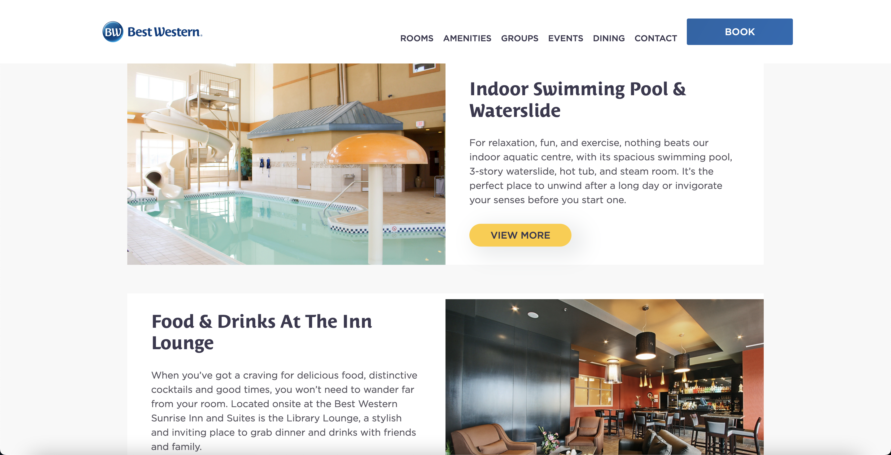

**Client:** CreativeMite (for SunRise International)
**Role:** Front-End Developer

## Overview
As a Front-End Developer for Sunrise International under CreativeMite, I contributed to creating responsive, 
user-friendly interfaces for a hospitality-focused platform using ASP.NET WebForms. This role was a key 
milestone in my career, providing me with invaluable mentorship from a Senior Developer who taught me 
critical soft skills, such as effective communication and collaborative problem-solving. These lessons 
became a model for how I approach leadership and teamwork in technical roles.

## Challenges & Objectives
- **Mentorship and Growth:** Learning to navigate professional development under the guidance of an experienced Senior Developer.
- **Responsive and User-Centric Design:** Building polished front-end interfaces to meet client goals in the hospitality industry.
- **WordPress Integration:** Connecting a WordPress blog with a custom framework for seamless content management.

## My Contributions

### 1. Front-End Development
- Designed and implemented responsive interfaces using **HTML**, **CSS**, and **JavaScript**, ensuring optimal user experiences across devices.
- Used **jQuery** to enhance interactivity and streamline UI components.

### 2. .NET Development
- Gained hands-on experience with **C#** and **ASP.NET WebForms**, contributing to functional, data-driven pages.
- Worked on integrating back-end services to create cohesive and scalable solutions.

### 3. WordPress Integration
- Utilized the WordPress JSON API to integrate blog posts into a custom framework, enabling real-time updates and content display.
- Provided non-technical staff with an easy-to-use blogging platform, streamlining content creation and management.

## Outcomes and Results
- **Enhanced User Interfaces:** Delivered responsive and visually appealing designs that aligned with the client’s vision.
- **Seamless Content Integration:** Successfully bridged WordPress with the custom framework, creating a cohesive platform for blog posts and site content.
- **Professional Growth:** Learned valuable soft skills and technical best practices under the guidance of a Senior Developer, shaping my approach to leadership and collaboration.

## Reflection
This role marked a significant step in my career, providing not only technical experience with 
**ASP.NET WebForms** and **C#**, but also invaluable mentorship from a Senior Developer. The lessons 
I learned about communication, teamwork, and problem-solving continue to influence my approach to 
software development and collaboration.

## Technical Summary
- **Skills:** Front-End Development, ASP.NET WebForms, WordPress Integration, Responsive Design
- **Tools:** HTML, CSS, JavaScript, jQuery, C#, WordPress
- **Specialized Tasks:** User Interface Development, API Integration, Content Management Solutions

## Gallery





