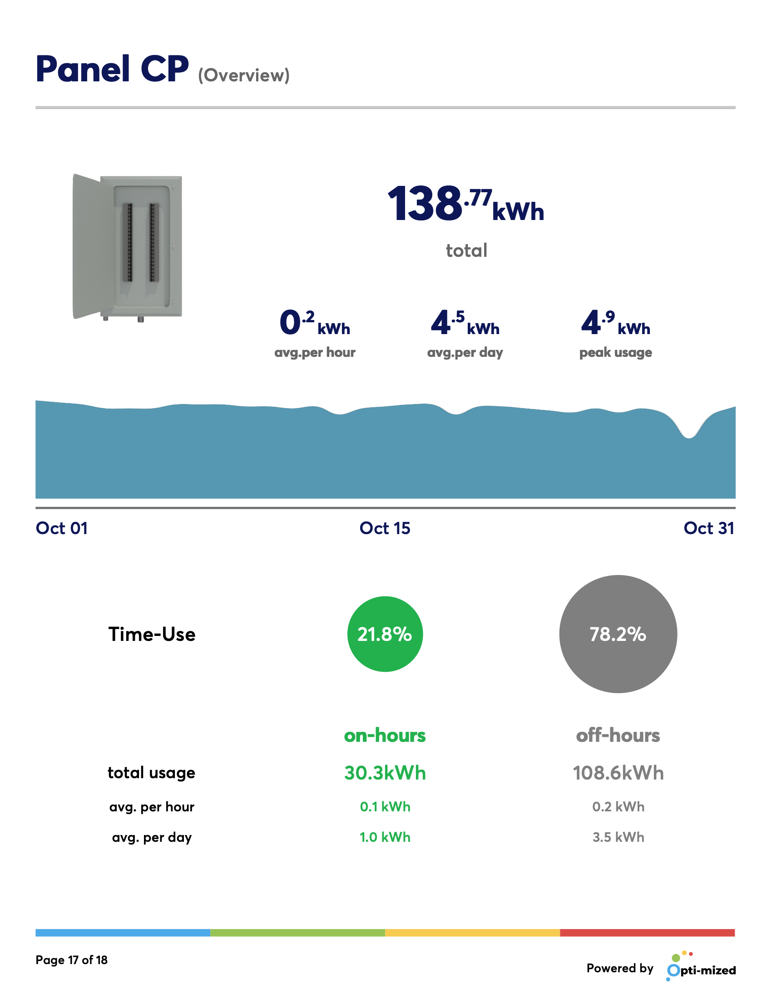

**Client:** Sustainergy  
**Role:** Full-Stack Developer

## Overview

At Sustainergy, I contributed to the development of a full-stack application aimed at improving energy 
efficiency in commercial and industrial buildings. My work involved building RESTful APIs with **Python/Django** 
for robust back-end functionality and developing an intuitive user interface with **Angular**. The system 
provided real-time insights into building energy consumption, helping clients optimize their energy usage 
and reduce costs.

## Challenges and Objectives
- **Scalability and Performance:** Optimizing APIs to handle large datasets from multiple facilities.
- **User Experience:** Designing an interface that simplifies the visualization of energy data for diverse users.
- **Data Integration:** Centralizing data from various sources, ensuring accuracy and reliability.

## My Contributions

### 1. Back-End Development
- Designed and implemented scalable RESTful APIs using **Django Rest Framework** for real-time energy monitoring and reporting.
- Developed a custom data pipeline to process and aggregate energy usage data from multiple facilities.
- Optimized database queries, resolving N+1 query issues and significantly improving response times.

### 2. Front-End Development
- Built user-friendly components using **Angular**, including dashboards for real-time energy consumption insights and detailed reports.
- Designed and implemented functionality for scheduling, reporting, and energy usage comparisons.
- Refactored existing codebases to improve performance, maintainability, and adherence to modern best practices.

### 3. Authentication and Security
- Implemented JWT-based authentication for secure user access and session management.
- Enhanced front-end security with features like auth guards and token refresh mechanisms.

### 4. Reporting Features
- Developed dynamic, exportable reports in **PDF** format, providing clients with actionable insights.
- Integrated real-time charting tools to visualize energy usage trends across multiple parameters.

### 5. Deployment and Maintenance
- Automated deployment workflows with **Docker** and **AWS**, ensuring smooth releases and robust scaling.
- Debugged and resolved deployment issues, including caching problems and static asset management.

## Outcomes and Results
- **Improved Efficiency:** Delivered a system capable of processing and visualizing energy data from multiple facilities in real time.
- **Enhanced User Experience:** Developed intuitive interfaces that empowered users to make data-driven decisions.
- **Operational Streamlining:** Automated reporting and centralized data access, saving clients time and resources.

## Reflection
s project deepened my expertise in full-stack development, API optimization, and building user-centric 
interfaces. It also demonstrated the importance of collaborative problem-solving and adaptability in 
high-stakes development environments.

## Technical Summary
- **Languages:** Python, JavaScript
- **Frameworks:** Django, Django Rest Framework, Angular
- **Tools:** Docker, AWS
- **Development Areas:** RESTful API Development, UI/UX Design, Data Processing and Visualization

## Gallery

### App

    
    
    
    
    
    
    
    
    
    
    
    
    


### Admin

    
    
    
    


### PDF Reports

    
    
    
    
    
    
    
    
    
    
    
    
    
    
    
    
    
    

