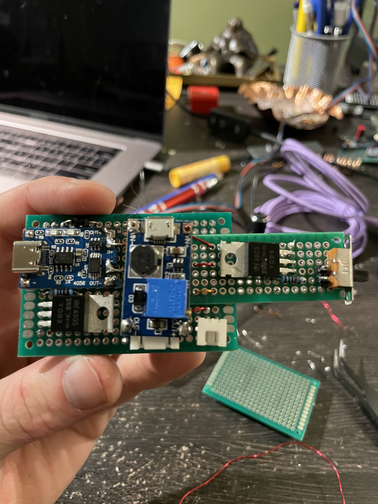
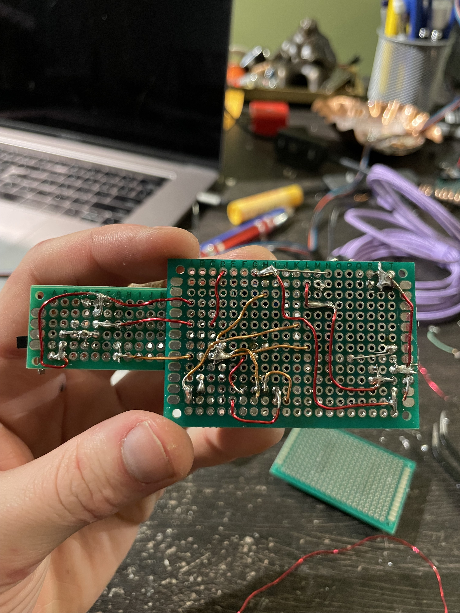
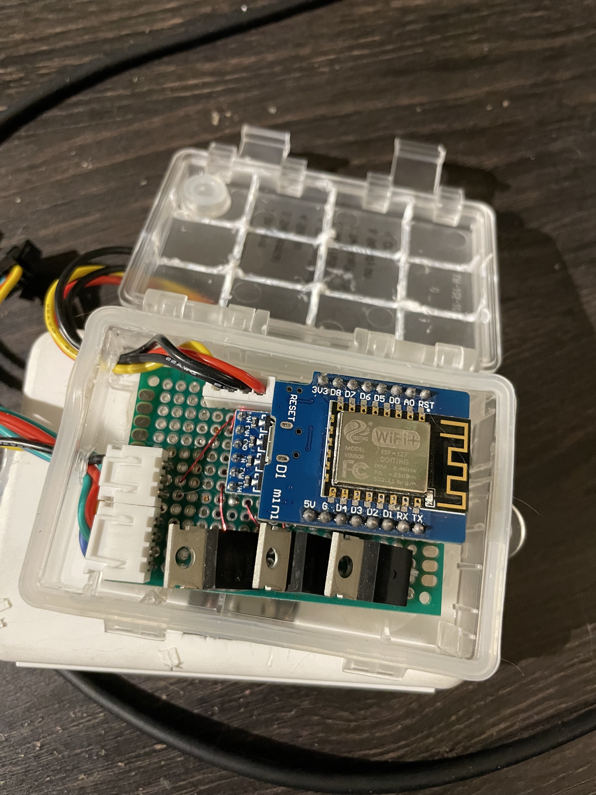
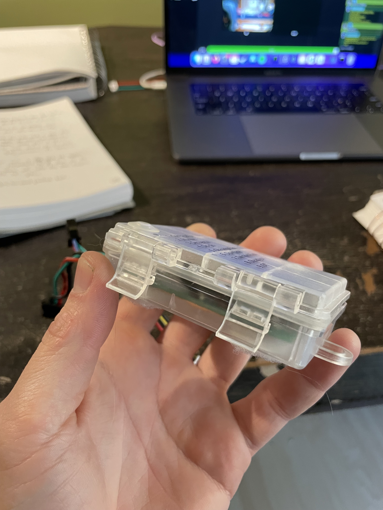
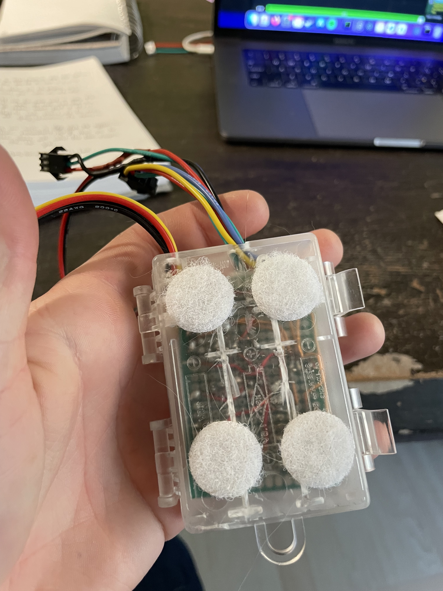
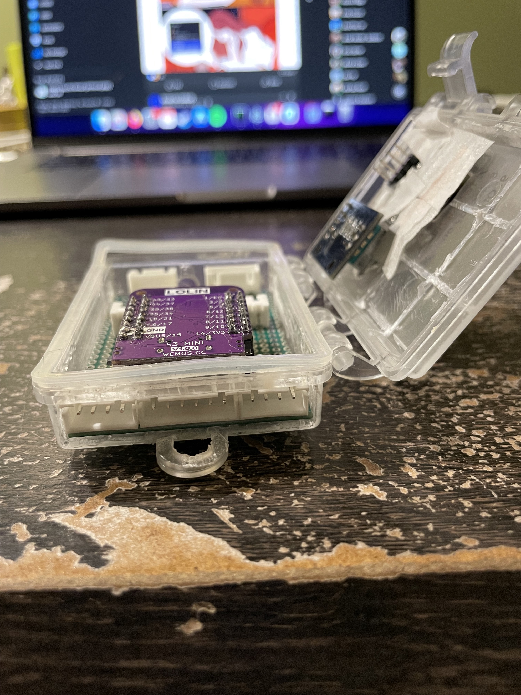

## Foreword

This is a bunch of words so that I can get the formatting to work properly. I'm laying down all of the audio/video 
content I can find for these works first, so that I can build the article around it. If you're seeing this before 
I've done that, then: thanks for looking!

## Shapes & Optics




### Patterns





### Optics Testing








### Ze Goggles






## Interface




## Prototype ESP8266

### Breadboarding




### Power Supply





#### Noise


### Mainboard




### Installation






## Prototype ESP32-S2





### Breadboarding




### Assembly





### Power Pack




### Installation






## Prototype ESP32-S3

### Breadboarding




### Protoboard





### Setup





## Alpha PowerPack Upgrade
I'm not sure which this one was for. It might have actually gone into the Alpha (because I upgraded it after 
I made the rest of these). 





## Exhibit






## Lean Canvas

