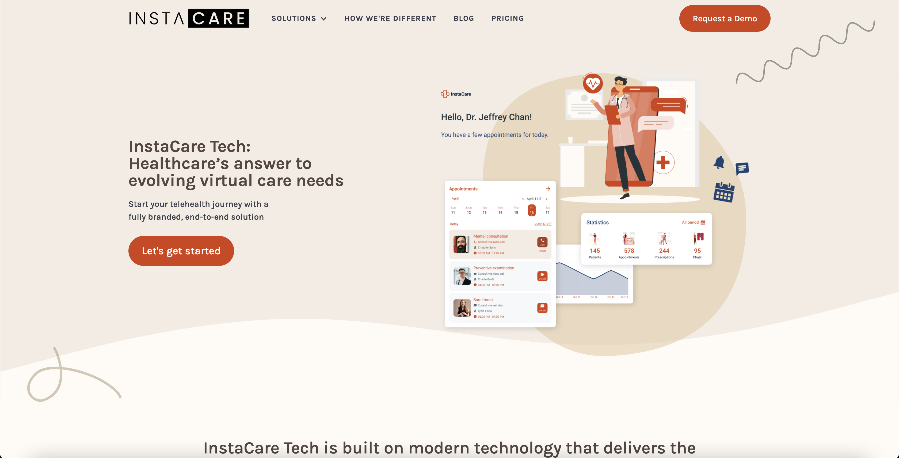

**Client:** The MARA Group  
**Role:** System Analyst

## Overview
As a System Analyst at The MARA Group, I worked on a virtual care platform aimed at improving healthcare 
accessibility and efficiency. My responsibilities included establishing and managing the full quality 
assurance process, evolving a robust bug tracking system in Jira, managing and designing corporate websites 
using Figma and Webflow, and bridging communication gaps between non-technical founders and an outsourced 
development team. I also extended the outsourced development team’s design system to create additional 
components that complemented the Product Roadmap and detailed technical requirements. Despite significant 
challenges—including strained relationships with the development team and unresolved IP issues—I played a 
pivotal role in shaping the platform’s technical and creative direction.

## Challenges and Objectives
- **Quality Assurance Ownership:** Establishing and managing all aspects of QA, including manual testing, bug reporting, and verification.
- **Communication Gaps:** Translating non-technical requirements from founders into actionable development tasks for the outsourced team.
- **Design System Extensions:** Extending the outsourced development team’s design system to align with the Product Roadmap.
- **Web Design and Development:** Collaborating on website designs and translating them into precise, functional Webflow implementations.
- **Funding Justification:** Preparing technical documentation to support an SR&ED funding application.

## My Contributions

### 1. Product Roadmap and Requirements
- Successfully delivered a detailed Product Roadmap, extending the outsourced development team’s design system in **Figma** to create additional components aligned with technical requirements and features.
- Collaborated with stakeholders to ensure the roadmap and designs addressed business goals and technical feasibility.

### 2. Full Ownership of Quality Assurance
- Designed and implemented a bug tracking system in **Jira**, evolving it to support future product directions.
- Conducted **manual testing**, identifying critical bugs and documenting them in the system.
- Verified bug resolutions in new builds, ensuring issues were fully eradicated before deployment.
- Established workflows for seamless tracking and resolution of issues, streamlining the QA process.

### 3. Web Design and Development
- Collaborated with the COO to create website designs in **Figma**, leveraging the **HTMLtoFigma** plugin for efficient prototyping.
- Translated finalized designs into precise, functional websites in **Webflow**, maintaining alignment with corporate branding and goals.
- Managed multiple web domains, ensuring consistent updates and professional online presence.

### 4. Bridging Communication Gaps
- Acted as a liaison between non-technical founders and the development team, improving understanding and reducing friction.
- Facilitated discussions to ensure actionable outcomes despite challenging interpersonal dynamics.

### 5. SR&ED Funding Justification
- Prepared technical analyses and documentation to support the company’s SR&ED funding application.
- Presented a compelling case for experimental developments, demonstrating potential value despite procedural issues with the consulting firm.

## Outcomes and Results
- **Delivered Product Roadmap:** Provided a clear and actionable roadmap, enhanced with extended design system components.
- **Established QA Processes:** Designed and managed a comprehensive QA system, ensuring product reliability and user satisfaction.
- **Improved Communication:** Enhanced clarity between stakeholders and developers, improving team alignment.
- **Elevated Web Presence:** Delivered professionally designed and functional websites, aligning corporate branding with strategic goals.
- **Valuable Insights:** Gained critical experience in design systems, outsourcing challenges, and high-stakes funding applications. v

## Reflection
This role deepened my expertise in systems analysis, quality assurance, web design, and stakeholder 
communication. Managing the entirety of the QA process and extending the design system further honed my 
organizational, technical, and creative skills. Despite significant challenges, I delivered impactful 
contributions that helped steer the platform’s development and enhance the company’s online presence.

## Technical Summary

- **Skills:** Systems Analysis, Technical Documentation, Quality Assurance, Web Design, Web Development, Stakeholder Communication
- **Tools:** Jira, Monday, Figma, Webflow, Automated Testing Frameworks
- **Specialized Tasks:** Product Roadmap Development, Design System Extension, Full QA Process Ownership, SR&ED Funding Justification

## Gallery



