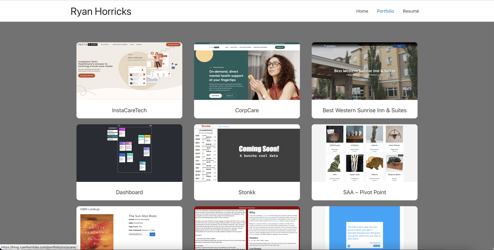
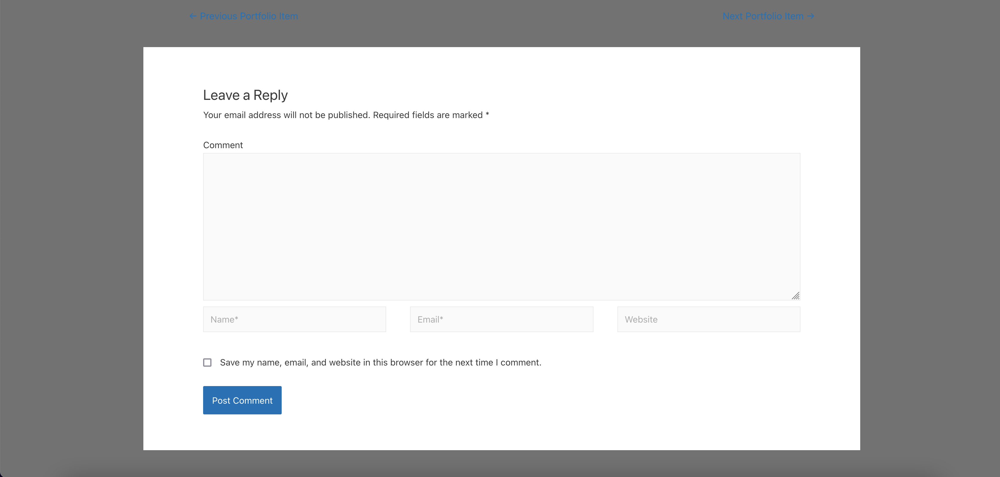
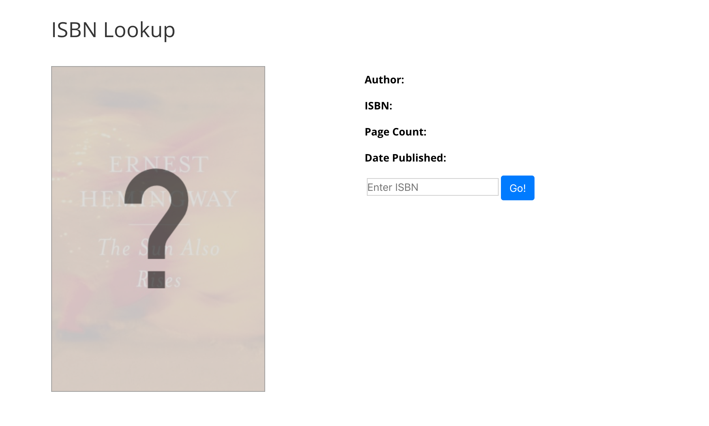

**Project:** 2021 Version of ryanhorricks.com + ISBN Lookup Tool  
**Role:** Solo Developer

## Overview
In 2021, I created a new version of my personal website using **WordPress**. This iteration was designed to 
experiment with new features, refine my understanding of WordPress development, and prepare myself to better 
serve clients in this space. One notable addition was a **Library** feature, designed to catalog my personal book 
collection. To support this, I built a simple **ISBN Lookup Tool** that retrieved book details from ISBN numbers 
via external API's. Though the Library feature was ultimately removed, these 
projects served as valuable exercises in learning, iteration, and personal branding.

## Challenges and Objectives
- **WordPress Mastery:** Building a functional site to explore WordPress features and improve client-readiness.
- **Library Feature:** Developing a unique feature to showcase my personal book collection.
- **Data Automation Assistance:** Creating a tool to streamline the process of gathering book data through ISBN lookups.
- **Experimentation and Design:** Using this version of the site to test design ideas and other experiments.

## My Contributions

### 1. Website Development
- Built the 2021 version of my site using **WordPress**, featuring a custom theme tailored to my personal branding.
- Added features like a Portfolio, Comment Section, and Library to experiment with functionality and layout.
- Focused on creating a polished and professional digital presence while learning advanced WordPress customization techniques.

### 2. Library Feature and ISBN Lookup Tool
- Developed the **ISBN Lookup Tool** as a stand-alone webpage to retrieve book details from ISBN numbers.
    - Integrated external APIs for retrieving book metadata (e.g., title, author, publisher).
    - Designed a simple, intuitive interface to streamline data retrieval for the Library feature.
- Leveraged the Library feature as a testbed for content management and custom WordPress functionality.

### 3. Experimentation and Branding
- Used this version of the site to experiment with professional photography, showcasing my first professionally taken portrait.
- Tested design and content ideas to gather insights for future iterations of my site and client work.

## Outcomes and Results
- **Enhanced WordPress Skills:** Gained hands-on experience with WordPress development, preparing me to better serve clients.
- **Functional ISBN Tool:** Built a simple but effective tool to streamline the process of retrieving book data for manual entry.
- **Personal Branding Improvement:** Created a more polished online presence, showcasing professional growth and technical expertise.
- **Lessons Learned:** Gained insights into balancing experimentation and usability while iterating on personal projects.

## Reflection
The 2021 version of my site and the ISBN Lookup Tool represent a pivotal moment in my journey as a developer. 
These projects allowed me to refine my WordPress skills, explore new features, and experiment with automation. 
Though the Library feature didn’t make it to later versions, this process helped me understand the iterative 
nature of development and how to balance creativity with practicality.

## Technical Summary
- **Skills:** WordPress Development, Front-End Design, API Integration
- **Tools:** WordPress, PHP, CSS, JavaScript, External APIs (e.g., ISBN lookup)
- **Specialized Tasks:** Website Development, Library Feature Creation, API Integration, Personal Branding

## Gallery

### Website





### ISBN Lookup




