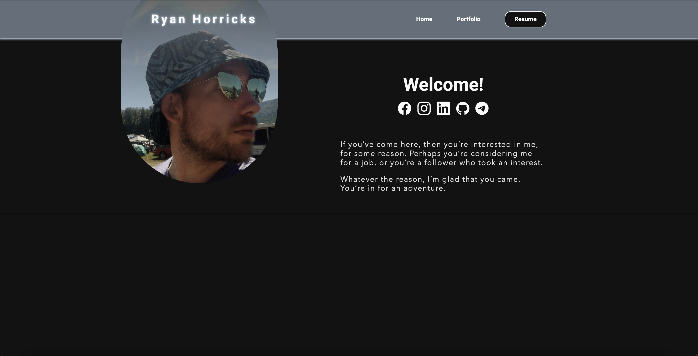
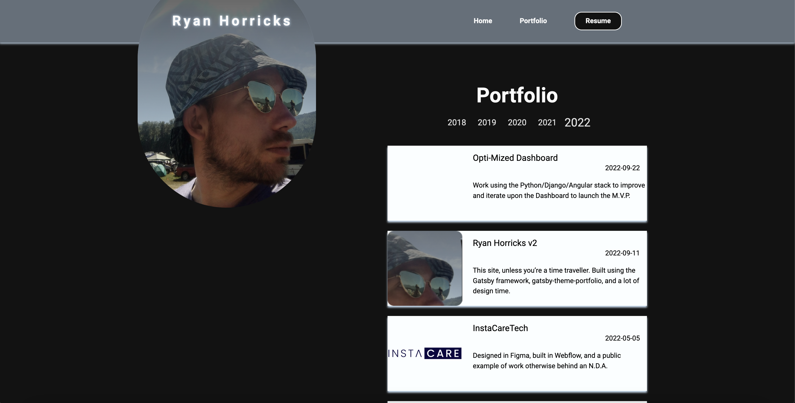

**Project:** 2022.ryanhorricks.com - A Fresh Digital Presence  
**Role:** Solo Developer  
**Live URL:** [https://2022.ryanhorricks.com](https://2022.ryanhorricks.com)

## Overview
The **2022 version** of my personal website marked a significant leap forward, built using **React** 
and **Gatsby** and deployed via **Netlify**. This iteration reflected a commitment to creating something I 
could genuinely take pride in, with an emphasis on performance, responsiveness, and design clarity. Designed 
to showcase my skills and personality, this site served as both a portfolio and a playground for exploring 
new technologies and techniques.

## Challenges and Objectives
- **Responsive Design:** Ensuring the site looks great across devices with tailored layouts for different screen sizes.
- **Dark Mode Implementation:** Seamlessly integrating a toggle for light and dark themes while addressing challenges like flashes of unstyled content.
- **Portfolio Expansion:** Introducing a dynamic portfolio feature to showcase projects effectively.
- **User Experience:** Creating an intuitive, visually appealing interface that reflects my style and technical expertise.

## My Contributions
### 1. Front-End Development
- Built the site using **React** and the **Gatsby** static site generator, taking advantage of its performance optimizations and plugin ecosystem.
- Refactored layout components for reusability, ensuring consistency across pages.
- Designed and implemented a responsive portfolio page with dynamic filtering options and a clean, grid-based layout.

### 2. Dark Mode and Theming
- Integrated **React Helmet** to manage dynamic theming, enabling light and dark modes without reloading the page.
- Overcame challenges like flashes of unstyled content by preloading theme variables in the document head.

### 3. Design and Customization
- Enhanced the visual appeal of the site using **CSS** and responsive design principles, ensuring usability across devices.
- Customized the Gatsby starter template significantly, aligning it with my personal brand and aesthetic preferences.

### 4. Deployment and Optimization
- Deployed the site using **Netlify**, leveraging its CI/CD pipeline for rapid iteration and seamless updates.
- Focused on performance tuning to minimize load times and ensure a smooth user experience.

## Outcomes and Results
- **Dynamic Portfolio:** Delivered a feature-rich portfolio section that highlights my projects effectively, providing dynamic filtering and detailed project views.
- **Enhanced User Experience:** Created an interface that reflects my personal brand while offering a smooth, responsive experience for visitors.
- **Improved Technical Expertise:** Gained deeper knowledge of Gatsby's static site generation capabilities and React's component-based architecture.

## Reflection
The **2022 version** of my site was a transformative project. What started as a redesign became an opportunity 
to refine my skills, explore modern tools, and push the boundaries of my personal brand. This iteration taught 
me the importance of balancing creativity with usability and highlighted the value of incremental improvements 
over time.

## Technical Summary
- **Skills:** Front-End Development, Static Site Generation, Responsive Design, Theming
- **Tools:** React, Gatsby, Netlify, React Helmet, CSS, JavaScript
- **Specialized Tasks:** Dark Mode Implementation, Dynamic Portfolio, Design Customization

## Repositories


## Gallery



