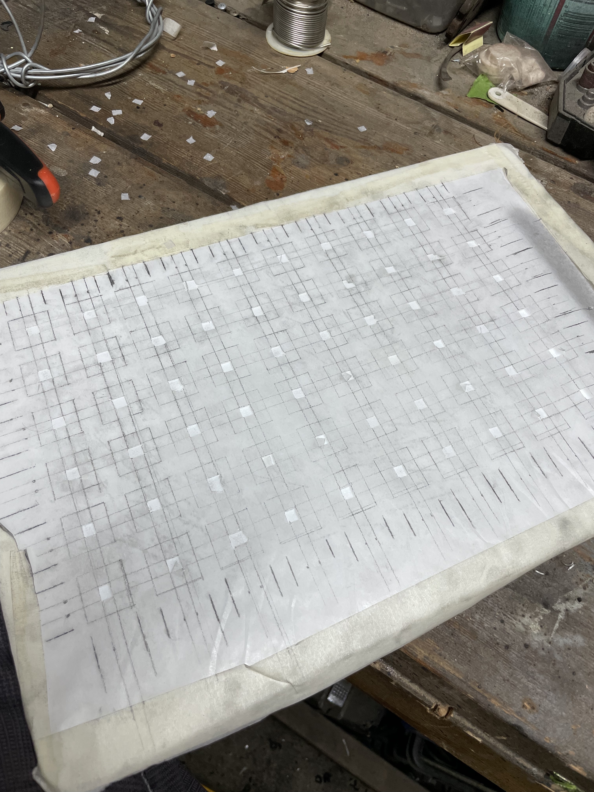
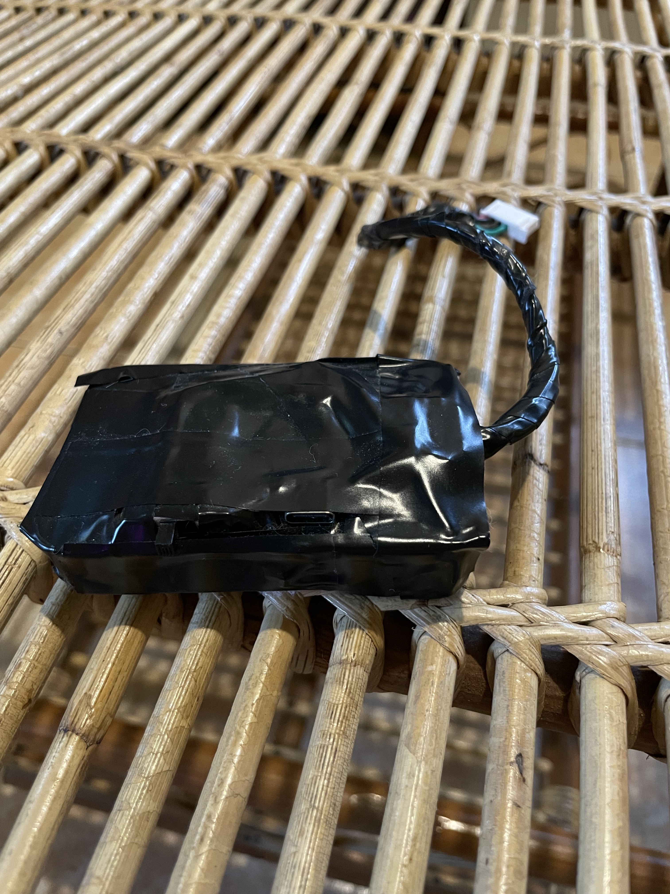
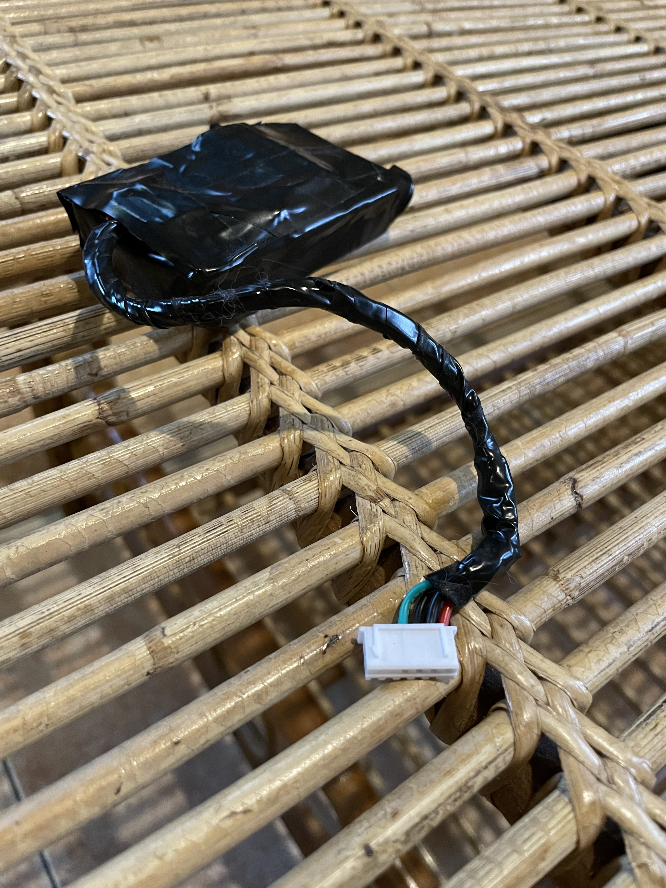

**Project:** Lit  
**Role:** Founder and Developer

## Overview
**Black Beauty** is the third chapter in developing Lit, representing a refined wearable prototype that balances 
aesthetics, functionality, and weight. Paired with the custom-built **3000mAh Power Pack**, this iteration 
tackled challenges in power management, construction techniques, and overall usability. While the hardware is 
sound, firmware issues and power system limitations provide key areas for future improvements.

## Objectives and Challenges
- **Weight Reduction:** Optimize the hat's weight for long-term comfort, addressing the shortcomings of previous prototypes.
- **Refined Construction Techniques:** Implement more precise and efficient methods for mounting and wiring components, ensuring durability and reliability.
- **Power System Optimization:** Integrate a compact and lightweight power pack with USB pass-through capabilities.
- **Field Testing:** Test the prototype in real-world conditions, exposing limitations in both hardware and software.

## My Contributions
### 1. Construction and Assembly
- **Holes and Mounting:** Enlarged and customized the hat's pre-punched holes using leather punches, achieving a precise fit for the heart-shaped LED PCBs.
- **Wiring:** Transitioned to **22-gauge solid-core wire**, simplifying the soldering process and improving overall assembly time and durability. Used stranded-core wire for terminal connections, where flexibility was critical.
- **Lens and Waterproofing:** Mounted 140° lenses on the top-facing LEDs, secured with carefully mixed epoxy, which also provided light diffusion and waterproofing.
- **PCB Securing:** Used masking tape to hold PCBs during assembly, ensuring correct orientation and alignment.

### 2. 3000mAh Power Pack Development
- Designed and built a **custom power pack** featuring:
    - **TP4056 USB-C Charging Module** for safe and efficient charging.
    - **USB Pass-Through Circuit** using P-Channel Mosfets and a Zener diode, allowing the device to run on USB power while preserving battery health.
    - Voltage divider circuit for battery monitoring, enabling the microcontroller to measure battery levels safely.
- Wrapped the power pack in electrical tape for field deployment, ensuring a lightweight, compact design while protecting internal components.

### 3. Weight Optimization
- Minimized wiring length and optimized gauge to balance durability and weight reduction.
- Eliminated unnecessary components and improved epoxy application to avoid excess weight from reapplications.

### 4. Field Testing and Lessons Learned
- **Field Testing:** The hat was tested during travel and live events, demonstrating comfort and wearability despite sporadic firmware issues.
- **Firmware Challenges:**
    - Experimental firmware and usermods caused instability and frequent re-flashing.
    - Corruption of configuration files occurred due to the limitations of the LDO voltage regulator on the microcontroller.
- **Power System Limitations:**
    - Phantom power draw: Identified potential leakage from pull-up/down resistors and the voltage divider circuit.
    - Lack of voltage regulation led to instabilities when the battery voltage dropped below nominal levels.

### 5. Future Improvements
- Introduce a **regulated 5V switched-mode converter** for stable voltage output and better microcontroller performance.
- Move current-sensing circuits to a dedicated board and gate voltage monitoring behind the power switch.
- Replace the SPDT switch with a **soft power switch** for improved durability and clean shutdowns, reducing risk of data corruption.

## Outcomes
- **Functional Prototype:** Achieved a wearable, lightweight hat with refined construction techniques and integrated LED panels.
- **Enhanced Comfort:** Weight optimizations allowed for extended wear during travel and events.
- **Identified Areas for Improvement:** Highlighted key limitations in firmware reliability, power system design, and control mechanisms.

## Technical Summary
- **Skills:** Electrical Engineering, Power System Design, PCB Design, Wearable Technology Development
- **Tools:** ESP32-S3, TP4056, IRF4905 P-Channel Mosfets, JST-XH Connectors, Leather Punches, Epoxy
- **Features:** USB Pass-Through, Battery Voltage Monitoring, LED Waterproofing, Lightweight Construction

## Gallery
### Construction




### 3000mAh Power Pack




### Product



