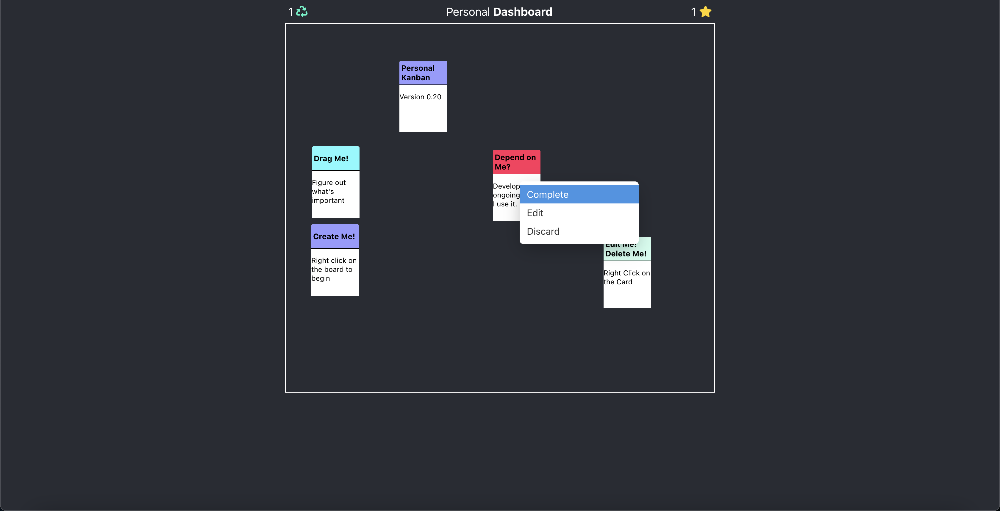
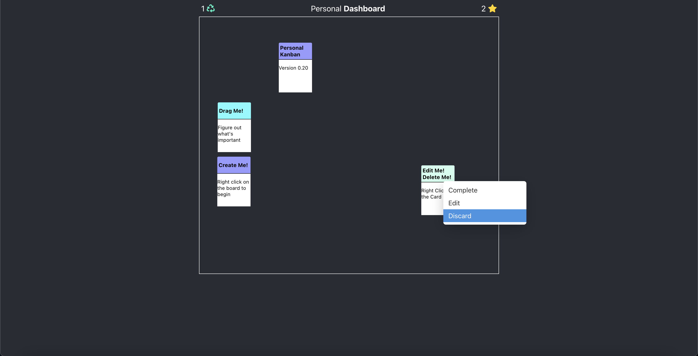
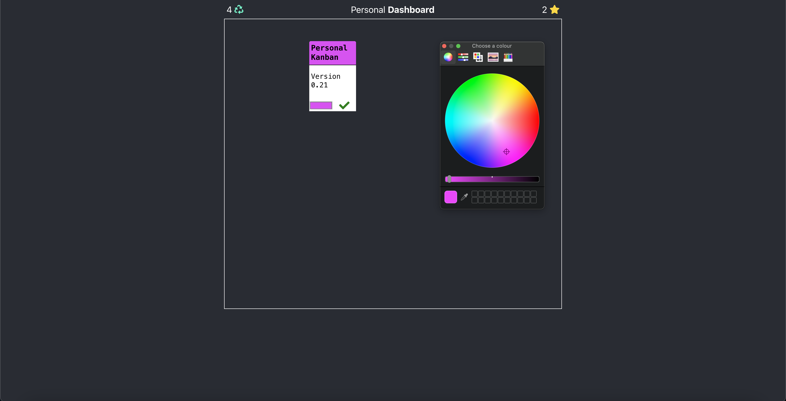

**Project:** Dashboard - Virtual Kanban Board  
**Role:** Solo Developer

## Overview
Dashboard is a virtual **Kanban board** designed to emulate the subtle possibilities of a physical board I 
had been using for personal organization. Built with React/Redux, this tool focuses on flexibility and 
freedom, enabling users to move cards dynamically without the rigid rows and columns often found in 
traditional tools like Asana or Trello. This project was a personal challenge to create something unique 
and functional while refining my front-end development skills.

## Challenges and Objectives
- **Creating Flexibility:** Designing a board that avoids the rigid structures of traditional Kanban tools, allowing users to move cards freely.
- **Enhanced User Interaction:** Emulating the tactile experience of a physical board in a digital interface.
- **Iterative Development:** Building and refining the application over multiple weeks to create a polished product.

## My Contributions

### 1. Front-End Development
- Built the application using **React** and managed state with **Redux**, ensuring a seamless and responsive user experience.
- Focused on dynamic card movement, mimicking the freedom of physical boards.
- Designed and implemented key features, including card creation, editing, and completion, with an intuitive interface.

### 2. Design and User Experience
- Used **Sketch** to mock up and design the user interface, ensuring a clear and user-friendly workflow.
- Modeled the digital board after a physical Kanban board I had previously used, capturing the subtle nuances of tactile organization.
- Created a customizable interface to allow users to adapt the board to their personal workflows.

### 3. Problem-Solving and Persistence
- Developed the project as a personal challenge after a job rejection, channeling motivation into a unique and functional tool.
- Overcame setbacks, including lost progress due to a wiped laptop, by focusing on continued learning and improvement.

## Outcomes and Results
- **Functional Kanban Board:** Delivered a virtual tool that blends the flexibility of physical boards with the convenience of digital interfaces.
- **Skill Development:** Deepened my expertise in **React** and **Redux**, while enhancing my understanding of user-focused design.
- *Creative Achievement:** Built a distinctive application that challenges traditional Kanban paradigms and emphasizes user freedom.

## Reflection
This project was both a technical and personal journey. While initially inspired by a professional 
rejection, Dashboard became a platform for exploring creative solutions to organizational challenges. 
Building this application reinforced my belief in the value of flexibility, both in design and in life, 
and demonstrated the power of persistence and iteration.

## Technical Summary
- **Skills:** React Development, Redux State Management, User Experience Design, Iterative Development
- **Tools:** React, Redux, CSS, JavaScript, Sketch
- **Specialized Tasks:** Dynamic Card Movement, Customizable Workflow Design, Front-End Optimization

## Gallery
{{ < github repo="codekane/Dashboard" > }}




