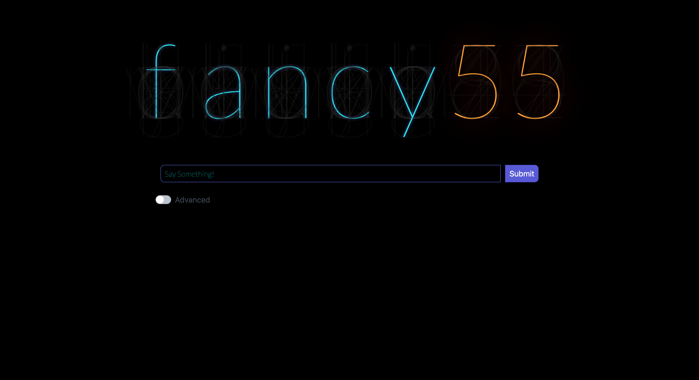

**Project:** Fancy55 - Interactive Nixie Tube Display  
**Role:** Solo Developer
**Live Site:** [https://fancy55.netlify.app](https://fancy55.netlify.app/)

## Overview
**Fancy55** is a creative and ambitious project inspired by the aesthetics of Nixie Tube displays. Originally 
based on a Nixie Tube clock designed by another developer, I abstracted their visual method to support any 
character, including letters and numbers. Built using **Jekyll**, **Liquid templates** **JavaScript**, and 
**jQuery**, Fancy55 features an interactive logo where users can input text to dynamically control the 
display, customize colors, and experiment with various aesthetic effects. This project highlights technical 
ingenuity, artistic expression, and interactive design.

## Challenges and Objectives
- **Aesthetic Excellence:** Abstracting the visual methodology of Nixie Tube displays to dynamically render any character.
- **Interactive Design:** Enabling users to input text and customize the display's behavior and aesthetics.
- **Iterative Expansion:** Extending the project to include sequential animations for multiple words and advanced user controls.
- **Rebuilding from Loss:** Reimagining the project after the original full-stack app was lost due to hardware failure, while incorporating new creative elements.

## My Contributions
### 1. Interactive Design and Development
- Abstracted the visual design of Nixie Tubes from an existing clock implementation, allowing it to dynamically render any character.
- Implemented a responsive interface where users can input text, and the logo flashes the entered characters sequentially if multiple words are entered.
- Added user controls to customize aesthetics, including color and visual effects, allowing for playful experimentation.

### 2. Front-End Development
- Built the website using **Jekyll**, leveraging **Liquid templates** to dynamically generate content and streamline front-end development.
- Enhanced the interactivity with **jQuery** and **JavaScript**, creating a seamless and engaging user experience.
- Created a flexible and proportional layout that adapts seamlessly to different screen sizes and devices.

### 3. Iteration and Resilience
- Rebuilt the project after losing the original full-stack app due to a hardware failure, starting anew with fresh inspiration and a refined scope.
- Pivoted from the original vision of a video chat enhancement tool to an artistic and technical showcase.

## Outcomes and Results
- **Interactive Showcase:** Delivered a visually captivating Nixie Tube display that highlights creativity and technical skill, complete with dynamic text animations and customizable effects.
- **Resilience in Development:** Successfully overcame the challenges of data loss and repurposed the project into a focused and impactful creation.
- **Technical Growth:** Expanded my expertise in responsive design, static site generation, and interactive front-end development using **Liquid templates** and **jQuery**.

## Reflection
**Fancy55** represents a journey of both technical and personal growth. What began as an ambitious full-stack 
app transitioned into an artistic expression through Nixie Tube-inspired visuals. By abstracting the design 
from an existing Nixie clock and leveraging **Liquid templates**, I created a versatile and interactive 
experience. Rebuilding from scratch taught me valuable lessons about resilience, adaptability, and the 
potential of combining aesthetics with interactivity.

## Technical Summary
- **Skills:** Front-End Development, Liquid Template Integration, Responsive Design, Static Site Generation, Interactive Interfaces
- **Tools:** Jekyll, Liquid Templates, jQuery, JavaScript
- **Specialized Tasks:** Nixie Tube Design Abstraction, Dynamic Interactivity, Aesthetic Customization, Sequential Animations

## Repositories

