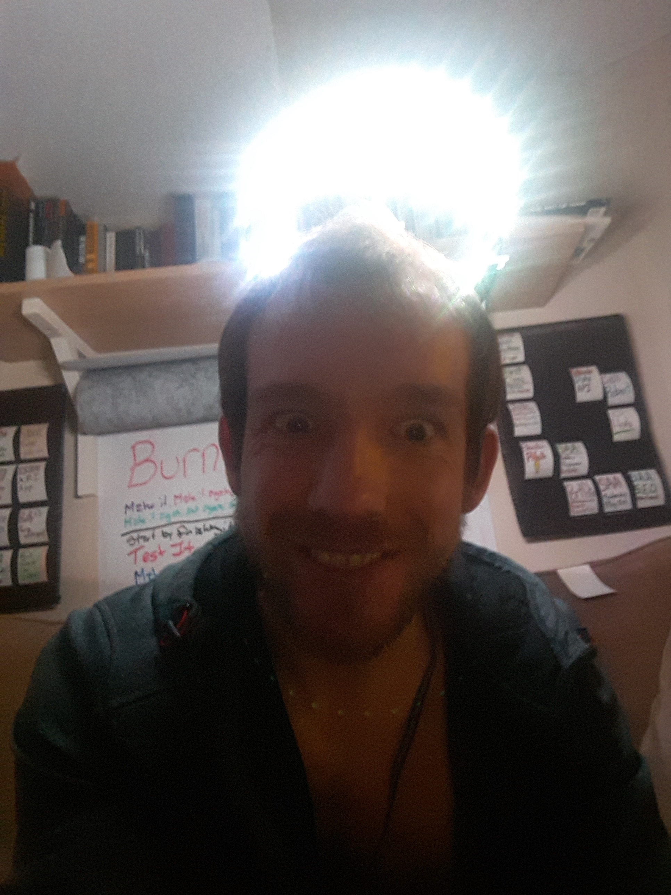
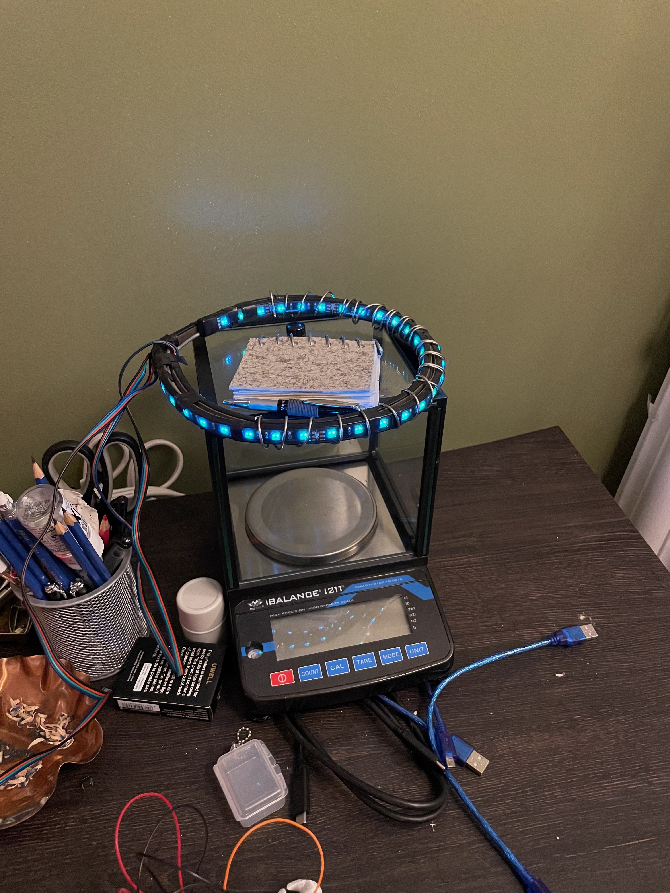

**Project:** Halo - Custom RGB LED Controller  
**Role:** Solo Designer and Developer

## Overview
**Halo** is a striking art piece and technical project born from salvaged materials. I repurposed waterproof 
12V RGB LED strips found next to a dumpster, pairing them with a custom-built **Arduino Pro Mini** controller 
to replace the broken original. This project combined electronic design, soldering, and structural ingenuity 
to create a mesmerizing halo of light that illuminated both inside and outside a circular loop.

## Challenges and Objectives
- **Controller Replacement:** Designing and building a new RGB LED controller to replace the broken one.
- **Noise Management:** Addressing circuit noise introduced by the boost converter powering the LEDs.
- **Power Consumption:** Overcoming power startup limitations caused by over-current protection on the 5V power bank.
- **Structural Rigidity:** Creating a stable and aesthetically pleasing frame to support the LED strips.
- **Artistic Vision:** Fashioning the salvaged LED strips into a halo with an innovative lighting effect.

## My Contributions
### 1. Circuit Design and Controller Development
- Designed and built a new RGB LED controller using an **Arduino Pro Mini**, **boost converter**, and **N-Channel MOSFETs**.
- Programmed the Arduino to read potentiometer inputs, enabling smooth, adjustable control over the **R/G/B** channels.

### 2. Structural Engineering
- Constructed a rigid circular frame using **galvanized steel wire**, ensuring stability for the LED loop.
- Secured the waterproof LED strips to the frame using **stainless steel wire**, carefully wrapping the structure while sparing the LEDs, resulting in a durable and aesthetically pleasing design.

### 3. Soldering and Assembly
- Soldered the circuit components onto a custom board, ensuring durability beyond the typical breadboard setup.
- Connected two waterproof LED strips in a loop configuration, creating a unique lighting effect that illuminated both inward and outward.

### 4. Problem-Solving
- **Circuit Noise:** Investigated and mitigated flickering caused by the boost converter, learning valuable lessons about noise in electrical circuits.
- **Power Consumption:** Developed a manual workaround to reduce startup power draw by adjusting potentiometer settings before gradually increasing brightness.

### 5. Artistic Execution
- Achieved an innovative design by mounting the LED strips in a circular configuration, producing a radiant halo effect that combined technical precision with artistic vision.

## Outcomes and Results
- **Functional Controller:** Delivered a fully operational RGB LED controller, salvaging otherwise unusable materials.
- **Innovative Art Piece:** Created a visually stunning light display that merged technology with creativity.
- **Lessons Learned:** Gained firsthand experience in managing circuit noise, power constraints, structural challenges, and the intricacies of MOSFET control in LED circuits.

## Reflection
The **Halo** project was a creative blend of art and engineering, transforming discarded materials into 
something beautiful and functional. This experience deepened my understanding of circuit design, power 
management, structural solutions, and the challenges of working with salvaged components. It also served as 
a reminder of the potential for resourcefulness and innovation in even the most unexpected projects.

## Technical Summary
- **Skills:** Circuit Design, Structural Engineering, Soldering, Arduino Programming, Power Management
- **Tools:** Arduino Pro Mini, N-Channel MOSFETs, Boost Converter, Galvanized Steel Wire, Stainless Steel Wire, Potentiometers
- **Specialized Tasks:** RGB LED Control, Circuit Noise Mitigation, Structural Stability, Salvaged Component Integration

## Gallery



