**Project:** Lit  
**Role:** Founder and Hardware Developer  

## Overview
**Iterations** is the second phase in the development of **Lit**, focused on creating and testing three 
prototypes based on the ESP8266, ESP32-S2, and ESP32-S3 microcontrollers. These prototypes explored hardware 
limitations, refined key subsystems, and tested wireless synchronization for sound-reactive lighting effects. 
Each iteration brought valuable insights into optimizing power systems, enhancing user interfaces, and 
advancing networked connectivity.

## Objectives and Challenges
- **Exploration of Hardware Limitations:** Evaluated the capabilities of the ESP8266, ESP32-S2, and ESP32-S3 for processing-intensive tasks, including audio signal processing, network synchronization, and real-time lighting effects.
- **Subsystem Refinement:** Enhanced physical user interfaces, transitioning from basic buttons and potentiometers to rotary encoders paired with OLED displays.
- **Power System Optimization:** Improved energy efficiency, reduced noise in power supplies, and enabled seamless operation on USB power with battery preservation.
- **Network Synchronization:** Made use of **UDP Multicast-based communication** to enable synchronized lighting effects across multiple devices.

## My Contributions
### 1. Prototyping and Design
- Developed three prototypes:
    - **ESP8266 Split Rail Controller:** Tested networked sound reactivity using experimental firmware that offloaded audio processing to other devices.
    - **ESP32-S2 Controller:** Incorporated a rotary encoder and I2S microphone for UI control and sound reactivity while evaluating its performance in audio processing. Found significant limitations in its capabilities compared to the S3.
    - **ESP32-S3 Controller:** Added an OLED display and I2S microphone for enhanced sound-reactive functionality and user interactivity.
- Designed and fabricated custom **adapter boards** for microcontrollers to simplify breadboarding and prototyping.

### 2. Exploration of Hardware Limitations
- Implemented experimental firmware to enable the ESP8266 to synchronize lighting effects with audio-reactive data processed on other devices.
- Conducted performance evaluations of the ESP32-S2 and ESP32-S3, identifying the latter as optimal for audio-intensive applications due to its dual-core architecture and advanced processing capabilities.

### 3. Subsystem Refinement
- Enhanced user interfaces across iterations:
    - Started with basic buttons and slide potentiometers.
    - Transitioned to a rotary encoder paired with an OLED display for intuitive, hardware-level control of brightness, effects, and color palettes.
- Tested and refined modular construction techniques to improve the reliability and maintainability of prototypes.

### 4. Power System Optimization
- Integrated a **USB Pass-Through Circuit** using P-Channel Mosfets and Schottky diodes, enabling simultaneous device operation and battery charging without impacting battery health.
- Reduced noise in the split-rail power supply with capacitors, achieving partial stability for the ESP8266. However, due to remaining instability, the design was eventually retired.
- Designed and tested efficient power delivery systems to support both analog and addressable LED systems, minimizing quiescent current draw and ensuring reliable performance.

### 5. Network Synchronization
- Leveraged **UDP Multicast-based communication** for wireless synchronization across devices, enabling real-time lighting effects.
- Experimented with using a Raspberry Pi Zero W as a dedicated router for managing network operations. This approach was abandoned due to insufficient processing power.

### 6. Practical Construction
- Used **JST-XH connectors** and custom protoboards to facilitate modular design and ease of assembly.
- Embedded LED panels seamlessly into enclosures, prioritizing aesthetics and accessibility for testing and maintenance.

## Outcomes and Learnings
- **Functional Prototypes:** Developed three unique controllers, each addressing specific challenges in power systems, network connectivity, and user interfaces.
- **Technical Validation:** Demonstrated the feasibility of sound-reactive, networked lighting systems while identifying limitations in certain hardware configurations.
- **Scalable Insights:** Gained a comprehensive understanding of modular design, power management, and network synchronization for future iterations.

## Technical Summary
- **Skills:** Microcontroller Integration, Power System Design, Sound Reactivity, Network Synchronization, Modular Prototyping
- **Tools:** ESP8266, ESP32-S2, ESP32-S3, EasyEDA, KiCad, JST-XH Connectors, FreeCAD, Logic Level Converters
- **Features:** Audio-Responsive Lighting, OLED UI, Split-Rail Power Supplies, Modular Construction, Wireless Synchronization

## Gallery

### ESP32-S3 LED Controller

#### Breadboard




#### Layout




#### Protoboard





#### Product


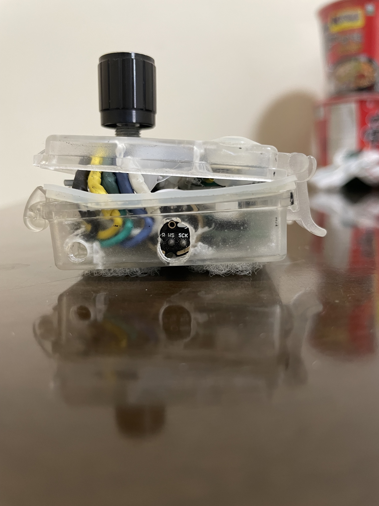
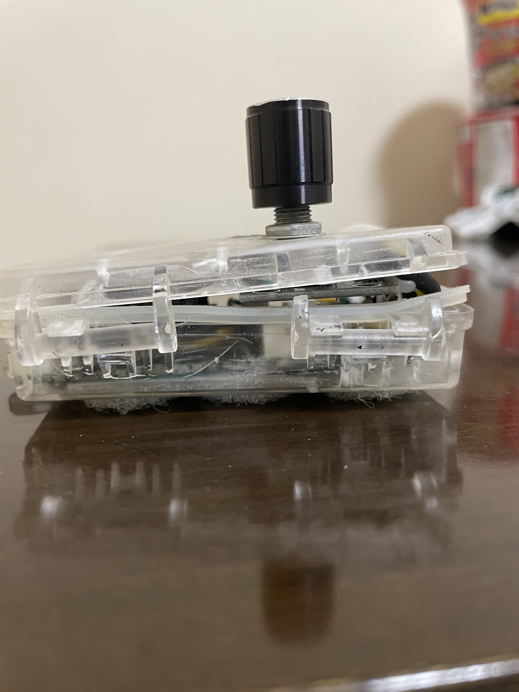



### ESP32-S2 LED Controller
Continuing with my experiments, and my penchant for using spare parts, I built another controller using the ESP32-S2. I equipped it with a rotary encoder, however my prime interest was in seeing how limited the S2 was compared to the S3, when being tasked with audio processing. The answer was quite - it did in fact work, however it came at the cost of UI responsiveness, with the web server often slowing to a crawl, and the audio processing time entering into the DANGER ZONE.

#### Breadboarding


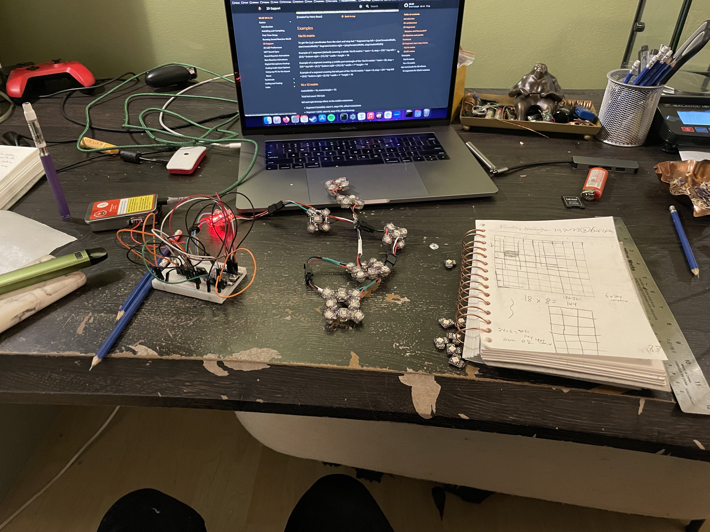

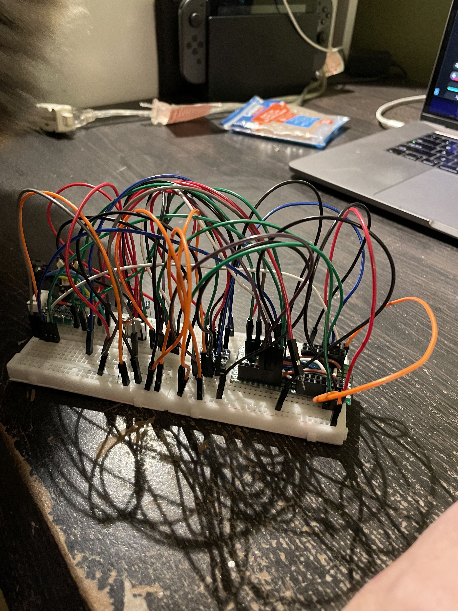

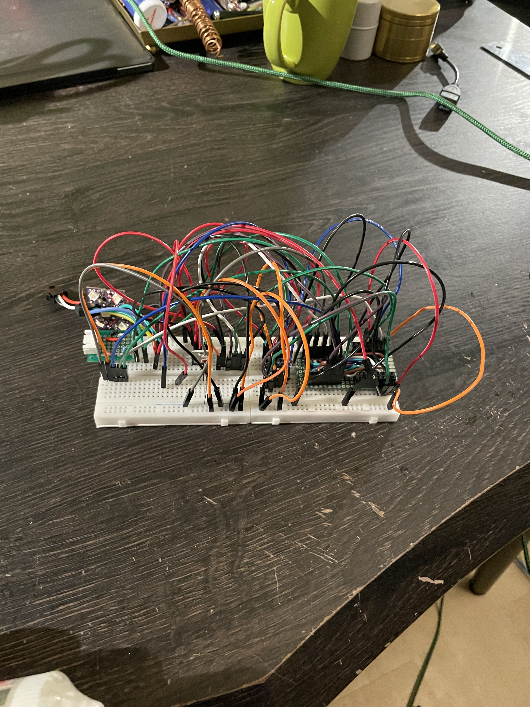


#### Assembly



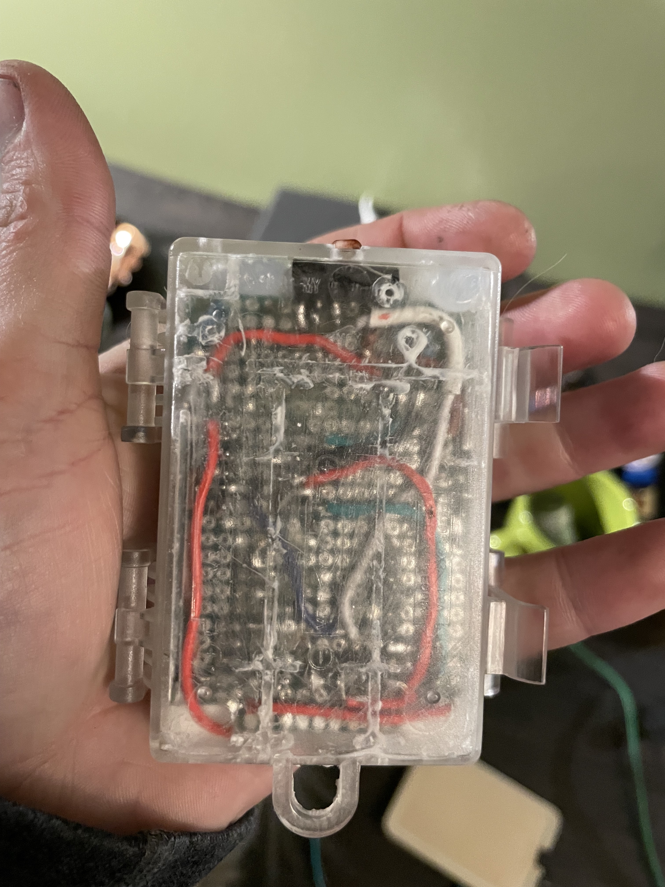



#### Power Pack




#### Installation






### ESP8266 Split Rail LED Controller
Looking to experiment, I created another controller for a fixed installation using some parts I had lying around. It drives a single string of 5V addressable LED's, as well as a strip of analog 12V LED's, both being powered from either 5V USB pass-through, or a single Lithium Polymer Battery. What's more, using experimental firmware, I was able to have it sync to the audio reactive data from my other devices (without needing to do the processing itself).

#### Breadboarding




#### Power Supply





#### Noise


#### Mainboard


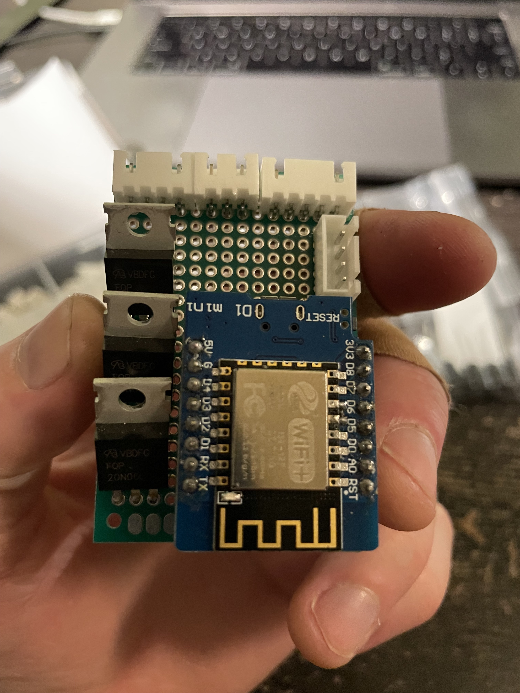



#### Installation

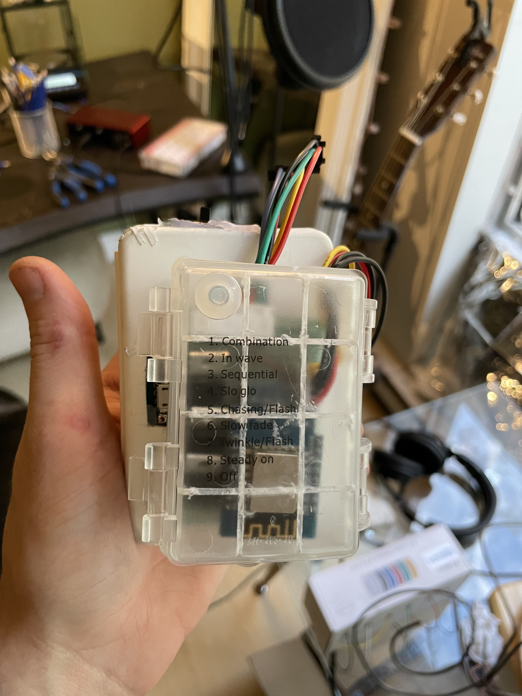



### All-Together

#### Live Demo


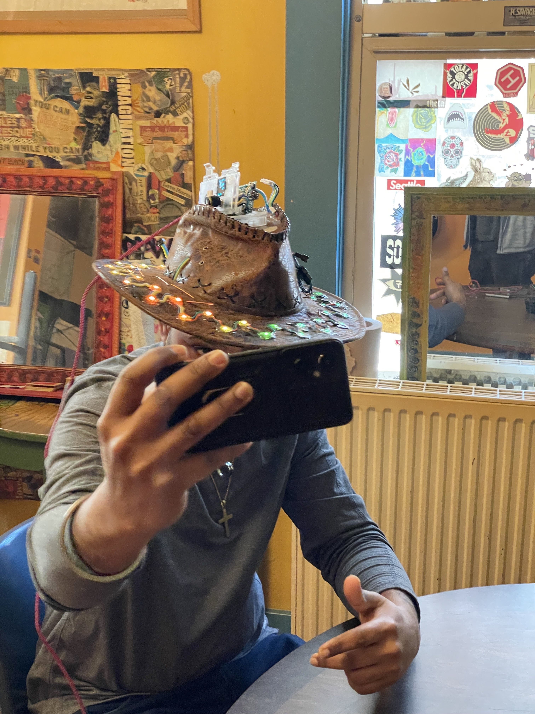




#### Ensemble


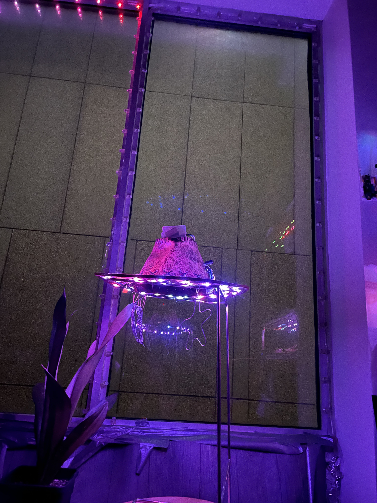

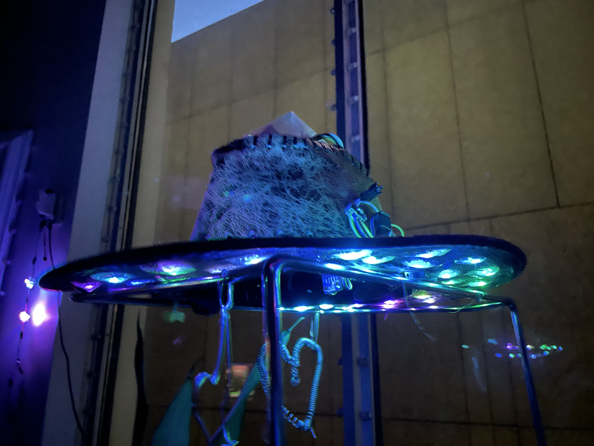



