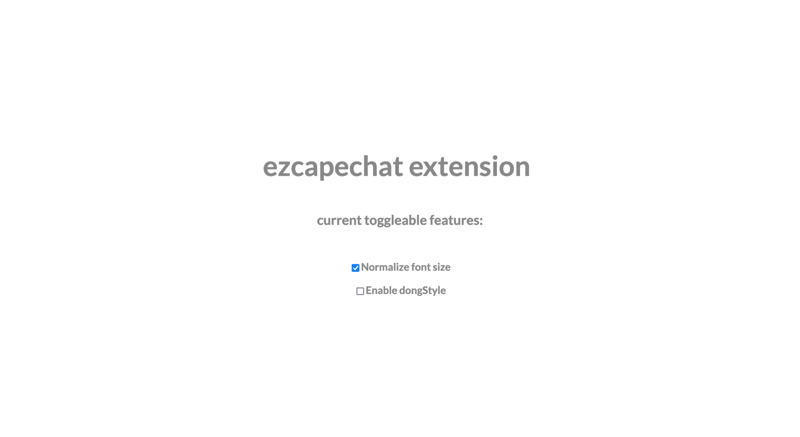

**Project:** Kageshi Browser Extension  
**Role:** Developer and Collaborator

## Overview
The **Kageshi Browser Extension** was a collaborative project aimed at extending the functionality of the 
now-defunct video chat website, **ezcapechat** (formerly known as Kageshi). With the platform’s transition 
from Flash to JavaScript, our small team took the opportunity to develop a **Firefox/Chrome extension** that 
added creative and practical features for users. This project blended reverse engineering with innovative 
front-end development, showcasing the potential for browser-based extensions to enhance user experiences.

## Challenges and Objectives
- **Reverse Engineering:** Understanding the newly implemented JavaScript front-end to identify integration points for the extension.
- **Feature Extension:** Adding new functionalities to enhance the base experience of the video chat platform.
- **Cross-Browser Compatibility:** Ensuring the extension worked seamlessly across both Firefox and Chrome.

## My Contributions

### 1. Reverse Engineering
- Analyzed the **JavaScript-based front-end** of the platform, identifying opportunities to integrate new features.
- Collaborated with the team to document the site’s behaviors and core functions, ensuring compatibility with the extension.

### 2. Extension Development
- Developed the extension using **JavaScript**, focusing on creating a robust and modular codebase.
- Implemented several interactive features to extend the functionality of the chat platform, making it more engaging for users.
- Ensured compatibility with both **Firefox** and **Chrome** browsers, adhering to the standards of their respective WebExtension APIs.

### 3. Collaborative Development
- Worked closely with a small team of developers to brainstorm and implement creative ideas for the extension.
- Contributed to versioning and collaborative workflows via GitHub to streamline the development process.

## Outcomes and Results
- **Enhanced User Experience:** Delivered a browser extension that enriched the base functionality of the video chat platform.
- **Cross-Browser Success:** Achieved seamless compatibility across Firefox and Chrome, ensuring accessibility for a wide user base.
- **Technical Growth:** Expanded my knowledge of browser extension development and collaborative coding workflows.

## Reflection
The **Kageshi Browser Extension** was a unique and rewarding experience that combined technical exploration 
with collaborative problem-solving. Working with a team to reverse-engineer the platform’s JavaScript 
front-end and implement new features demonstrated the power of creative development within browser-based 
ecosystems. Though the platform is now defunct, this project remains a testament to the versatility and 
potential of browser extensions.

## Technical Summary
- **Skills:** Browser Extension Development, JavaScript, Front-End Development, Reverse Engineering
- **Tools:** JavaScript, WebExtension APIs, GitHub
- **Specialized Tasks:** Cross-Browser Compatibility, Feature Extension, Collaborative Development

## Repositories


