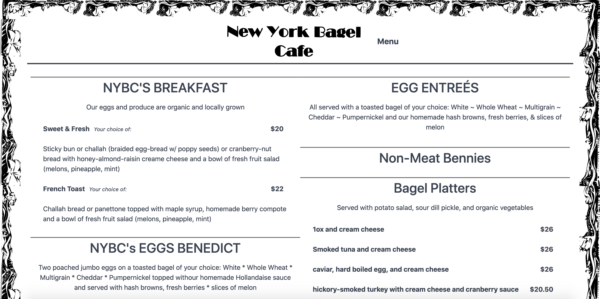
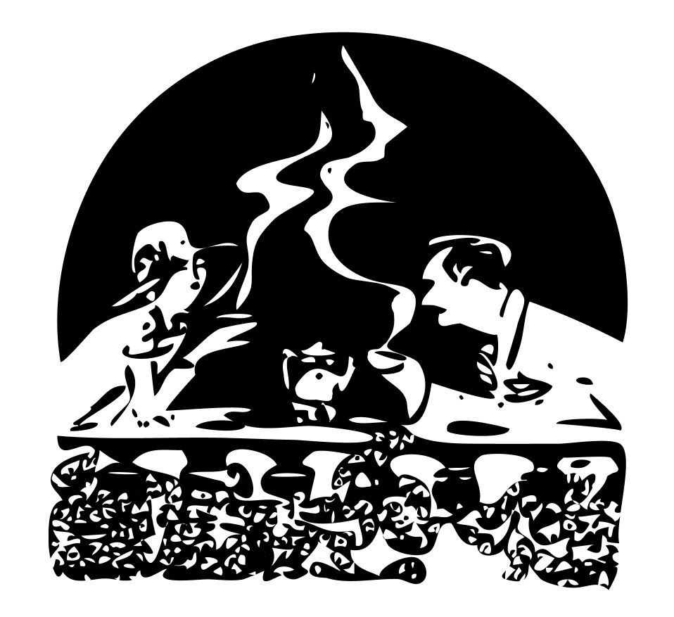
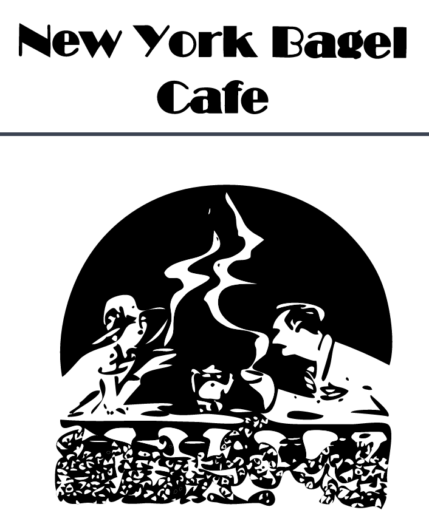

**Project:** New York Bagel Cafe - Static Website  
**Role:** Solo Developer

## Overview
The **New York Bagel Cafe** website is a static site built using **Jekyll** to provide an online presence for 
the restaurant, featuring their menu and key information. This project marked one of my first proactive efforts 
to offer my services directly to a business. By leveraging privileged access to physical content like images 
and menus provided by the cafe, I was able to craft a visually appealing and functional site. Utilizing 
**Liquid templates**, **CSS**, and **SVG graphics**, the site was designed for easy maintenance and strong 
brand representation.

## Challenges and Objectives
- **Responsive Design:** Ensuring the site looked great on both desktop and mobile devices.
- **Interactive Menus:** Implementing an intuitive, visually engaging layout for the restaurant menu.
- **Brand Representation:** Incorporating custom SVG graphics and design elements that aligned with the cafe’s identity.
- **Client Collaboration:** Translating the cafe’s physical assets into a cohesive digital experience.

## My Contributions
### 1. Front-End Development
- Designed and implemented a responsive layout using **HTML**, **CSS**, and **Liquid templates** for dynamic content generation.
- Created an accordion-style menu for an interactive and user-friendly experience.
- Enhanced the aesthetic with custom **SVG graphics**, including the restaurant’s logo and decorative elements.

### 2. Menu Data Structuring
- Codified the restaurant’s menu into a structured data file, making updates easier and reducing the potential for errors.
- Designed a two-column layout for efficient display of menu items, ensuring clear readability and visual balance.

### 3. Client Collaboration and Content Integration
- Collaborated with the cafe’s staff to gather high-quality physical assets, including images, menus, and branding materials.
- Translated these assets into a polished and cohesive digital format, ensuring fidelity to the cafe’s branding.

### 4. Responsive Features and Optimization
- Integrated Spectre.css for lightweight, responsive styling across all pages.
- Configured dynamic elements like a responsive navbar and footer, featuring the restaurant’s hours and address.
- Added **Google Analytics** for tracking visitor activity and gathering insights into user behavior.

## Outcomes and Results
- **Engaging Online Presence:** Delivered a clean, responsive website that showcased the cafe’s offerings and made information easily accessible.
- **Streamlined Updates:** Structured the menu in a way that allowed for quick and accurate updates, minimizing downtime.
- **Enhanced User Experience:** Features like the interactive menu and clear navigation improved usability and engagement.
- **Business Collaboration:** Successfully translated the cafe’s physical assets into a strong online presence, providing a new channel for customer interaction.

## Reflection
The **New York Bagel Cafe** website was an early opportunity to refine my skills in static site development 
and responsive design while working directly with a client. By combining Jekyll’s static site generation with 
custom front-end features, I delivered a functional and visually appealing site tailored to the cafe’s needs. 
This project also underscored the value of proactive outreach and effective client collaboration in driving 
meaningful projects.

## Technical Summary
- **Skills:** Static Site Development, Responsive Design, Interactive Features, Client Collaboration
- **Tools:** Jekyll, Liquid Templates, Spectre.css, Google Analytics, CSS, SVG
- **Specialized Tasks:** Menu Structuring, Accordion Menu Design, SVG Graphics Creation

