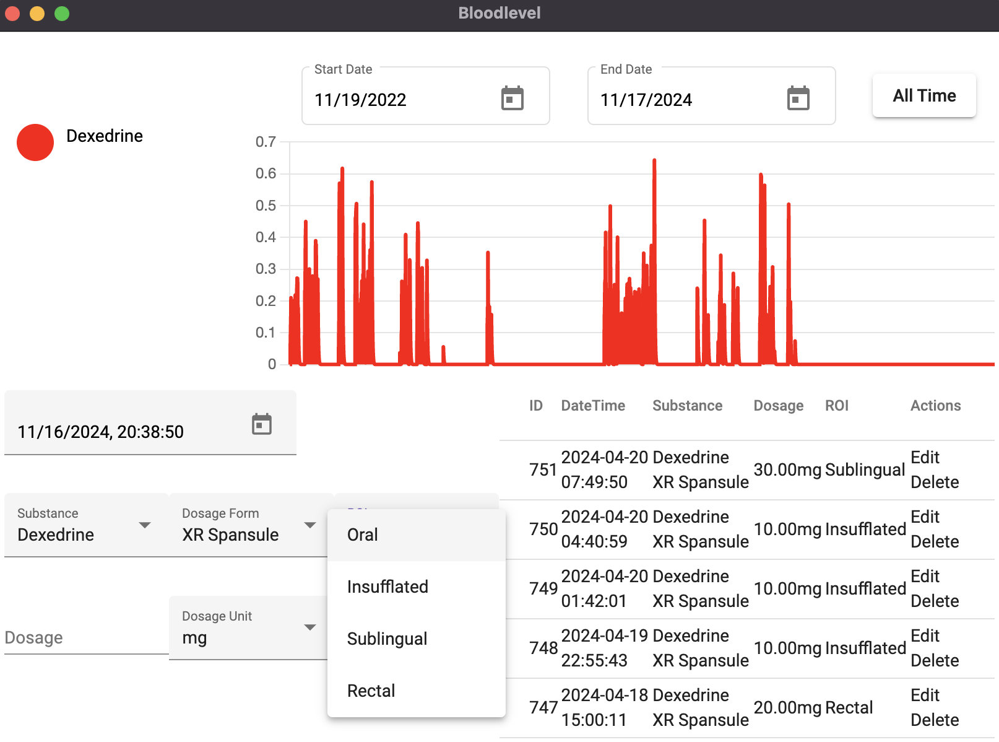

## Why
I was inspired to build this app by my work at the MARA group. While I was there, while prospecting for features, 
I spent a considerable amount of time designing potential improvements to their medication tracker. What I figured, 
was that if we had precise knowledge of when the medication was taken, what the dosage was, and the precise 
formulation of the substance, then it should be possible to more-or-less accurately plot out what the actual 
blood level of that medication would be, over time.

The reason this matters is that some drugs have a very long half life. An example of this happens to be Dexedrine, 
which I had been taking at the time. This is a feature that was never actually implemented in the application 
I was working on, however I invested a fair amount of time plotting out what it would take, and despite the 
fact that I no longer worked at that job (or in the digital health space) I decided to go about making it 
for myself.

This is that application.

## Front End
The front-end is a web app built using Angular. I chose Angular because I'd just finished working on a project 
that used it, making it very quick for me to get productive in. I then took that angular webapp, and I packaged 
it up using Electron, making it useful as a desktop app.







It's designed to hook in to the back-end, pulling the history for all of my dose records, and then plotting them 
on a chart. I don't recall what scale it's using here, but it is using a scale, and these are meaningful numbers. 
It's likely ng/mL, or something else that's esoterically medical.

There is an option to change the start/end date of the graph, in case I didn't want to look at myself wholly, 
in any particular instance. Doing so was also helpful for performance reasons - it worked okay at first, but 
all of the calculations to actually derive the blood level are being performed on the front-end (albeit using 
numbers for the calculations that are derived from the back-end).

## Back End

### Version 1
The first version of the back-end used Go. I did this, because I'd never actually used Go before, and I wanted 
to learn.



I did actually succeed in building a functional AI using Go. I learned a lot in the process, however when it 
came time to continue iterating, and building upon what I'd already made, I found it to be rather... slow. 
Not in terms of performance, but rather in terms of how much I could hope to get done. If I was looking to 
make something rock-solid, and production ready, then Go is a wonderful option. In this case, what I wanted 
was to put together a quick, iteratable, functional prototype. It's for this reason that, for the next version, 
I switched to Python/Django.

### Version 2
For this version, I switched to Python. Initially I made a stab at building it out using FastAPI, but I again 
found the process to be slow. I had just finished working on a project using Django, and I knew it would be 
fast, hence my choice of framework.







I made use of the built-in Django Admin panel to provide a front-end. I made use of this for adding different 
substances, formulations, and the pharmacokinetic data, which together enable the pseudo-accurate calculations. 
I used Django Rest Framework for building out the API, and set up all of the correct database associations to 
ensure that only valid data is collected.

I also provided the faculties for estimation of certain time-release medications. Given that my target 
substance was Dexedrine, I added support for the Dexedrine XR formulation. Additionally, I added support for 
multiple different routes of administration, having to guestimate at their relative bioavailabilities, but 
nonetheless seeking to account for all variables.

The faculty for recording individual doses was primarily offloaded to the Front-End app. It can theoretically 
be done on the back-end, however I only found it to be necessary in a few select cases, when the libraries I was 
using to handle date on the front-end struggled (think DST, and on the first/last day of the month, for a few 
hours... bug remains unresolved).

## Lessons
Though it may have been inspired by work I did for another company, this project was actually deeply personal 
to me. I'd had a few years clean off of Dexedrine before I started that job, however I found that the unrealistic 
expectations, poor boundaries, and lack of support in that position ultimately lead me to drug use to cope. 

That's not how I actually want to live, and yet it's how I lived until, apparently, April of 2024. I actually 
used this application, and I found it to be very helpful as a means to really LOOK at myself, and see these 
patterns in my behaviour, and it gave me the faculty to cross-reference what else was going on in my life, 
alongside the drug use. Ultimately, as you can see from the graph, I actually got clean.

How did I do it? Dancing. Climbing. Boundaries. Discipline.

It was also noticing that I was a much more loving person when I was off the drug. Sure, I couldn't code for 
12 hours at a stretch, but that wasn't healthy for me, and if I'm in a position in life where I am expected 
to put in superhuman efforts, at the expense of my health, and well-being? I seriously question whether or not 
it's worth it.

If you've got to the end, thank you. I hesitated on sharing this project, and this story for several years. 
It wasn't until I saw on my analytics that someone had actually looked at this page, and the stub that was 
the content, that I was motivated to act. My new deal is all about Authenticity - this is who I am, this is where 
I've been, and I own these facts. I also have the privilege that comes with having recovered - I can actually 
talk about these experiences with the benefit of hindsight, and clean living, without having to worry about 
being judged for it.

Thank You. I really mean that.

