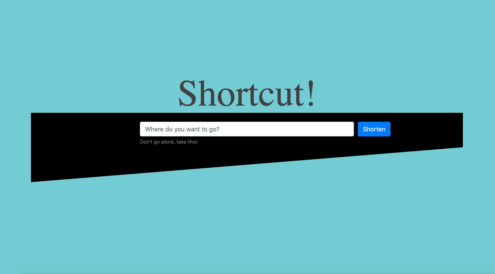

**Project:** Shortcut - URL Shortener  
**Role:** Solo Developer  

## Overview
**Shortcut** is a simple yet functional **URL shortener** built using **Ruby** and the **Sinatra framework**. 
This project was developed during a pivotal moment in my life, as I embarked on a journey to Vancouver to 
break into the tech industry. Though basic in scope, it served as a valuable exercise in creating 
streamlined, user-focused applications with core back-end functionality.

## Challenges and Objectives
- **Core Functionality:** Designing a system to accept long URLs and generate short, unique links.
- **Custom SVG Design:** Creating hand-drawn SVGs for the homepage, using math to achieve perfect alignment with the design.
- **Minimalist Design:** Focusing on simplicity and ease of use for a clean and efficient user experience.
- **Time Constraints:** Completing a functional prototype within a limited time frame.

## My Contributions
### 1. Back-End Development
- Built the application using **Ruby** and the lightweight **Sinatra framework**, focusing on simplicity and performance.
- Implemented functionality to accept long URLs, generate short links, and redirect users to the original URL upon request.
- Designed a basic database structure to store URL mappings securely.

### 2. Front-End Design and Custom SVGs
- Created a simple and intuitive user interface to ensure ease of use for all interactions, from URL input to link retrieval.
- Designed **hand-drawn SVG graphics** for the homepage, leveraging precise mathematical calculations to achieve perfect alignment with the design.
- Used **Sketch** for initial mockups and translated the designs into clean, scalable SVGs to maintain a cohesive and visually pleasing aesthetic.

### 3. Learning and Experimentation
- Leveraged the project as an opportunity to deepen my understanding of **Sinatra** and explore URL mapping algorithms.
- Focused on creating a foundational application that could be iterated upon for more complex features in the future.

## Outcomes and Results
- **Functional URL Shortener:** Delivered a working application that efficiently shortens URLs and redirects users to their intended destinations.
- **Hands-On Sinatra Experience:** Gained practical knowledge of the **Sinatra** framework and its use in building lightweight web applications.
- **Custom Design Excellence:** Developed visually striking SVG graphics that elevated the homepage design, showcasing both technical precision and artistic creativity.
- **Personal Milestone:** Completed a meaningful project while transitioning to a new chapter in my career, demonstrating adaptability and determination.

## Reflection
**Shortcut** may be a basic application, but it represents an important step in my journey as a developer. 
Built during a time of significant personal and professional transition, this project underscored the value 
of focusing on core functionality and simplicity while also pushing myself creatively. Designing 
mathematically precise SVGs for the homepage was a rewarding challenge that highlighted the intersection of 
art and technology.

## Technical Summary
- **Skills:** Back-End Development, SVG Design, URL Mapping, Lightweight Frameworks
- **Tools:** Ruby, Sinatra, Sketch, HTML, CSS
- **Specialized Tasks:** URL Shortening, Redirection, Database Design, SVG Graphics Creation

## Repositories

