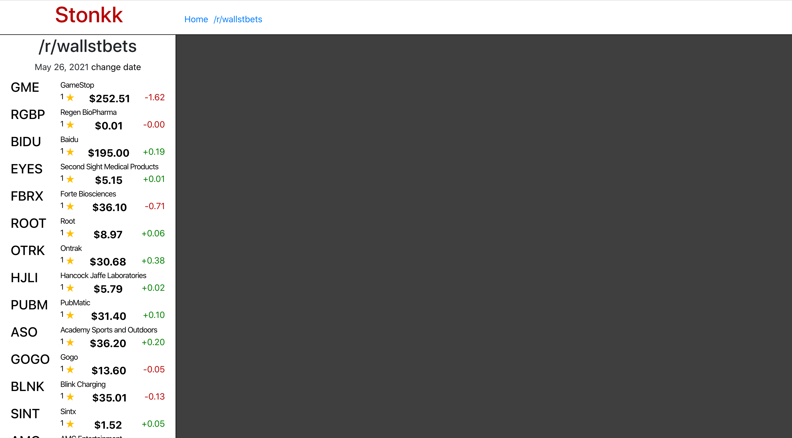

**Project:** Stonk Ticker - Reddit Sentiment Analyzer  
**Role:** Solo Developer

## Overview
Stonk Ticker is a tool designed to analyze stock sentiment by scraping the **/r/wallstbets** subreddit. 
It aggregates mentions of stocks, correlates them with real-time data from the **unofficial Yahoo Finance API**, 
and displays insights through an interactive front-end. Built with a **Ruby/Python** back-end and a **React** 
front-end, the project employs Redis for caching API responses and the Interface pattern to bridge Ruby 
and Python components using JSON messaging. This project demonstrates my ability to integrate diverse 
technologies into a cohesive, high-performance application.

## Challenges and Objectives
- **Reddit Scraping:** Implementing a scraper to parse stock mentions from Reddit posts while handling rate limits and evolving subreddit content.
- **Real-Time Data Correlation:** Integrating the Yahoo Finance API to provide up-to-date stock data, overcoming API inconsistencies.
- **Cross-Language Integration:** Using the Interface pattern and JSON messaging to connect Ruby and Python components seamlessly.
- **Interactive Front-End:** Creating a user-friendly interface to visualize stock mentions and corresponding financial data.

## My Contributions

### 1. Back-End Development
- Developed the core scraper in **Ruby**, aggregating stock mentions from **/r/wallstbets** posts and comments.
- Built a Python service to interface with the Yahoo Finance API, enabling real-time stock data retrieval.
- Used the Interface pattern with JSON messaging to connect Ruby and Python services for streamlined communication.

### 2. Front-End Development
- Built the front-end in **React**, enabling users to explore aggregated stock mentions alongside real-time price, volume, and sentiment data.
- Designed sortable lists and visualizations to highlight trending stocks and patterns.

### 3. Caching and Optimization
- Integrated **Redis** to cache Yahoo Finance API responses, mitigating the impact of inconsistent data retrieval and improving reliability.
- Optimized data processing pipelines to handle large data volumes without significant performance degradation.

### 4. Integration and Automation
- Automated the Reddit scraping and data analysis pipeline to provide near-real-time updates.
- Established deployment pipelines to streamline updates and ensure minimal downtime during iterations.

## Outcomes and Results
- **Insightful Analytics:** Delivered a platform capable of analyzing sentiment trends and identifying popular stocks from Reddit chatter.
- **Optimized Performance:** Successfully mitigated unreliable API response times with **Redis**, ensuring a seamless user experience.
- **Cross-Language Solution:** Demonstrated proficiency in integrating Ruby and Python components into a unified application.

## Reflection
Stonk Ticker was a challenging but rewarding project that honed my skills in full-stack development, 
cross-language integration, and API optimization. This experience deepened my understanding of caching 
strategies and real-time data visualization, preparing me for larger-scale projects with complex 
data pipelines.

## Technical Summary
- **Skills:** Full-Stack Development, Data Scraping, Cross-Language Integration, API Optimization, Real-Time Data Visualization
- **Tools:** Ruby, Python, React, Redis, Yahoo Finance API
- **Specialized Tasks:** Reddit Scraping, API Caching, Stock Sentiment Analysis, Data Pipeline Optimization

## Repositories

### Front-End


### Back-End


