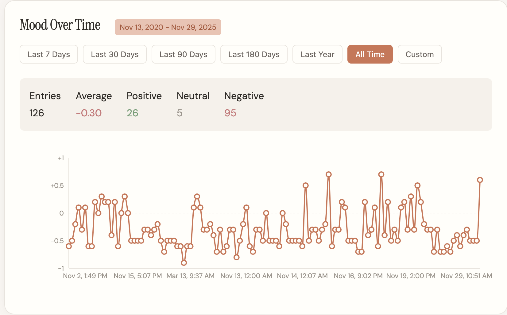
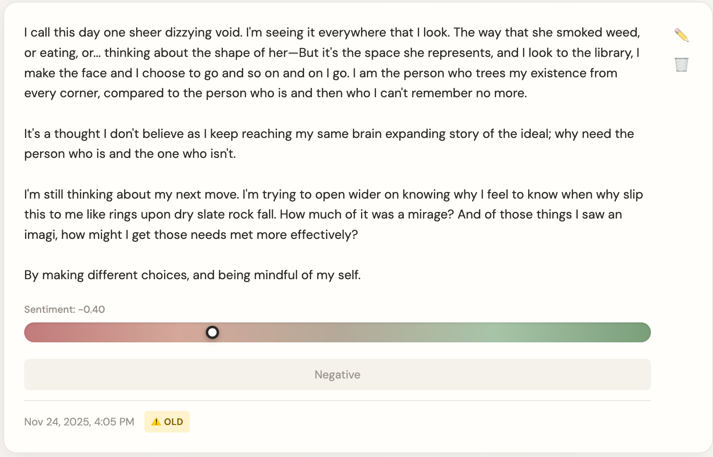

**Project:** Voice Journal  
**Role:** Developer  

## Overview

**Voice Journal** is an AI journaling platform that combines support for voice transcription with 
notebook digitization, enabling importing data from both digital and handwritten sources. Built with 
Python/FastAPI and React, the platform processes audio or scanned pages, applies date detection, 
and generates sentiment scores. The notebook digitization platform is particularly robust, 
with the ability to correctly parse multiple date and time-stamped entries on each page.

## Challenges and Objectives

- **Voice Journaling with AI:** Record audio, transcribe via OpenAI, and classify sentiment.
- **Evaluate LiveKit:** Test LiveKit for voice processing.
- **Notebook Digitization:** Extend the platform to scan handwritten pages using OCR.
- **Structured Parsing:** Detect dates and timestamps, organising content into notebooks, pages, and entries.
- **Editable Transcription:** Provide a correction interface modeled on government record digitization workflows.
- **Sentiment Analysis:** Experiment with binary and three-class classification, gradient scoring, and emoji‑based tagging.

## My Contributions

### 1. Voice Journaling Foundation (FastAPI + React)

- **Audio Recording:** Built a React frontend for audio recordings, sending files to a FastAPI backend.
- **Audio Transcription:** Integrated OpenAI's Whisper API for transcription, achieving high accuracy at modest cost.
- **Sentiment Analysis:** Implemented a binary sentiment classifier (positive/negative) and stored results in PostgreSQL.
- **LiveKit:** Replaced OpenAI with LiveKit for transcription: the results were significantly worse, prompting a swift rollback.

### 2. Notebook Digitization

- **Pivot:** Recognised that notebook digitization aligned with my earlier **Spokebooks** project, given that my notes are hand-written, rather than being stored as voice recordings.
- **OCR Pipeline:** Added an upload endpoint for scanned notebook pages, using OpenAI's vision models for OCR.
- **Manual Editing:** Designed a split‑view UI where users see the original scanned image alongside an editable transcription field, modeled after the workflow at Vital Statistics.

### 3. Date Parsing and Content Structuring

- **Analysis:** Analyzed my own note‑taking format (dated entries, timestamps) to build a reliable parser.
- **Sanity Checks:** Implemented temporal consistency checks: if a parsed date precedes the previous page's date, it auto-corrects to the next logical day.
- **Data Model:** Designed a three‑tier data model: **Notebooks -> Pages -> Entries**, allowing for multiple entries per page, and sequential pages in a notebook.

### 4. Sentiment Analysis

- **Binary -> Neutral -> Gradient:** Evolved from binary (positive/negative) to three‑class (positive/neutral/negative) to a continuous gradient score.
- **Emoji Soup:** Experimented with assigning up to three emojis per entry, inspired by work with the MARA Group; deprioritized as less actionable than the gradient.

### 5. Workflow and Development

- **LLM‑Assisted Coding:** Built with significant assistance from Claude, opting to take the output wholesale for expediency, and to experiment with higher levels of trust.
- **Training Data:** Manually processed 80 pages of a personal notebook to validate the system, and determine OCR accuracy.
- **Persistence:** Used Dockerised PostgreSQL for data storage. After losing the container during a cleanup, I decided to switch to Obsidian/Markdown/flat files.

## Outcomes and Results

- **Functional Dual‑Purpose Platform:** Successfully handles both voice transcription and notebook digitization, with sentiment analysis spanning both.
- **Custom Parsing Logic:** Robust date‑detection system that structures unstructured handwritten notes into a coherent hierarchy.
- **Editable Transcription Interface:** User‑friendly correction workflow that allows refinement of OCR output.
- **Sentiment Analysis Variants:** Iterated through multiple approaches, gaining insight into trade‑offs between simplicity and nuance.
- **Prototype Validation:** Digitized and structured a substantial volume of personal notes, confirming the system's utility.

## Reflection

The final product diverged considerably from the initial concept. What began as an exercise to learn LiveKit, with my stated 
intention being to monetize that skillset, became a renewed attempt at the realization of a much earlier vision: digitizing my 
library of notebooks, and providing myself the ability to search through them. Tackling this project again, with tools such 
as AI transcription and OCR being available, has made it vastly more realistic.

That being said, my methodology towards OCR could stand to be improved. A part of that is improving the source material. I fed 
my app photographs of pages, instead of making use of a pre-processing step where the image is converted to exhibit extremely 
high contrast. Additionally, pages were only added one at a time, and there was no PDF support. These represent limits to the 
effectiveness of the OCR, and a bottleneck regarding throughput. 

Were these limitations to be addressed, it might be possible to work with a higher volume of higher-quality data, which is the 
point where you might be capable of identifying longer-term trends, and stand a real chance of an understanding of the 
user's mental health. It's a feature that has a lot of room for improvement, and much of my time was spent on the 
practicalities of acquiring the requisite data, rather than what's to be done with it.

How I store that data could likewise be improved. While it could be considered clean architecture, and good practice to use a 
containerized SQL instance, without backups it becomes quite vulnerable, and when the data is very "expensive", in terms of 
man-hours spent to acquire it, that's a real loss. Flat files would be a far better solution for this, and I'd seek to output 
the transcriptions in a format compatible with Obsidian. That would provide me with a means for accessing the data that 
doesn't require re-inventing the wheel.

## Technical Summary

- **Skills:** Python, FastAPI, React, OpenAI API, OCR, Sentiment Analysis, PostgreSQL, Docker, Date Parsing, Document Digitization.
- **Tools & Libraries:**
  - *Backend:* Python 3.10, FastAPI, SQLAlchemy, OpenAI (Whisper), PostgreSQL, Docker.
  - *Frontend:* React, Axios, MediaRecorder API.
  - *Processing:* OpenAI Vision API (OCR), custom date‑parsing logic.
- **Key Features:** Voice transcription with sentiment analysis, notebook page upload and OCR, editable transcription interface, hierarchical content parsing, multi‑class sentiment scoring.

## Gallery



