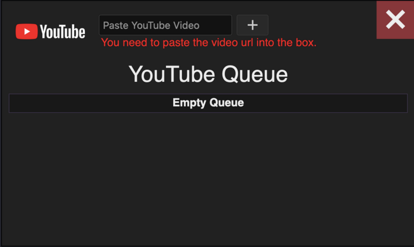

**Project:** YouTube Queue - Communal Video Sharing Tool  
**Role:** Solo Developer

## Overview
The **YouTube Queue** was a personal project created to restore a communal video-sharing experience for my 
friends after the original feature on ezcapechat stopped working. This tool allowed users to queue and watch 
YouTube videos together in real time, reintroducing a sense of shared connection and enjoyment. Built with 
**Ruby (Sinatra)** and **JavaScript**, the project highlights my ability to build small-scale, functional solutions to 
meet immediate needs while navigating real-world API limitations.

## Challenges and Objectives
- **Restoring Functionality:** Recreating a working YouTube queue after the existing platform’s feature became defunct.
- **Real-Time Video Sharing:** Enabling users to collaboratively manage a video queue and synchronize playback.
- **Navigating API Limitations:** Overcoming strict usage quotas imposed by the YouTube API, which restricted the number of searches allowed.
- **User-Friendly Design:** Developing an intuitive interface for seamless interaction and enjoyment.

## My Contributions

### 1. Back-End Development
- Developed the back-end in **Ruby** using the **Sinatra framework**, creating a lightweight and efficient structure for managing the application’s logic.
- Managed core functionalities for queueing, video playback, and collaborative user interactions.
- Created a system to handle real-time updates and ensure consistency across all users.

### 2. Front-End Development
- Built the front-end using JavaScript, implementing a simple and intuitive interface for queue management.
- Integrated YouTube’s API to fetch video metadata and ensure compatibility with playback requirements.

### 3. Addressing API Challenges
- Worked within the constraints of the **YouTube API**, which limited the application to approximately 100 searches per day, shared across all users.
- Contacted Google to request additional API credits but received no response, highlighting the inherent limitations of third-party service dependencies.
- Developed strategies to maximize search efficiency and user experience within the API’s restrictions.

### 4. Synchronization and Real-Time Updates
- Designed a system to synchronize video playback across users, ensuring everyone experienced the same content at the same time.
- Implemented real-time updates for queue changes, allowing seamless collaboration between users.

## Outcomes and Results
- **Functional Replacement:** Successfully delivered a working YouTube queue that restored communal video-sharing functionality for my friends.
- **Engaging Experience:** Reintroduced the joy of shared music and video experiences, fostering connection and collaboration.
- **Technical Growth:** Expanded my understanding of API integration, real-time updates, and the practical challenges of third-party service dependencies.

## Reflection
The **YouTube Queue** was more than just a technical challenge—it was a way to rebuild a sense of community 
and shared enjoyment in a digital space. Navigating the limitations of the **YouTube API** reinforced the 
importance of adaptability and creativity when solving problems, while also highlighting the potential 
pitfalls of relying on external services. This project demonstrated how even small-scale tools can create 
meaningful impacts when designed with care.

## Technical Summary
- **Skills:** Back-End Development, Front-End Development, API Integration, Real-Time Updates
- **Tools:** Ruby (Sinatra), JavaScript, YouTube API
- **Specialized Tasks:** Queue Management, Synchronization, Collaborative Video Sharing, Navigating API Limitations

## Repositories

